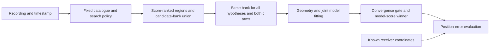

# Iteration 54: satellite-bank and position-dependency audit

Known receiver coordinates and reference errors are evaluation-only. They must
not determine satellite membership, starting points, region retention, per-scan
hyperparameters or operational winner selection. This restriction governs future
experiments as well as interpretation of existing results.

## What a common bank means

A bank is a list of candidate satellites with orbit models. A common bank uses
the same list when scoring competing receiver-position hypotheses for one scan.
The proposed position still determines predicted visibility and Doppler for each
satellite. This necessary hypothesis geometry is distinct from knowledge of the
actual receiver position. A common list does not force satellites to be visible
from every hypothesis. Nor does it mean using the same satellite IDs across scans
taken at different times: the construction rule must be the same.

## Audited dependencies

| Dependency | Evidence and finding | Interpretation |
|---|---|---|
| Regional inventory | Iteration41 `region_inventory.inventory` ranks initial40km cells by objective, then east/north tie order, takes32 and appends ordinary retained regions. | No reference coordinate/error input to this selection. The budget32 was developed after inspecting this consumed failure; not independent validation. |
| 145-satellite union | Iteration41 `summarize.py` unions satellite IDs from both arms of every complete regional document. Iterations42/46/52 use that frozen union. | No error-based region filtering in union construction. Three regional calibration failures remain recorded; membership depends on successful regional fits. |
| Regional fits | Iteration31 `branch.regional` selects the minimum objective among converged fits, then computes horizontal error. | Generic fit function can be used without reference-guided seeds. Its earlier oracle caller and recovered joint seed remain diagnostic. |
| Recovered joint starts | Iterations46/52 load the recovered joint result from iteration40. | Prior reference-guided diagnostic ancestry. The1.15km fitted-c result is not an operational rescue and cannot replace cohort errors. |
| Ordinary transport census | Iteration53 transports all192 endpoints from32 successful regions;187 are feasible,5 violate shared-frame slope bounds. | No recovered joint seed or position-error selection. This is only a preparation audit, not a demonstrated rescue. |
| Uniform cohort selection | Iteration50 `select_documents` and iteration06 selector use convergence and selection score. Iteration51 applies baseline/sep25/sep50 in that fixed order to all148 members. | No per-scan reference-error winner selection. This is a separate bank policy from common145; it must not be described as the common-union experiment. |
| Reference coordinates in documents | Iteration51 calls `run_hard60` before passing reference coordinates to `regional_position_document`. Branch code computes error after choosing a fit. Cohort loader compares historical error fields for receipt integrity. | Reporting and integrity checks carry reference fields; those reviewed uses do not choose a numerical hypothesis. This is not a claim that arbitrary downstream code cannot access them. |
| Spatial search prior | All reviewed DS16/DS17/newer/completion loaders instantiate `RegionalPrior()`:38.5816,-121.4944, radius250km, altitude0. | Explicit Sacramento regional assumption, not per-scan ground truth. No worldwide/general-altitude validation claim. Any new region must be specified independently of the evaluation answer. |
| Timing sigma1 | Iteration52 changed relative timing sigma after investigation of this known failure. | Consumed-data tuning. It is a candidate global policy, not permission to switch sigma based on each scan's reference error. |
| Wider region separation | Iteration48 demonstrated sep50 on DS16-046; iteration51 tests it uniformly alongside existing regions. | Consumed-data development, added compute, not a fresh validation success. |

## Enforced interpretation and next experiment policy

1. Keep all frozen dataset members and exposure labels: DS16=63, DS17=51,
   DS18=34. DS18's24 previously consumed members remain consumed; no registry
   match for the other10 alone does not establish independence.
2. Keep the current uniform iteration51 run unchanged and label its bank policy
   accurately. Do not substitute the single-scan common-bank diagnostic into it.
3. Before a new common-bank cohort run, freeze one construction/selection policy,
   search region specification, region budget, priors, deterministic ties and
   compute limits for all three datasets. Membership may differ by timestamp and
   observed evidence, never by reference position or error.
4. Use ordinary algorithm-generated starts only. Match observations, candidate
   banks, priors, starting hypotheses and search budgets between c=0 and fitted-c.
   Keep failed/infeasible starts explicit. Select by the prespecified converged
   model score; report localization and frequency fit separately afterward.
5. A single-scan ordinary-start recovery would establish feasibility only. The
   1.15km recovered-seed result stays diagnostic until an ordinary reference-free
   rule reaches and selects a comparable solution; generalization additionally
   requires new independent validation under the frozen rule. No new RF collection
   is authorized; validation must use eligible existing recordings if available.
6. Reference error must not control per-scan seeds, satellite lists, retention or
   hyperparameters. Global research choices informed by aggregate consumed-data
   evaluations must be disclosed as development and frozen before validation.

## Verification and limits

Ran the existing iteration41 inventory and iteration50 selection tests together:
**4 passed**. These cover reference-field invariance of inventory, deterministic
ordering, preserving a real score-selected rescue, and selecting by convergence
and score despite opposing reference errors. They are targeted checks, not a
full end-to-end proof that reference metadata is inaccessible.

This audit changes interpretation and future experiment requirements, not frozen
numerical code or results. Existing production hard60, bounded recovery and
longest16-track PNG rendering remain unchanged. The below1km goal remains active.
