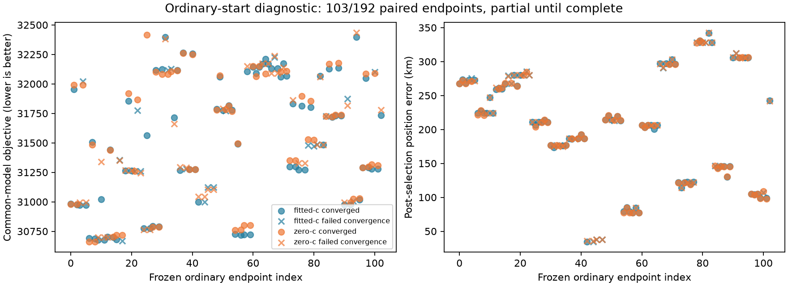

# Iteration55: ordinary-start common-bank refits

**Partial: 103/192 endpoint pairs; 207/384 receipts.** This is
consumed DS18 development evidence, not independent validation, and does not
replace any dataset benchmark result. Only endpoints completed in both arms
participate in the provisional comparison. All192 remain in the denominator.

| Arm | Provisional score-selected endpoint | Objective | Error km | Frequency RMS Hz |
|---|---:|---:|---:|---:|
| fitted-c | 9 | 30677.984875 | 223.964164 | 116.924 |
| zero-c | 8 | 30661.428143 | 221.197615 | 114.121 |

## Frozen policy and limitations

All187 feasible ordinary endpoints from iteration53 receive both fits with20s,
600-iteration limits. The other5 endpoints remain explicit infeasible receipts
in both arms without clipping. The common145 bank, ordinary clock calibration,
sigma1 relative timing prior, common3 prior, joint100 clock prior, residual slope60
and25km local disks are shared. No recovered diagnostic joint seed is used.
Source and input hashes are checked before fitting; each receipt is immutable
and bound to the frozen protocol. Convergence failures remain ineligible even
when the optimizer reports success. Ties use ascending frozen endpoint index.

The evaluator never calculates reference error. The reporter chooses converged
winners by objective before calculating error. Frequency fit and position error
are shown separately; a lower objective is not proof of greater accuracy.
This experiment does not tune per-scan settings using the known position.
Nevertheless, its region budget and sigma were developed on consumed data.
An ordinary-start success would require uniform policy evaluation across
DS16/DS17/DS18 and new independent validation before a generalization claim.
The current three-dataset iteration51 run uses a different regional policy and
continues unchanged. No production, RF, public-contract or fixture changes.

## Complete endpoint coverage

| Endpoint | Region | Source arm/start | Fitted-c status | Zero-c status |
|---:|---:|---|---|---|
| 0 | 0 | zero-c/association | complete converged | complete converged |
| 1 | 0 | zero-c/zero-timing | complete converged | complete converged |
| 2 | 0 | zero-c/own-continuation | complete converged | complete converged |
| 3 | 0 | fitted-c/association | complete converged | complete nonconverged |
| 4 | 0 | fitted-c/zero-timing | complete nonconverged | complete converged |
| 5 | 0 | fitted-c/own-continuation | complete converged | complete nonconverged |
| 6 | 1 | zero-c/association | complete converged | complete converged |
| 7 | 1 | zero-c/zero-timing | complete converged | complete converged |
| 8 | 1 | zero-c/own-continuation | complete converged | complete converged |
| 9 | 1 | fitted-c/association | complete converged | complete nonconverged |
| 10 | 1 | fitted-c/zero-timing | complete converged | complete nonconverged |
| 11 | 1 | fitted-c/own-continuation | complete converged | complete nonconverged |
| 12 | 3 | zero-c/association | complete converged | complete nonconverged |
| 13 | 3 | zero-c/zero-timing | complete converged | complete converged |
| 14 | 3 | zero-c/own-continuation | complete converged | complete converged |
| 15 | 3 | fitted-c/association | complete converged | complete converged |
| 16 | 3 | fitted-c/zero-timing | complete nonconverged | complete nonconverged |
| 17 | 3 | fitted-c/own-continuation | complete nonconverged | complete converged |
| 18 | 4 | zero-c/association | complete converged | complete nonconverged |
| 19 | 4 | zero-c/zero-timing | complete converged | complete converged |
| 20 | 4 | zero-c/own-continuation | complete converged | complete nonconverged |
| 21 | 4 | fitted-c/association | complete nonconverged | complete converged |
| 22 | 4 | fitted-c/zero-timing | complete nonconverged | complete converged |
| 23 | 4 | fitted-c/own-continuation | complete nonconverged | complete nonconverged |
| 24 | 5 | zero-c/association | complete converged | complete nonconverged |
| 25 | 5 | zero-c/zero-timing | complete converged | complete converged |
| 26 | 5 | zero-c/own-continuation | complete converged | complete nonconverged |
| 27 | 5 | fitted-c/association | complete converged | complete converged |
| 28 | 5 | fitted-c/zero-timing | complete converged | complete converged |
| 29 | 5 | fitted-c/own-continuation | complete converged | complete converged |
| 30 | 6 | zero-c/association | complete converged | complete converged |
| 31 | 6 | zero-c/zero-timing | complete converged | complete nonconverged |
| 32 | 6 | zero-c/own-continuation | complete nonconverged | complete converged |
| 33 | 6 | fitted-c/association | complete nonconverged | complete converged |
| 34 | 6 | fitted-c/zero-timing | complete converged | complete nonconverged |
| 35 | 6 | fitted-c/own-continuation | complete converged | complete converged |
| 36 | 7 | zero-c/association | complete converged | complete nonconverged |
| 37 | 7 | zero-c/zero-timing | complete converged | complete converged |
| 38 | 7 | zero-c/own-continuation | complete nonconverged | complete nonconverged |
| 39 | 7 | fitted-c/association | complete converged | complete converged |
| 40 | 7 | fitted-c/zero-timing | complete converged | complete converged |
| 41 | 7 | fitted-c/own-continuation | complete converged | complete converged |
| 42 | 8 | zero-c/association | complete converged | complete nonconverged |
| 43 | 8 | zero-c/zero-timing | infeasible | infeasible |
| 44 | 8 | zero-c/own-continuation | complete nonconverged | complete nonconverged |
| 45 | 8 | fitted-c/association | complete nonconverged | complete nonconverged |
| 46 | 8 | fitted-c/zero-timing | infeasible | infeasible |
| 47 | 8 | fitted-c/own-continuation | complete nonconverged | complete nonconverged |
| 48 | 9 | zero-c/association | complete converged | complete converged |
| 49 | 9 | zero-c/zero-timing | complete converged | complete converged |
| 50 | 9 | zero-c/own-continuation | complete converged | complete nonconverged |
| 51 | 9 | fitted-c/association | complete nonconverged | complete converged |
| 52 | 9 | fitted-c/zero-timing | complete converged | complete converged |
| 53 | 9 | fitted-c/own-continuation | complete converged | complete converged |
| 54 | 10 | zero-c/association | complete converged | complete converged |
| 55 | 10 | zero-c/zero-timing | complete converged | complete converged |
| 56 | 10 | zero-c/own-continuation | complete converged | complete converged |
| 57 | 10 | fitted-c/association | complete converged | complete converged |
| 58 | 10 | fitted-c/zero-timing | complete converged | complete nonconverged |
| 59 | 10 | fitted-c/own-continuation | complete converged | complete converged |
| 60 | 11 | zero-c/association | complete converged | complete converged |
| 61 | 11 | zero-c/zero-timing | complete converged | complete converged |
| 62 | 11 | zero-c/own-continuation | complete converged | complete converged |
| 63 | 11 | fitted-c/association | complete converged | complete nonconverged |
| 64 | 11 | fitted-c/zero-timing | complete converged | complete converged |
| 65 | 11 | fitted-c/own-continuation | complete converged | complete nonconverged |
| 66 | 12 | zero-c/association | complete converged | complete nonconverged |
| 67 | 12 | zero-c/zero-timing | complete nonconverged | complete nonconverged |
| 68 | 12 | zero-c/own-continuation | complete converged | complete nonconverged |
| 69 | 12 | fitted-c/association | complete converged | complete converged |
| 70 | 12 | fitted-c/zero-timing | complete converged | complete nonconverged |
| 71 | 12 | fitted-c/own-continuation | complete converged | complete converged |
| 72 | 13 | zero-c/association | complete converged | complete converged |
| 73 | 13 | zero-c/zero-timing | complete converged | complete nonconverged |
| 74 | 13 | zero-c/own-continuation | complete converged | complete converged |
| 75 | 13 | fitted-c/association | complete converged | complete nonconverged |
| 76 | 13 | fitted-c/zero-timing | complete converged | complete converged |
| 77 | 13 | fitted-c/own-continuation | complete converged | complete nonconverged |
| 78 | 14 | zero-c/association | complete nonconverged | complete converged |
| 79 | 14 | zero-c/zero-timing | complete converged | complete converged |
| 80 | 14 | zero-c/own-continuation | complete nonconverged | complete converged |
| 81 | 14 | fitted-c/association | complete nonconverged | complete nonconverged |
| 82 | 14 | fitted-c/zero-timing | complete converged | complete nonconverged |
| 83 | 14 | fitted-c/own-continuation | complete converged | complete nonconverged |
| 84 | 15 | zero-c/association | complete nonconverged | complete converged |
| 85 | 15 | zero-c/zero-timing | complete converged | complete converged |
| 86 | 15 | zero-c/own-continuation | complete converged | complete converged |
| 87 | 15 | fitted-c/association | complete converged | complete converged |
| 88 | 15 | fitted-c/zero-timing | complete converged | complete converged |
| 89 | 15 | fitted-c/own-continuation | complete converged | complete converged |
| 90 | 16 | zero-c/association | complete converged | complete nonconverged |
| 91 | 16 | zero-c/zero-timing | complete nonconverged | complete nonconverged |
| 92 | 16 | zero-c/own-continuation | complete converged | complete converged |
| 93 | 16 | fitted-c/association | complete nonconverged | complete converged |
| 94 | 16 | fitted-c/zero-timing | complete converged | complete nonconverged |
| 95 | 16 | fitted-c/own-continuation | complete converged | complete converged |
| 96 | 17 | zero-c/association | complete converged | complete converged |
| 97 | 17 | zero-c/zero-timing | complete converged | complete converged |
| 98 | 17 | zero-c/own-continuation | complete converged | complete converged |
| 99 | 17 | fitted-c/association | complete converged | complete converged |
| 100 | 17 | fitted-c/zero-timing | complete nonconverged | complete converged |
| 101 | 17 | fitted-c/own-continuation | complete converged | complete converged |
| 102 | 19 | zero-c/association | complete converged | complete nonconverged |
| 103 | 19 | zero-c/zero-timing | complete converged | pending |
| 104 | 19 | zero-c/own-continuation | pending | pending |
| 105 | 19 | fitted-c/association | pending | pending |
| 106 | 19 | fitted-c/zero-timing | pending | pending |
| 107 | 19 | fitted-c/own-continuation | pending | pending |
| 108 | 21 | zero-c/association | pending | pending |
| 109 | 21 | zero-c/zero-timing | pending | pending |
| 110 | 21 | zero-c/own-continuation | pending | pending |
| 111 | 21 | fitted-c/association | pending | pending |
| 112 | 21 | fitted-c/zero-timing | pending | pending |
| 113 | 21 | fitted-c/own-continuation | pending | pending |
| 114 | 22 | zero-c/association | pending | pending |
| 115 | 22 | zero-c/zero-timing | pending | pending |
| 116 | 22 | zero-c/own-continuation | pending | pending |
| 117 | 22 | fitted-c/association | pending | pending |
| 118 | 22 | fitted-c/zero-timing | pending | pending |
| 119 | 22 | fitted-c/own-continuation | pending | pending |
| 120 | 23 | zero-c/association | pending | pending |
| 121 | 23 | zero-c/zero-timing | pending | pending |
| 122 | 23 | zero-c/own-continuation | pending | pending |
| 123 | 23 | fitted-c/association | pending | pending |
| 124 | 23 | fitted-c/zero-timing | pending | pending |
| 125 | 23 | fitted-c/own-continuation | pending | pending |
| 126 | 24 | zero-c/association | pending | pending |
| 127 | 24 | zero-c/zero-timing | pending | pending |
| 128 | 24 | zero-c/own-continuation | pending | pending |
| 129 | 24 | fitted-c/association | pending | pending |
| 130 | 24 | fitted-c/zero-timing | pending | pending |
| 131 | 24 | fitted-c/own-continuation | pending | pending |
| 132 | 25 | zero-c/association | pending | pending |
| 133 | 25 | zero-c/zero-timing | pending | pending |
| 134 | 25 | zero-c/own-continuation | pending | pending |
| 135 | 25 | fitted-c/association | pending | pending |
| 136 | 25 | fitted-c/zero-timing | pending | pending |
| 137 | 25 | fitted-c/own-continuation | pending | pending |
| 138 | 26 | zero-c/association | pending | pending |
| 139 | 26 | zero-c/zero-timing | pending | pending |
| 140 | 26 | zero-c/own-continuation | pending | pending |
| 141 | 26 | fitted-c/association | pending | pending |
| 142 | 26 | fitted-c/zero-timing | pending | pending |
| 143 | 26 | fitted-c/own-continuation | pending | pending |
| 144 | 27 | zero-c/association | pending | pending |
| 145 | 27 | zero-c/zero-timing | pending | pending |
| 146 | 27 | zero-c/own-continuation | pending | pending |
| 147 | 27 | fitted-c/association | pending | pending |
| 148 | 27 | fitted-c/zero-timing | pending | pending |
| 149 | 27 | fitted-c/own-continuation | pending | pending |
| 150 | 28 | zero-c/association | pending | pending |
| 151 | 28 | zero-c/zero-timing | pending | pending |
| 152 | 28 | zero-c/own-continuation | pending | pending |
| 153 | 28 | fitted-c/association | pending | pending |
| 154 | 28 | fitted-c/zero-timing | pending | pending |
| 155 | 28 | fitted-c/own-continuation | pending | pending |
| 156 | 29 | zero-c/association | pending | pending |
| 157 | 29 | zero-c/zero-timing | pending | pending |
| 158 | 29 | zero-c/own-continuation | pending | pending |
| 159 | 29 | fitted-c/association | pending | pending |
| 160 | 29 | fitted-c/zero-timing | pending | pending |
| 161 | 29 | fitted-c/own-continuation | pending | pending |
| 162 | 30 | zero-c/association | pending | pending |
| 163 | 30 | zero-c/zero-timing | pending | pending |
| 164 | 30 | zero-c/own-continuation | pending | pending |
| 165 | 30 | fitted-c/association | pending | pending |
| 166 | 30 | fitted-c/zero-timing | pending | pending |
| 167 | 30 | fitted-c/own-continuation | pending | pending |
| 168 | 31 | zero-c/association | pending | pending |
| 169 | 31 | zero-c/zero-timing | pending | pending |
| 170 | 31 | zero-c/own-continuation | pending | pending |
| 171 | 31 | fitted-c/association | pending | pending |
| 172 | 31 | fitted-c/zero-timing | pending | pending |
| 173 | 31 | fitted-c/own-continuation | pending | pending |
| 174 | 32 | zero-c/association | pending | pending |
| 175 | 32 | zero-c/zero-timing | pending | pending |
| 176 | 32 | zero-c/own-continuation | pending | pending |
| 177 | 32 | fitted-c/association | pending | pending |
| 178 | 32 | fitted-c/zero-timing | pending | pending |
| 179 | 32 | fitted-c/own-continuation | pending | pending |
| 180 | 33 | zero-c/association | pending | pending |
| 181 | 33 | zero-c/zero-timing | pending | pending |
| 182 | 33 | zero-c/own-continuation | pending | pending |
| 183 | 33 | fitted-c/association | pending | pending |
| 184 | 33 | fitted-c/zero-timing | pending | pending |
| 185 | 33 | fitted-c/own-continuation | pending | pending |
| 186 | 34 | zero-c/association | pending | pending |
| 187 | 34 | zero-c/zero-timing | pending | pending |
| 188 | 34 | zero-c/own-continuation | pending | pending |
| 189 | 34 | fitted-c/association | pending | pending |
| 190 | 34 | fitted-c/zero-timing | pending | pending |
| 191 | 34 | fitted-c/own-continuation | pending | pending |
