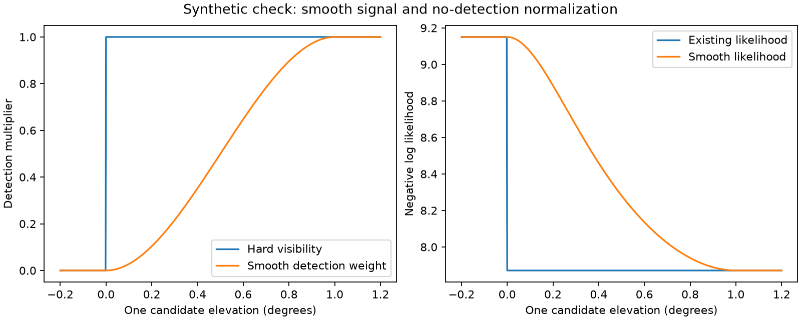

# Iteration56: differentiable horizon-likelihood prototype

The research-only likelihood now has a continuous first derivative through the
horizon transition. Three component tests pass. This is a mathematical prototype,
not a localization result, and changes neither production nor running experiments.

Iteration49 found discontinuous geometric visibility at four failed fitted-c
endpoints. Simply allowing more evaluations does not remove such score jumps.
This prototype replaces binary visibility with a smooth detection probability:
zero below the horizon, cubic smoothstep between0 and1degree, and full probability
above1degree. The1degree width is an unvalidated global development choice, not a
per-recording value selected using reference error. It is not an antenna model.

For each observation/candidate, let w be the taper, q=q0*w, G the frequency
Gaussian density, and T=clutter_density+sum(q*G/(1-q)). Then
log(P0)=-clutter_rate+sum(log(1-q)), and the observation log likelihood is
log(P0)-log(1-P0)+log(T). This changes both the signal term and no-detection
normalization. Softening only the signal would be inconsistent with this model.

The negative-log-likelihood derivative with respect to q is
1/((1-q)*(1-P0))-G/(T*(1-q)^2). Multiplying by q0 and the taper derivative gives
the elevation derivative. The frequency derivative retains the responsibility
weighted wrapped residual. Values at the alias wrap are outside these tests;
the prototype retains the existing narrow-Gaussian approximation.

## Verification

- Binary0/1 taper values match existing likelihood and frequency gradients.
- All48 frequency and48 elevation partial derivatives on a deterministic random
  interior fixture match central finite differences (relative tolerance1e-5,
  absolute1e-7). This exercises the no-detection term as well as signal weights.
- Detection is exactly zero below the horizon. Taper and score are continuous
  at0 and1degree, with zero taper derivative on both sides of each endpoint.

Command: `PYTHONPATH=src .venv/bin/python -m pytest -q
reports/2026_10_09_position_error_iter56/test_smooth_likelihood.py` —3passed.
The figure is synthetic and uses no recordings or known receiver coordinates.

## Remaining integration work

The current orbit kernel returns Boolean visibility, frequency, and frequency
derivatives. It does not expose elevation derivatives. A complete objective must
compute elevation and its position/timing derivatives consistently with the
orbit interpolation, and add their likelihood contributions to those gradients.
Then test combined geometric finite differences through horizon crossings before
running matched c0/fitted-c fits. Do not mistake the likelihood-only tests for
verification of a full position optimizer.

Any fit experiment needs a frozen, uniform bank/selection policy and global taper
width across DS16/DS17/DS18, all failure coverage and independent validation after
consumed-data development. Reference positions remain evaluation-only. No
benchmark result is replaced, and no RF collection is requested or performed.
