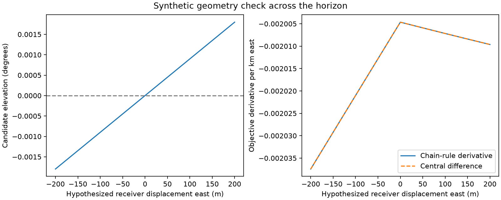

# Iteration57: elevation and full geometry derivatives verified

The smooth-horizon research prototype now includes elevation derivatives with
respect to receiver position and each satellite's orbit timing shift. The
combined likelihood derivative includes both frequency and elevation effects.
**Six tests pass across iterations56/57**, including explicit taper-boundary cases.
This is synthetic numerical verification, not a measured positioning improvement.

The elevation helper uses the same piecewise-linear satellite position
interpolation as the existing native frequency kernel. Timing derivatives use
the slope between position nodes, not interpolated physical velocity. Receiver
position derivatives include changes in both observer position and the local up
direction. Omitting the latter would give an incomplete elevation derivative.

For unit line of sight d, range R, up vector u, and s=d.u, the spatial derivative
of s is -(u-s*d).site_jac/R + d.up_jac. The timing derivative is
(u-s*d).position_node_slope/R. Convert these to degree elevation derivatives
through asin(s). At exact zenith/nadir the elevation coordinate has no unique
derivative, but the horizon taper is constant; the helper returns zero there
for that chain rule. It is not a general zenith angle derivative API.

## Checks and limits

- Elevation sign matches native-kernel visibility on the synthetic fixture.
- Spatial and individual timing derivatives agree with central differences.
- Full likelihood geometry gradients agree when frequency and elevation terms
  are combined, both inside smooth regions and with candidates at0/1degree.
- The inherited likelihood tests cover binary-oracle equivalence, all individual
  frequency/elevation partials, and continuity at the taper boundaries.

`synthetic.json` contains the plotted81-point sweep and its maximum absolute
gradient discrepancy. The plot uses a hypothetical receiver chart location and
synthetic satellite trajectories, with no real reference receiver coordinates.

Next, wrap this verified likelihood/geometry in the joint clock-position
objective and audit every parameter gradient and unchanged priors before fitting
recordings. Performance is not qualified: the research helper currently uses
NumPy arrays in addition to the native frequency kernel. Smooth-versus-hard
comparisons must disclose runtime differences and keep c arms matched.

No executed frozen experiment, production component, public contract or fixture
was changed. No scan outcome is replaced. Any later scan policy must retain the
iteration54 reference-leakage restrictions, uniform cohort policy, consumed-data
tuning disclosure and independent validation requirement. No RF was collected.
