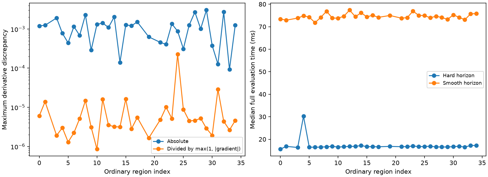

# Iteration58: smooth joint objective integrated; runtime and gradient limits

The research objective now integrates smooth horizon likelihood with joint
position, receiver clocks, fitted c and satellite timing. All eight synthetic
tests across iterations56–58 pass, including every joint parameter gradient,
unchanged priors, reporting shape and horizon-boundary geometry.

A separately frozen, non-optimizing audit checked the first feasible ordinary
endpoint in each of32 successful regions on the common145 bank. No recovered
joint seed or receiver reference error was used. Eight derivative coordinates
per region cover east/north, both receiver slopes, c, common/one relative timing,
and one clock coefficient: **256 real-data derivative checks**.
This is directional coverage, not all-parameter real-data verification.

Maximum absolute discrepancy is0.00304534; maximum
discrepancy divided by max(1,abs(analytic_gradient)) is
0.000226458. Central steps are0.001 for position,
slopes,c,clock and0.0001 for timing. Several absolute discrepancies exceed0.001;
these finite-step diagnostics must not be presented as proof of stationarity
accuracy. A step-size convergence study is required before optimizer qualification.
No pass threshold was retroactively selected from these results.

Median evaluation cost is16.71ms for hard
horizon versus74.31ms for smooth, a
4.45x ratio. Each timing is a median of3 full
evaluations under the same running workload; it is not a dedicated performance
benchmark. The NumPy elevation helper duplicates orbit-position work and allocates
large arrays. A20second smooth fit would therefore get fewer objective evaluations
than the hard model; any comparison must expose both budgets and actual work.

## What changed and what remains

SmoothJointObjective retains the existing joint-clock class and priors, adds
elevation derivatives to the position and satellite timing gradients, and returns
the existing WindowLikelihood interface for frequency residual reporting.
Reference coordinates are absent from its inputs. The fixed1degree taper remains
an unvalidated global model choice, not a per-scan accuracy-tuned setting.

Next: check gradient convergence with smaller finite-difference steps, then freeze
a bounded matched c0/fitted-c experiment with disclosed hard/smooth computational
costs. Independent validation and a uniform bank/selection policy across all three
datasets remain required. This iteration reports no optimized position or accuracy
gain, replaces no cohort outcome, and changes no production/RF/contracts/fixtures.
Frozen numerical source and protocol are committed before the real-data audit.
