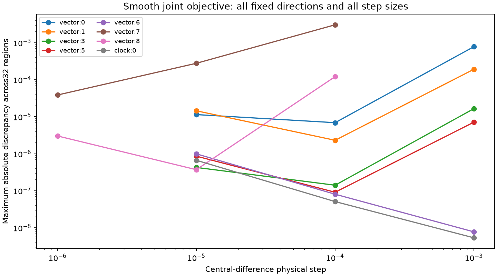

# Iteration59: smaller steps resolve the large timing-gradient discrepancy

This audit repeats the same32 ordinary endpoints and8 directions from iteration58
with steps10x and100x smaller. It evaluates no position error, performs no fitting,
and makes no adaptive endpoint selection. All three step levels are reported.

| Direction | Original step / max discrepancy | 10x smaller / max discrepancy | 100x smaller / max discrepancy |
|---|---:|---:|---:|
| vector:0 | 0.001 / 0.0007794906 | 0.0001 / 6.893031e-06 | 1e-05 / 1.140179e-05 |
| vector:1 | 0.001 / 0.0001911964 | 0.0001 / 2.304414e-06 | 1e-05 / 1.444452e-05 |
| vector:3 | 0.001 / 1.648445e-05 | 0.0001 / 1.406329e-07 | 1e-05 / 4.255321e-07 |
| vector:5 | 0.001 / 7.104476e-06 | 0.0001 / 9.083273e-08 | 1e-05 / 8.58357e-07 |
| vector:6 | 0.001 / 7.723445e-09 | 0.0001 / 8.032778e-08 | 1e-05 / 9.897878e-07 |
| vector:7 | 0.0001 / 0.003045339 | 1e-05 / 0.0002775296 | 1.0000000000000002e-06 / 3.858667e-05 |
| vector:8 | 0.0001 / 0.0001209233 | 1e-05 / 3.697759e-07 | 1.0000000000000002e-06 / 3.014109e-06 |
| clock:0 | 0.001 / 5.327391e-09 | 0.0001 / 5.080694e-08 | 1e-05 / 6.643441e-07 |

The original common-timing discrepancy was dominated by finite-step effects:
compare vector:7 across all three scales. Very small steps introduce numerical
cancellation, so improvement need not be monotonic at the smallest step. This is
evidence about evaluated derivatives, not proof that an optimizer has converged
or that a fitted position is accurate. The existing stationarity gate is unchanged.

The audit covers geographic, receiver slope, c, common/one relative timing and
one clock direction. It does not establish all-parameter accuracy on real scans;
the synthetic tests supply all-parameter coverage. Orbit interpolation retains
piecewise-linear node boundaries, so smoothing horizon visibility does not make
the entire model globally smooth. No independent validation claim is made.

The integrated prototype can now proceed to a bounded exploratory fit comparison
with the original convergence gate, while retaining failed fits. Hard/smooth runtime
differs: iteration58 measured4.45x evaluation cost. c0/fitted-c budgets must match;
any wall-time allowance difference between hard and smooth models must be disclosed.
Use the same ordinary seeds/bank and priors, choose winners by converged objective,
and measure position errors only afterward. This is a consumed diagnostic, not
permission for per-scan tuning or cohort-result replacement. A uniform policy on
all three datasets and new independent validation remain necessary.

Frozen audit source/protocol commit:a02e192c9. No production, contracts, fixtures,
RF collection, or existing immutable experiment sources changed.
