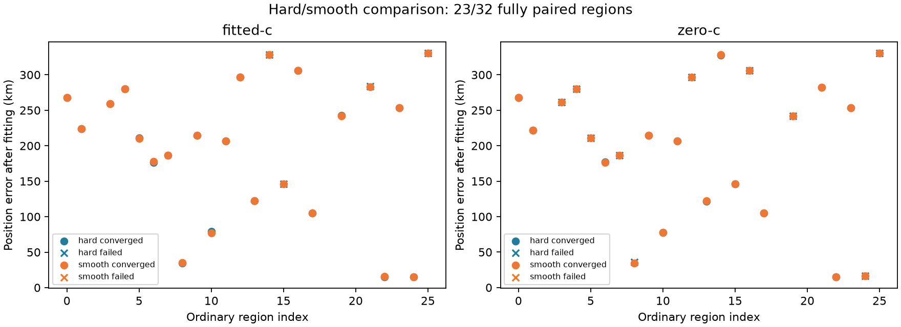

# Iteration60: ordinary-start smooth-horizon pilot

**Partial: 23/32 fully paired regions.** Each region requires hard and
smooth results in both c arms before entering this comparison. All32 planned
regions remain in coverage. This is consumed DS18 development, not independent
validation; no result replaces a cohort error or establishes an operational fix.

## Provisional score-selected winners and computation

| Model | Arm | Winner index | Error km | RMS Hz | Converged/failed | Median evals | Median s |
|---|---|---:|---:|---:|---:|---:|---:|
| hard | fitted-c | 126 | 14.795589 | 107.348 | 19/4 | 621.0 | 10.51 |
| hard | zero-c | 6 | 221.415046 | 114.216 | 13/10 | 663.0 | 10.78 |
| smooth | fitted-c | 126 | 15.350396 | 106.803 | 23/0 | 605.0 | 41.90 |
| smooth | zero-c | 126 | 16.189070 | 108.284 | 23/0 | 606.0 | 41.79 |

## Paired regional changes

Position changes below use only pairs where both fits converged (1m tie tolerance).
Gained/lost convergence is reported separately and is not an accuracy improvement.

| Arm | Improved/regressed/tied | Gained/lost convergence | Both failed |
|---|---:|---:|---:|
| fitted-c | 11/8/0 | 4/0 | 0 |
| zero-c | 3/10/0 | 10/0 | 0 |

Winners minimize objective among converged fits, ties by ascending frozen index.
Reference errors are calculated afterward. Cross-model objectives are not treated
as localization improvements. The table's computational medians include failed
fits on the matched completed subset, not just successful winners.

Smooth uses90seconds/600iterations versus hard20seconds/600iterations, following
the measured4.45x evaluation cost. **This is not equal wall-time allowance.**
Both c arms share budgets within each model. No convergence gate is relaxed.
Shared inputs: common145 bank, ordinary calibration, sigma1/common3, joint100,
residual slopes60, local25km, identical ordinary seeds. Global1degree smoothstep
is the model change. No recovered joint seed or reference-guided selection is used.

One first feasible endpoint per successful region is the frozen pilot policy;
it does not use all187 feasible starts. All192 source endpoints,5infeasible and
the3earlier regional calibration failures remain in iterations41/53. Hard
controls use exactly the pilot indices from iteration55. This subset must not
be compared with the best winner over all192 endpoints as if budgets matched.
Prior tuning is consumed development. Uniform policy across DS16/17/18 and
independent validation remain required. Production/RF/contracts unchanged.

## Full pilot coverage

| Endpoint | Hard fitted-c | Hard c0 | Smooth fitted-c | Smooth c0 |
|---:|---|---|---|---|
| 0 | converged | converged | converged | converged |
| 6 | converged | converged | converged | converged |
| 12 | converged | failed | converged | converged |
| 18 | converged | failed | converged | converged |
| 24 | converged | failed | converged | converged |
| 30 | converged | converged | converged | converged |
| 36 | converged | failed | converged | converged |
| 42 | converged | failed | converged | converged |
| 48 | converged | converged | converged | converged |
| 54 | converged | converged | converged | converged |
| 60 | converged | converged | converged | converged |
| 66 | converged | failed | converged | converged |
| 72 | converged | converged | converged | converged |
| 78 | failed | converged | converged | converged |
| 84 | failed | converged | converged | converged |
| 90 | converged | failed | converged | converged |
| 96 | converged | converged | converged | converged |
| 102 | converged | failed | converged | converged |
| 108 | failed | converged | converged | converged |
| 114 | converged | converged | converged | converged |
| 120 | converged | converged | converged | converged |
| 126 | converged | failed | converged | converged |
| 132 | failed | failed | converged | converged |
| 138 | pending | pending | converged | converged |
| 144 | pending | pending | pending | pending |
| 150 | pending | pending | pending | pending |
| 156 | pending | pending | pending | pending |
| 162 | pending | pending | pending | pending |
| 168 | pending | pending | pending | pending |
| 174 | pending | pending | pending | pending |
| 180 | pending | pending | pending | pending |
| 186 | pending | pending | pending | pending |
