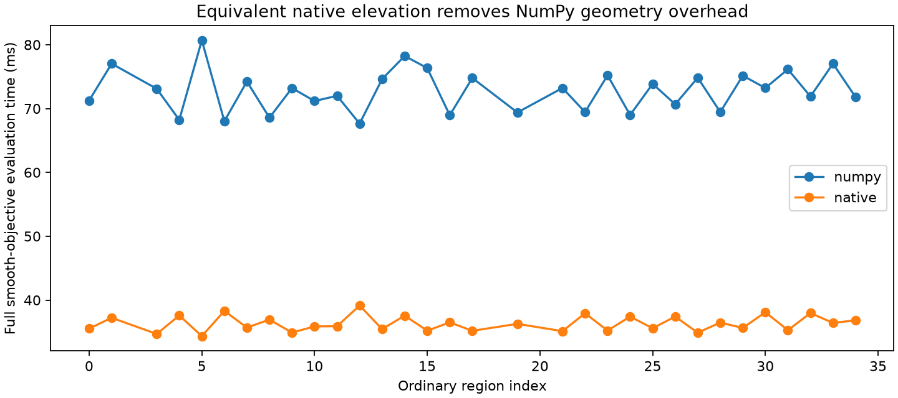

# Iteration61: native elevation halves smooth-objective evaluation time

The private native elevation helper passed all32 ordinary-region equivalence
checks for the complete smooth objective, parameter/clock gradients and candidate
responsibilities. Median evaluation time changed from
73.15ms to
36.09ms, a
**2.03x speedup**. This is a computational improvement, not a
localization improvement or an optimization-trajectory equivalence claim.

The measured4.45x slowdown in iteration58 motivated this narrow helper. It ports
the verified NumPy elevation interpolation and derivatives into one double-
precision loop, without fast-math. The receiver chart derivatives, likelihood,
clock terms and priors are unchanged. No RF or reference coordinates are used
to choose starts or tune the numerical implementation.

Maximum absolute differences across32 endpoints:

| Quantity | Maximum difference |
|---|---:|
| Objective | 0 |
| Parameter gradient | 3.55271368e-15 |
| Clock gradient | 0 |

Frozen tolerances: objective/gradients atol1e-7,rtol1e-9; responsibilities
atol1e-10,rtol1e-9. All passed. Each reported timing is a median of3 full
evaluations under the running workload, not a dedicated performance benchmark.
The two synthetic tests also pass: geometry equivalence including a near-zenith
case, and explicit rejection of invalid shapes/nonfinite/out-of-support inputs.

Build manually with `g++ -std=c++17 -O3 -fPIC -shared elevation.cpp -o
local/elevation.so` from this report directory. The local binary is excluded
from Git; protocol.json binds its actual SHA256 as well as source hashes.
No runtime compilation or silent fallback is used. Missing binary is an explicit
failure. Rebuilding with another compiler may require a new qualification receipt.

This helper is research-only. Existing production and every running frozen
experiment remain unchanged. In particular, iteration60 continues using NumPy
with its recorded90second allowance. A future use of the native helper must
freeze its implementation and budgets separately; current results cannot be
retroactively relabeled as faster-native results. Fit-trajectory qualification
and independent validation remain outstanding. No public contract or fixture changed.
