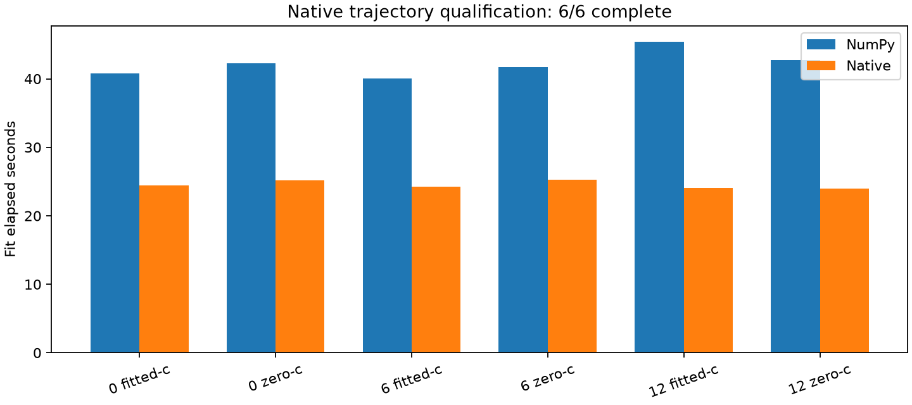

# Iteration62: native smooth-fit trajectory qualification

**6/6 complete; 3 satisfy every frozen tolerance.**
This compares implementations, not localization policies. No receiver reference
coordinate or position error is used in this audit. The first three ordinary
regions are selected by inventory order, not their outcomes. Both c arms use
identical starts,90second allowances,600iteration caps, priors and convergence gates.

| Endpoint | Arm | Qualified | Max coordinate delta km | Objective delta | NumPy/native evals |
|---:|---|---|---:|---:|---:|
| 0 | fitted-c | True | 9.194622e-08 | 1.200533e-10 | 598/605 |
| 0 | zero-c | False | 0.010012123 | 0.018340601 | 625/615 |
| 6 | fitted-c | True | 7.4835962e-07 | 3.2741809e-11 | 584/589 |
| 6 | zero-c | True | 1.7911366e-07 | 5.0931703e-11 | 606/616 |
| 12 | fitted-c | False | 0.069919135 | 2.1412879 | 653/630 |
| 12 | zero-c | False | 0.084196264 | 8.7116551 | 631/629 |

Frozen absolute tolerances: position coordinates1e-5km; other vector parameters
1e-3 in their native units; clock coefficients1e-3Hz; objective1e-5; RMS1e-5Hz.
Convergence state must match and c0 must remain locked. summary.json reports every
difference and check, including failures; no tolerance is relaxed after execution.
Floating-point evaluation equivalence alone does not guarantee identical optimizer
trajectories. This audit tests that distinction on six controls, not all recordings.

The native helper is private research code. The ongoing iteration60 pilot still
uses its original NumPy implementation and immutable receipts. No result is
replaced, and no production, contract, fixture or RF changes are made. Future use
still needs frozen budgets and policy, uniform cohort evaluation and independent
validation. This audit is consumed-data numerical qualification only.

## Qualification failed

Three controls fail the frozen trajectory tolerances despite pointwise objective/gradient equivalence. Maximum position-coordinate discrepancies are approximately10m,70m and84m. These are implementation-to-implementation differences, not errors against receiver truth. The native helper is not qualified as a drop-in numerical replacement. Keep the NumPy pilot unchanged. Any native use requires its own frozen outcomes and further investigation of optimizer sensitivity; do not relax tolerances retroactively.
