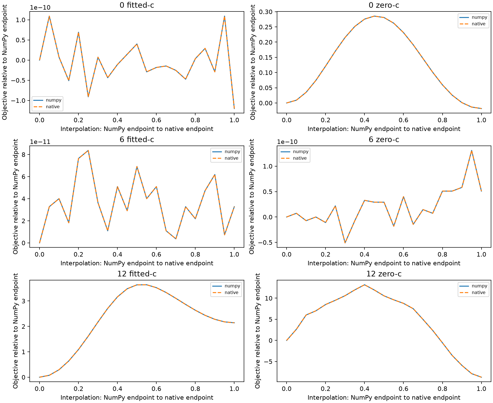

# Iteration63: divergent fits follow different paths on the same evaluated objective

Both implementations returned **identical objective values at all126 sampled
points** across the six fit pairs. Parameter gradients differed only at floating-
point roundoff scale. All connecting-path samples satisfied the existing position,
timing, affine and clock bounds, and saved endpoint scores were reproduced.

| Endpoint | Arm | Native minus NumPy score | Peak above endpoints | Max gradient difference |
|---:|---|---:|---:|---:|
| 0 | fitted-c | -1.20053301e-10 | 1.09139364e-10 | 2.22e-16 |
| 0 | zero-c | -0.0183406007 | 0.285511362 | 4.41e-16 |
| 6 | fitted-c | 3.27418093e-11 | 5.09317033e-11 | 2.21e-16 |
| 6 | zero-c | 5.09317033e-11 | 8.00355338e-11 | 1.78e-15 |
| 12 | fitted-c | 2.14128788 | 1.49650528 | 3.55e-15 |
| 12 | zero-c | -8.71165509 | 13.1727792 | 4.44e-16 |

## Interpretation

The three trajectory-qualification failures have sampled straight-line barriers
above both endpoints: about0.286,1.497 and13.173 objective units. Their native
endpoint scores are respectively0.018better,2.141worse and8.712better. The other
three pairs coincide within the frozen qualification tolerances; their plotted
score differences are at numerical precision. Axis scales differ deliberately.

This supports optimizer path sensitivity rather than a mathematical-model
mismatch at the sampled locations. Tiny evaluation-order differences can affect
iterative line-search decisions in a nonconvex problem. The audit does not trace
every optimization step, establish a unique causal iteration, prove distinct
topological basins, or exclude a lower curved path between endpoints. It does
not establish global optimality or better localization. No reference coordinates
or position errors enter this analysis, and score differences are not accuracy.

The failed drop-in qualification remains failed. Do not replace frozen NumPy
results with native endpoints or choose between implementations by receiver error.
Any future native experiment requires its own fixed implementation, ordinary
starts, score-based selection and matched c arms. The existing multistart pilots
continue unchanged and are the relevant tests of finding/selecting useful regions.

Protocol/source freeze7583f0029. All6fit pairs were retained, each evaluated at
21equally spaced parameter/clock interpolation points. Position/timing feasibility
uses the original seed-centered constraints; clock coefficients retain the2000Hz
bound. No fitting, production, public-contract, fixture or RF changes occurred.
