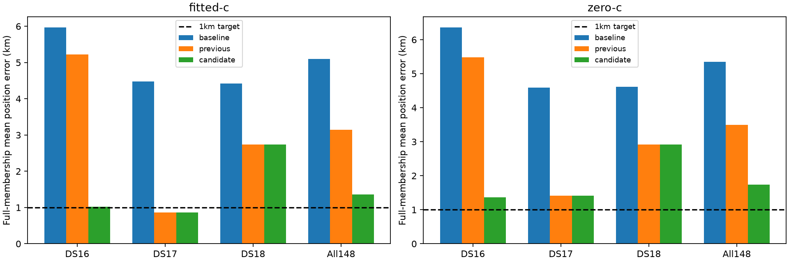

# Iteration65: complete148-recording uniform region-policy assessment

All **63 DS16,51 DS17 and34 DS18** members have matched completed results.
The uniform expanded-region candidate has pooled fitted-c mean error
**1.360148km**, versus
3.150628km for the preceding research pipeline and
5.097594km for bounded-recovery hard60 baseline.
The below1km goal remains unachieved. No single-scan diagnostic replacement or
independent-validation claim enters these means.

| Dataset | Arm | Baseline mean km | Previous research mean km | Expanded-region mean km |
|---|---|---:|---:|---:|
| DS16 | fitted-c | 5.964450 | 5.223513 | 1.017307 |
| DS16 | zero-c | 6.355169 | 5.484097 | 1.363228 |
| DS17 | fitted-c | 4.477043 | 0.864203 | 0.864203 |
| DS17 | zero-c | 4.585465 | 1.417183 | 1.417183 |
| DS18 | fitted-c | 4.422188 | 2.739331 | 2.739331 |
| DS18 | zero-c | 4.618410 | 2.917558 | 2.917558 |

## What changed

The policy retains baseline,25km-separated and50km-separated regional finalists,
then selects each c arm using converged regional score. Downstream joint clocks,
timing pruning, RF-time and satellite-slope fitting remain the frozen research
sequence. It adds regional computation; this is not an equal-total-compute claim.
Matched c arms preserve observations, candidate inputs, other priors and stage
budgets, with c0/RF-time locks. Frequency RMS is reported separately from position.

| Arm | Improved / regressed / tied versus previous research |
|---|---:|
| fitted-c | 1 / 0 / 147 |
| zero-c | 1 / 0 / 147 |

DS16-046 is the known consumed rescue:265.789km to0.798370km fitted-c and
261.743km to2.128007km c0. Its sep50 regional receipt was explicitly reused from
iteration48; this is reproduction in the uniform policy, not new validation.
The large DS18 failure remains in all means. The separate common-bank and smooth
horizon pilots do not replace any cohort result and are still development work.

## Coverage, failures and provenance

The [full cohort report](../2026_10_09_position_error_iter51/README.md) contains
every session, per-dataset mean/median/p95/worst, convergence/fallbacks, paired
regressions, separate RMS and original48/added15 DS16 subgroup metrics.
The two historical metadata serialization failures remain immutable; separately
frozen iteration64 retries completed with unchanged numerical policy. Their
original attempts and completion sources are retained in snapshot.json.

DS18 uses the frozen34-member authority and includes the sealed archive member.
Its24 previously consumed recordings remain flagged. No earlier registry match
for the other10 does not establish unseen validation; all evaluated data here are
now consumed research. No readiness/quality gate or exclusion changes membership.
The configured Sacramento250km spatial prior remains explicit. Known/reference
coordinates and errors are evaluation-only, never operational region/seed/bank
or per-scan hyperparameter selection inputs.

## Decision

Keep the expanded-region candidate as a demonstrated consumed-data tail rescue,
not a claim of broad average improvement or a promoted production default.
Complete the ordinary-start/common-bank and smooth-horizon pilots, evaluate any
resulting policy uniformly across all three datasets, and obtain independent
validation under a frozen rule. Mean error below1km is not yet proven. Existing
production deployment, fitted-c default and longest16-track PNG rendering remain
unchanged; no new RF collection is authorized or performed.
