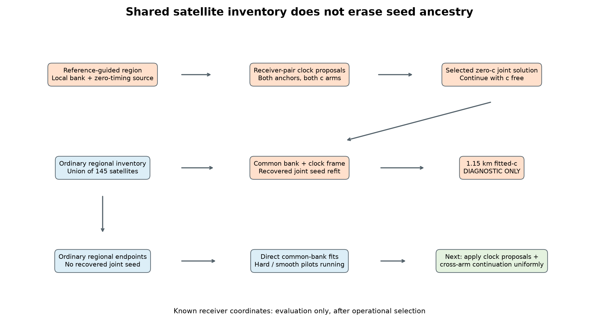

# Iteration 66: why the recovered seed is not an ordinary position start

The diagnostic recovery required **clock initialization and cross-arm
continuation**, in addition to a position region. Ordinary common-bank regional
starts do not yet reproduce that complete sequence. This provenance audit adds
no fits and changes no benchmark results.

## Common bank and allowable geometry

A satellite bank is a candidate list with orbit models. A common bank uses one
list for all competing position hypotheses within a recording. Predicted Doppler
and visibility still depend on each hypothesized receiver position. This is
necessary forward-model geometry, not access to the actual receiver position.
Different recording times can have different satellite IDs under the same rule.

The 145-satellite bank is the union from the iteration41 regional inventory,
without reference-error filtering. That inventory ranks ordinary coarse cells by
objective, uses a fixed tie order, and includes ordinary retained regions. Its
32-cell budget was developed on this consumed failure. The recovered joint seed
has a separate dependency: its region was originally selected using reference
proximity in iteration31. A reference-free bank does not remove that ancestry.

Known receiver coordinates must enter only after inference, to evaluate accuracy.
They must not choose satellite IDs, seeds, retained regions, per-scan priors or
winners. The configured Sacramento-centered 250 km search prior is an explicit
regional assumption; these experiments do not establish worldwide coverage.

## Audited recovery sequence

| Stage | Actual operation | Finding and limitation |
|---|---|---|
| 31/33 | Reference-guided region, local 32-satellite bank, original and zero-timing initializations | This is the origin of the diagnostic ancestry. |
| 36 | Generate receiver-pair affine clock proposals; try both receiver anchors plus unchanged continuation | Original-source sigma2 fitted result stays at 13.168349 km by score. Clock proposals alone do not rescue that start. |
| 37 | Apply the same proposal generator to both saved initializations | At sigma2, the zero-timing source with proposal1, preserving RX1 and correcting RX0, yields the selected **zero-c 1.517293 km** solution. Fitted-c still selects 13.168349 km. |
| 38 | Initialize both c arms from each selected complete arm solution, including its smooth-clock coefficients | Releasing c from the selected zero-c solution yields **0.998884 km fitted-c**, with objective 28061.005 instead of 28514.443. This adds fits and recenters local disks. |
| 39 | Give both timing-prior experiments the same four saved arm/prior solutions | Sigma2 retains 0.998884/1.517293 km; sharing complete solutions matters for a fair local comparison. |
| 40 | Continue the recovered sigma2 result through the downstream research stages | The final diagnostic becomes 0.759079/0.819865 km. It remains reference-guided and is not substituted into a dataset. |
| 46/52 | Transport complete joint seeds to a common 145-satellite bank and ordinary clock frame; refit | Sigma1 selects **1.151112/1.930915 km** fitted/zero. It still starts from the diagnostic recovery. |
| 53/55/60 | Transport ordinary regional endpoints; directly fit the shared-bank joint model | These remove the recovered seed, but do not generate the receiver-pair proposals or repeat the subsequent cross-arm continuation sequence. Both fitting jobs remain incomplete at this audit. |

Numbers across different rows use different candidate sets, stages or priors;
they are not an equal-budget progression or comparable objective series.
Frequency-fit improvements are not evidence of position accuracy by themselves.
The exact pair-generator controls and rejected/failed fits are retained in the
linked source reports and their raw receipts.

## Root-cause implication

The older successful sequence changed several coupled unknowns: receiver affine
clock offsets/slopes, smooth-clock coefficients, satellite timing, position, and
finally c. Its useful intermediate solution was found in the constrained c=0
model. Merely transporting an ordinary regional position plus its original clock
calibration does not recreate that intermediate state.

This explains why the existing direct-start experiment is not a replication of
the diagnostic recovery. It does **not** establish which step is sufficient in
the common-bank model, prove that local-bank continuation will work generally,
or excuse reference-guided region selection. The complete ordinary-start results
are still required before judging that experiment.

## Next controlled experiment design

After the pending direct-start and smooth-horizon comparisons finish, freeze a
new numerical protocol before running a continuation experiment:

1. Use every region retained by one documented ordinary inventory rule. Do not
   single out the historically useful region or choose starts using error.
2. Preserve a direct-start control. For each region, use the same fixed source
   initialization inventory and receiver-pair proposal generator. Try both
   anchors; retain unchanged continuation. Reject infeasible slopes explicitly,
   without clipping or choosing a different bound for a particular recording.
3. Give both c arms every generated start with identical fit budgets. Retain
   complete vectors and clock coefficients. Continue the converged per-arm
   winners into both arms, including continuing each into itself as a control.
4. If local banks are used for proposal exploration, transport the resulting
   hypotheses into the common bank and clock frame, verify prediction
   preservation, then refit before comparing across regions. Local-bank scores
   must not rank regions with different candidate lists.
5. Select only eligible converged solutions under the fixed common-model score,
   with deterministic ties and explicit fallbacks. Do not compare objectives
   across different priors or select an arm by its reference error.
6. Apply the eventual bank, proposal and selection policy uniformly to all
   DS16/DS17/DS18 members. Report additional fits, timing, failures, matched c
   ablations and paired regressions. Keep RMS separate from position metrics.

This is a design, not an executed or frozen numerical experiment. Priors, exact
source inventory, stage budgets and any local-bank continuation still need to be
fixed in that protocol. Choosing them from these outcomes is consumed-data
development. Independent validation needs eligible existing recordings under the
frozen policy; no new RF collection is authorized. A reference-free rescue on
this one recording would demonstrate reachability, not generalization.

## Full-cohort status and deployment

The completed [148-recording comparison](../2026_10_09_position_error_iter65/README.md)
remains authoritative: 63 DS16, 51 DS17 and 34 DS18, with no quality exclusions.
The fitted-c means are **1.017307, 0.864203 and 2.739331 km**, respectively;
pooled **1.360148 km**. Zero-c means are **1.363228, 1.417183 and 2.917558 km**;
pooled **1.738896 km**. The below-1-km goal is not achieved. The 1.15 km
single-scan diagnostic does not replace the remaining DS18 failure.

DS16's original48 and added15, and DS18's previously consumed24 and remaining10,
stay explicitly accounted for in the full cohort report. No registry match for
those10 is not evidence of unseen validation. No new independent-validation
success is claimed. Production hard60 bounded recovery, fitted-c default and
longest16-track review PNGs are unchanged.

## Evidence

This is a source/receipt provenance review, not a new numerical validation.
[Iteration36](../2026_10_08_position_error_iter36/README.md),
[37](../2026_10_08_position_error_iter37/README.md),
[38](../2026_10_08_position_error_iter38/README.md),
[39](../2026_10_08_position_error_iter39/README.md),
[40](../2026_10_08_position_error_iter40/README.md), and
[52](../2026_10_09_position_error_iter52/README.md) document the ancestry.
The [position-dependency audit](../2026_10_09_position_error_iter54/README.md)
continues to govern all research. `integrity.json` pins the reviewed sources and
this report's visualization source. No numerical source or receipt was changed.
