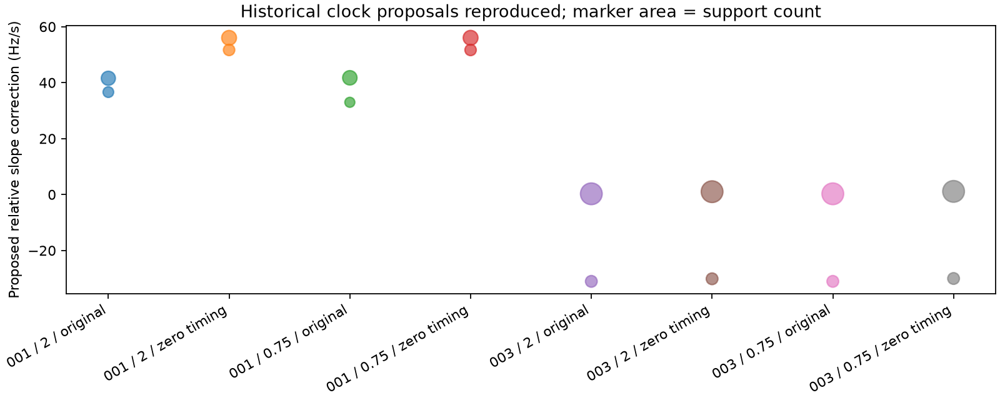

# Iteration 67: reference-free clock-start helper reproduces historical proposals

**Seven synthetic tests pass, and all eight historical proposal inventories
reproduce exactly.** This qualifies a reusable research helper for a future
ordinary-region continuation experiment. It is not a new localization result,
does not run an optimizer, and does not remove the historical oracle ancestry.

## Inputs and behavior

`clock_starts.py` accepts arrays of observation times, RF frequencies, receiver
IDs, measured frequencies, proposed nuisance corrections, and a seed vector.
There is no reference coordinate, reference error, satellite identity, candidate
bank or region-selection input. The caller supplies the nuisance correction from
an ordinary hypothesis: baseline plus affine/RF terms plus smooth-clock terms.
This narrow interface removes the need for the helper to inspect result documents
that also contain reference metadata. It does not prove arbitrary callers cannot
leak truth into those arrays; the caller and its seed provenance still need audit.

Pairs use the existing millisecond-rounded timestamp and exact-RF grouping.
Groups must contain exactly one observation per receiver; ambiguous/unmatched
groups are excluded explicitly. Same-time/RF pairing does not establish that both
receivers observed the same satellite. The circular line proposal generator is
unchanged from iteration36: two support-distinct proposals, each tried with both
receiver anchors, alongside unchanged continuation. No pair penalty is added to
the scientific likelihood. Infeasible added affine slopes are rejected, not
clipped. The bounds constrain residual affine coefficients in the current clock
frame, not the total physical LNB drift.

## Qualification

Commit `31ec9add7` froze source and the historical qualification protocol before
execution. Eight inventories cover two consumed cases, relative timing sigma2
and0.75, and original/zero-timing sources. The replay verifies proposal values,
support masks, rejected starts and the accepted start-name inventory against
the immutable iteration36/37 receipts. Each has five accepted starts: control,
two proposals times two anchors. This implies no new fits or accuracy gain.

As a separate consistency check, receiver-pair residuals reconstructed from the
stored measured differences and nuisance differences agree to a maximum
**2.04e-10 Hz**. The raw observation grouping helper is covered synthetically;
the historical replay uses saved pair receipts and is not a fresh end-to-end
reconstruction of every pair from raw observations.

| Consumed case | Prior sigma s | Source | Proposal slopes Hz/s | Support counts |
|---|---:|---|---|---|
| RESERVED-001 | 2 | original | 41.5694, 36.6169 | 103, 59 |
| RESERVED-001 | 2 | zero timing | 56.0175, 51.6925 | 113, 67 |
| RESERVED-001 | 0.75 | original | 41.7343, 32.9738 | 107, 52 |
| RESERVED-001 | 0.75 | zero timing | 56.0349, 51.6811 | 113, 67 |
| RESERVED-003 | 2 | original | 0.2642, -31.0469 | 244, 71 |
| RESERVED-003 | 2 | zero timing | 1.0161, -30.1224 | 244, 71 |
| RESERVED-003 | 0.75 | original | 0.2628, -31.0464 | 244, 71 |
| RESERVED-003 | 0.75 | zero timing | 1.1187, -30.0194 | 244, 71 |

These are corrections relative to each current hypothesis. The change between
sources is another reason not to interpret a proposal as an absolute receiver
clock measurement or satellite-identification result. Support is in-sample and
is not independent validation.

The four new tests cover ambiguous/unmatched grouping, cancellation of the shared
signal and existing nuisance terms, both anchor signs, preservation of unrelated
seed parameters, rejection without clipping, and empty-pair handling. The three
unchanged generator tests cover alias-boundary recovery with outliers, distinct
branches/determinism, and insufficient time span. Ruff passes. The rendered plot
was inspected. [Results](results.json) preserve full proposal masks; the
[protocol](protocol.json) hashes the executed sources and historical inputs.

## Interpretation and next step

The helper can reproduce the clock-proposal step without requesting a known
receiver location. A reference-free caller must still apply the same source
inventory and continuation policy to every retained region, supply both c arms
the same starts/budgets, and perform common-bank refitting before selecting
across regions. Historical oracle seeds are qualification fixtures only; they
cannot initialize the operational experiment.

The ordinary-start hard/smooth jobs remain live. Complete those comparisons,
then freeze the next continuation experiment described in
[iteration66](../2026_10_09_position_error_iter66/README.md). No extra optimizer
experiment was launched here. All DS16/DS17/DS18 membership, consumed-data labels
and full-cohort metrics remain unchanged: **1.360148 km fitted-c** and
**1.738896 km zero-c** across148. The goal remains open. Production deployment,
fitted-c default and longest16 PNG rendering are preserved. No RF collection,
public-contract or golden-fixture changes occurred.
