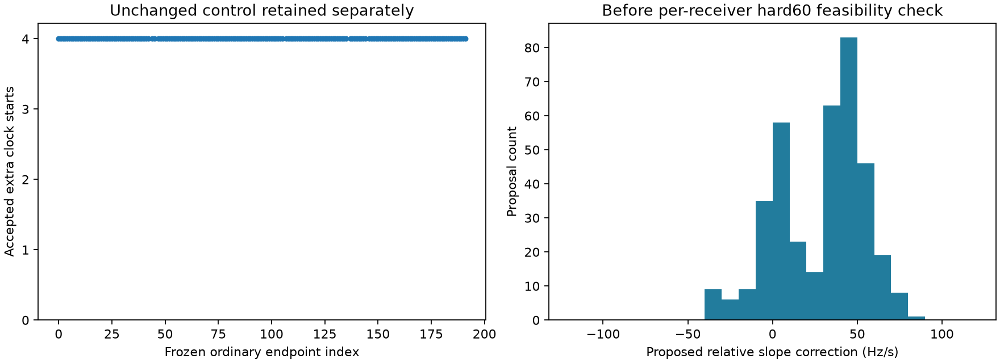

# Iteration68: observation reconstruction and ordinary clock-proposal inventory

**All eight historical pair/residual reconstructions pass.** The same helper
generates 748 feasible extra clock starts from
187 of187 feasible ordinary endpoints. This is
an input/preparation audit, not an optimization experiment or localization gain.

## Historical observation-path qualification

Commit `bb61524fe` froze the executable and523 source/input hashes before execution.
Both consumed recordings are loaded through the existing scientific input path.
For each of their four saved fitted-c states, the audit rebuilds singleton
receiver pairs directly from prepared observation times, RF and receiver IDs.
Pair indices exactly match the iteration34 receipts. Nuisance corrections are
rebuilt from each state's baseline, affine/RF parameters and smooth-clock
coefficients, then subtracted from measured frequencies.

All eight circular residual arrays match within1e-7Hz; the observed maximum
difference is **0Hz**.
Historical reference-guided states appear only in this isolated qualification.
They do not initialize the ordinary proposal census below. No optimizer runs,
reference errors, or new satellite assignments are used in either part.

## Ordinary proposal census

The census includes all192 ordinary endpoints from iteration53. The five already
infeasible shared-frame transports remain explicit and receive no proposals.
Every other endpoint uses its saved transported seed and clock coefficients with
the ordinary common145-bank calibration frame. Each contains[516]
singleton receiver pairs; this is the available-pair count, not confirmed
same-satellite support. The unchanged iteration36 consensus generator supplies
up to two line proposals, each tried with both receiver anchors.

| Item | Count |
|---|---:|
| All endpoints | 192 |
| Feasible / previously infeasible | 187 / 5 |
| Unchanged controls retained | 187 |
| Accepted extra clock starts | 748 |
| Extra starts rejected by residual slope bound | 0 |
| Endpoints with at least one accepted extra start | 187 |

No clipping is used. The ±60 bound applies to each receiver's resulting affine
coefficient in the shared frame. Proposed relative corrections can exceed60
while the resulting coefficients remain feasible, or be smaller and still fail.
This is not an absolute physical-clock drift measurement. The plot's proposal
slope distribution precedes this feasibility check.

Every feasible endpoint receives the same rule, without reference-error ranking
or choosing the historically useful region. Results preserve masks, starts,
rejections and the original192-member endpoint inventory. This does not commit
to fitting every proposal: the next experiment still needs a frozen, bounded,
uniform start/continuation budget and matched c arms. Candidate observations and
existing source calibration are reused; no extra pair likelihood is introduced.

## Interpretation and remaining work

Iteration67 reproduced the historical generator from saved residuals. This audit
closes the prepared-observation-to-residual path and demonstrates that ordinary
starts can supply proposals through the same array interface. It does not show
that these starts reach or select a better position. The existing direct hard
and smooth fitting jobs remain separate and unchanged.

The full148 cohort results remain1.360148km fitted-c /1.738896km c0, with all
63DS16,51DS17,34DS18 members accounted for. The known/reference position is
evaluation-only. All experiments here are consumed-data development. A common
bank and selection policy must be evaluated uniformly across those datasets;
independent validation remains required. The diagnostic1.15km result still cannot
replace the DS18 failure. Production, contracts, fixtures and RF collection are
unchanged. The below1km goal remains active.

[Raw results](results.json), [summary](summary.json), and [frozen protocol](protocol.json)
retain the audit evidence. Source checks and assertions passed; Ruff passes and
the visualization was inspected. The seven helper/generator tests passed in
iteration67; their numerical source is unchanged here.
