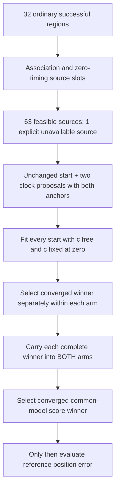

# Iteration69: ordinary-region clock proposals and cross-arm continuation

**Running; no accuracy result yet.** This experiment tests the missing recovery
steps with ordinary seeds under one fixed rule across every successful region.
The recovered diagnostic joint seed is excluded. Source and protocol were frozen
at `cf442c2e4`, with the exact unavailable-source count and budget corrected
before execution at `e7efe6940`. Neither correction used fitting outcomes.

## Fixed source inventory and coverage

For each of the32 successful ordinary inventory regions and each source type
(`association`, `zero-timing`), take the first feasible source arm in the frozen
iteration53 census order. The rule is identical for every region and does not
use position error. There are64 source slots,63 feasible. Region8's zero-timing
slot has no feasible source arm after shared-frame transport; it remains an
explicit unavailable entry in the protocol. Its association source is included.
The three earlier regional calibration failures remain in the parent inventory;
this diagnostic does not silently count them as successful searched regions.

Including zero-timing sources is deliberate: iteration37's diagnostic recovery
used that initialization. Restricting this test to association starts would omit
part of the proposed recovery mechanism. This is a globally fixed consumed-data
development choice, not an independent-validation claim.

## Fitting and selection

Every feasible source receives five starts from the audited iteration68 census:
unchanged continuation and two receiver-pair clock proposals, each preserving
RX0 or RX1. Both c arms get all five starts with identical20-second/600-iteration
limits. Proposal construction does not assume coincident signals share a satellite
and does not add a duplicate pair likelihood. Smooth-clock coefficients are
carried from the ordinary source, not reset or taken from a recovered solution.

Select each arm's converged lowest-score result from this first stage. Freeze
those two winners before any continuation; each available complete winner then
initializes both arms, with the same20-second/600-iteration limits. A missing
converged winner produces an explicit skipped continuation source. The continuation
fits recenter their25km local search disks on the preceding winners, which adds
search range as well as computation. No convergence tolerance is relaxed.

Final selection retains every eligible first-stage result and adds the qualified
continuations. Lowest common-model objective wins; exact ties favor earlier
inventory/stage order. No reference coordinate or error enters the evaluator.
The zero-c lock is asserted on every zero-c result. Unqualified fits stay in the
receipts and cannot win, even if the optimizer reports success.

The bank/calibration is common145 in the ordinary receiver-clock frame,
relative timing sigma1/common3, joint-clock100, hard horizon and residualhard60.
This is the same model as iteration55. The unchanged-start controls are rerun
under the new execution context; comparisons should use those controls on exactly
the completed source set. There are up to**882 new fits**, including controls and
continuations. Eight single-thread workers process disjoint source slots. Added
proposals and continuation are **not an equal-total-compute comparison** against
direct starts. Both c arms have matched proposed starts and per-fit budgets;
unavailable continuation sources are shared by both target arms.

## Why launch while the earlier jobs finish?

Iterations55 and60 continue unchanged. This experiment uses their fixed model
and the qualified observation/proposal path, not their provisional reference
errors to pick regions or tune settings. Its scientific question is independent:
do clock proposals plus complete-state cross-arm continuation reach a better
score-selected solution from ordinary hypotheses? Waiting for those jobs is not
a dependency of this frozen test. Full results from all three must be reported.

## Verification and interpretation

Three new selector tests pass: score/convergence overrides misleading reference
errors, deterministic tie handling and arm separation, and no qualified candidate
returns an explicit absence. The unchanged proposal path passed seven synthetic
tests, eight historical receipt reproductions, and eight prepared-observation
pair/residual reconstructions in iterations67/68. Frozen source/input hashes and
ordinary seed objective reconstructions are asserted before fitting. Ruff passes.
These checks do not establish localization accuracy or independent validation.

The eventual report must show all64 source slots, convergence/fallbacks, matched
direct/proposal/continuation comparisons, per-arm frequency RMS separately from
position accuracy, and score-selected winners. A single consumed-scan success
cannot replace the all148 cohort mean. Any promising policy must be applied
uniformly to all63 DS16,51 DS17 and34 DS18 members, preserving exposure labels,
then receive independent validation. The full-cohort means remain1.360148km
fitted-c and1.738896km zero-c. The below1km goal is not achieved.

No changes to production, public contracts, golden fixtures, QNAP data, or RF
collection. Existing hard60 bounded recovery, fitted-c default and longest16 PNG
rendering remain deployed. [Protocol](protocol.json) records every source slot,
the unavailable slot, model, budgets and hashes.
