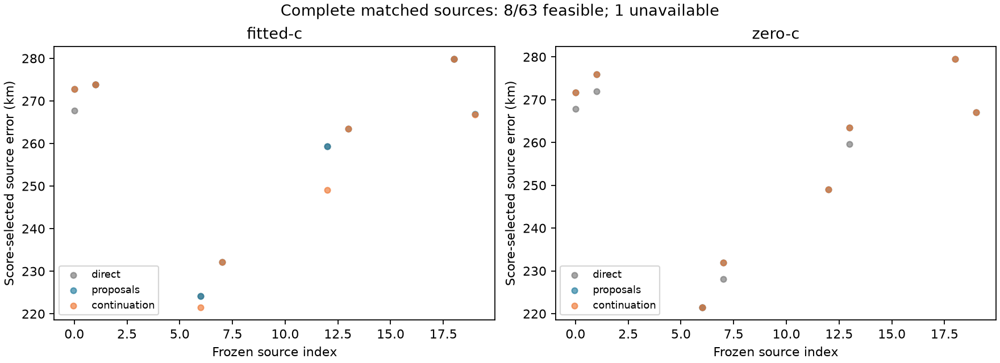

# Iteration69 results: ordinary clock proposals and continuation

**Stopped: 8/63 feasible sources complete;
one further source unavailable.**
Only completed source pipelines enter the three-way comparison. All64 planned
slots remain in coverage. There are157 fit receipts so far,
including52 independent-convergence failures.

## Score-selected winners on the matched completed-source set

| Arm | Search stage | Source | Objective | Position error km | Frequency RMS Hz |
|---|---|---:|---:|---:|---:|
| fitted-c | direct | 6 | 30690.009457 | 224.195728 | 117.399 |
| fitted-c | proposals | 12 | 30518.296512 | 259.352661 | 120.191 |
| fitted-c | continuation | 12 | 30435.285919 | 249.066896 | 117.532 |
| zero-c | direct | 6 | 30662.260999 | 221.415046 | 114.216 |
| zero-c | proposals | 12 | 30449.956852 | 249.004609 | 118.539 |
| zero-c | continuation | 12 | 30449.956852 | 249.004609 | 118.539 |

Reference error is evaluated after winner selection. These are alternative
hypotheses for one consumed recording, not independent dataset samples.
Lower objective or RMS does not establish better position accuracy. The direct
controls are new unchanged-start runs; historical iteration55 control differences
are separately retained in summary.json, not silently ignored or substituted.
Currently16 controls are compared, with
4 convergence-flag changes and maximum
absolute objective difference19.6403.
This is a numerical reproducibility audit, not an accuracy selection rule.

## Paired source changes relative to the new direct controls

| Arm | Stage | Improved / regressed / tied | Gained / lost convergence | Both unqualified |
|---|---|---:|---:|---:|
| fitted-c | proposals | 1 / 1 / 3 | 3 / 0 | 0 |
| fitted-c | continuation | 2 / 1 / 2 | 3 / 0 | 0 |
| zero-c | proposals | 0 / 4 / 1 | 3 / 0 | 0 |
| zero-c | continuation | 0 / 4 / 1 | 3 / 0 | 0 |

Position comparisons require both alternatives qualified, with1m tie tolerance.
Convergence gains are not counted as accuracy gains. Earlier eligible candidates
remain available, so a later score improvement can still worsen reference error.
Every fit uses20s/600; proposals and continuation add compute and recenter local
disks. Both arms share starts and stage budgets. No convergence gate is relaxed.

## Source coverage

| Source index | Region | Status |
|---:|---:|---|
| 0 | 0 | complete |
| 1 | 0 | complete |
| 6 | 1 | complete |
| 7 | 1 | complete |
| 12 | 3 | complete |
| 13 | 3 | complete |
| 18 | 4 | complete |
| 19 | 4 | complete |
| 24 | 5 | incomplete at stop |
| 25 | 5 | incomplete at stop |
| 30 | 6 | incomplete at stop |
| 31 | 6 | incomplete at stop |
| 36 | 7 | incomplete at stop |
| 37 | 7 | incomplete at stop |
| 42 | 8 | incomplete at stop |
| 48 | 9 | incomplete at stop |
| 49 | 9 | incomplete at stop |
| 54 | 10 | incomplete at stop |
| 55 | 10 | incomplete at stop |
| 60 | 11 | incomplete at stop |
| 61 | 11 | incomplete at stop |
| 66 | 12 | incomplete at stop |
| 67 | 12 | incomplete at stop |
| 72 | 13 | incomplete at stop |
| 73 | 13 | incomplete at stop |
| 78 | 14 | incomplete at stop |
| 79 | 14 | incomplete at stop |
| 84 | 15 | incomplete at stop |
| 85 | 15 | incomplete at stop |
| 90 | 16 | incomplete at stop |
| 91 | 16 | incomplete at stop |
| 96 | 17 | incomplete at stop |
| 97 | 17 | incomplete at stop |
| 102 | 19 | incomplete at stop |
| 103 | 19 | incomplete at stop |
| 108 | 21 | incomplete at stop |
| 109 | 21 | incomplete at stop |
| 114 | 22 | incomplete at stop |
| 115 | 22 | incomplete at stop |
| 120 | 23 | incomplete at stop |
| 121 | 23 | incomplete at stop |
| 126 | 24 | incomplete at stop |
| 127 | 24 | incomplete at stop |
| 132 | 25 | incomplete at stop |
| 133 | 25 | incomplete at stop |
| 138 | 26 | incomplete at stop |
| 139 | 26 | incomplete at stop |
| 144 | 27 | incomplete at stop |
| 148 | 27 | incomplete at stop |
| 150 | 28 | incomplete at stop |
| 151 | 28 | incomplete at stop |
| 156 | 29 | incomplete at stop |
| 157 | 29 | incomplete at stop |
| 162 | 30 | incomplete at stop |
| 163 | 30 | incomplete at stop |
| 168 | 31 | incomplete at stop |
| 169 | 31 | incomplete at stop |
| 174 | 32 | incomplete at stop |
| 175 | 32 | incomplete at stop |
| 180 | 33 | incomplete at stop |
| 181 | 33 | incomplete at stop |
| 186 | 34 | incomplete at stop |
| 187 | 34 | incomplete at stop |
| zero-timing | 8 | unavailable: no feasible source arm |

The frozen [experiment policy](README.md) explains the32-region inventory,
three parent calibration failures, common bank, ordinary clock frame, two source
types, priors and tie rules. This consumed single-recording experiment does not
replace any full-cohort result or prove independent generalization. Full148 means
remain1.360148km fitted-c /1.738896km zero-c. Uniform DS16/17/18 assessment and
independent validation remain necessary. Production and RF collection unchanged.
