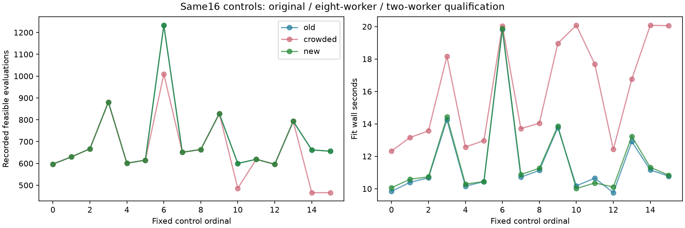

# Iteration70: lower-concurrency execution qualification

**Qualified on all16 fixed controls.**
Original/eight-worker/new convergence counts are
**14 / 10 / 14**.
There are0 losses relative to original controls and
0 new fits reaching the90-second wall allowance.

## Frozen test

Commit `69e5d4b99` froze the first eight iteration69 source indices, both c arms,
before execution. These are all16 controls from the first completed-source
comparison, not just its four regressions. There is no reference-position selection
or position-error computation. Two single-thread workers replace eight; the wall
allowance increases from20 to90seconds. The model,600-iteration limit, constraints,
starts, c locks and independent convergence gate remain unchanged. The original
direct sweep continued as a separate live job. This changes two execution settings,
so it does not isolate concurrency alone or claim equal computational budgets.

The observed max absolute objective difference from original is
**0**; max parameter-vector difference is
0 in mixed native units, and max smooth-clock
coefficient difference is0Hz. These are descriptive
reproducibility checks, not a relaxed accuracy/convergence threshold.

| Source | Arm | Evaluations: old / crowded / new | Converged: old / crowded / new | New s |
|---:|---|---:|---|---:|
| 0 | fitted-c | 597 / 597 / 597 | True / True / True | 10.056 |
| 0 | zero-c | 630 / 630 / 630 | True / True / True | 10.589 |
| 1 | fitted-c | 667 / 667 / 667 | True / True / True | 10.733 |
| 1 | zero-c | 881 / 881 / 881 | True / True / True | 14.434 |
| 6 | fitted-c | 601 / 601 / 601 | True / True / True | 10.292 |
| 6 | zero-c | 615 / 615 / 615 | True / True / True | 10.443 |
| 7 | fitted-c | 1233 / 1009 / 1233 | True / False / True | 19.885 |
| 7 | zero-c | 651 / 651 / 651 | True / True / True | 10.878 |
| 12 | fitted-c | 664 / 664 / 664 | True / True / True | 11.265 |
| 12 | zero-c | 828 / 828 / 828 | False / False / False | 13.868 |
| 13 | fitted-c | 600 / 486 / 600 | True / False / True | 10.013 |
| 13 | zero-c | 619 / 619 / 619 | True / True / True | 10.356 |
| 18 | fitted-c | 596 / 596 / 596 | True / True / True | 10.111 |
| 18 | zero-c | 793 / 793 / 793 | False / False / False | 13.234 |
| 19 | fitted-c | 662 / 466 / 662 | True / False / True | 11.321 |
| 19 | zero-c | 656 / 466 / 656 | True / False / True | 10.839 |

The preserved iteration69 stopped receipts remain first-attempt evidence, not
overwritten controls. Its partial position results do not decide whether the
clock-proposal method works. If this execution qualification passes, use a new
frozen protocol for the full ordinary-region continuation experiment with this
lower-concurrency/larger-allowance policy; rerun controls and proposals together.
No timing or convergence limits in an already executed protocol are changed.

The overlapping tails of55/60 must retain their first results with the execution
overlap disclosed. No completed cohort errors are replaced. All148 DS16/DS17/DS18
members and exposure labels remain unchanged, and the fitted-c mean is1.360148km.
This is execution qualification on consumed controls, not localization validation.
The below1km goal remains active; production and RF collection are unchanged.

[Protocol](protocol.json), [raw receipts](results/), and [comparison data](summary.json)
retain all16 controls and their original/crowded counterparts. Source hashes are
checked by the evaluator. No independent convergence gate was relaxed.
