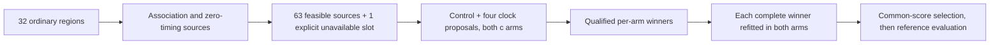

# Iteration71: clock continuation rerun after execution qualification

**Running, with no accuracy result yet.** This is a fresh execution of the
ordinary-region clock-proposal and cross-arm experiment. It uses two single-thread
workers and a90-second emergency wall allowance per fit, with the same600-iteration
limit and scientific convergence gate. Commit `bf678aa1e` froze source, protocol,
source inventory and execution settings before launch.

The [iteration70 qualification](../2026_10_09_position_error_iter70/README.md)
reproduced all16 original controls exactly in objective, parameter vector and
clock coefficients. It restored14/16 convergence versus10/16 under the stopped
eight-worker run. None reached90seconds. This supports the new execution setup on
those controls, not a claim that all future fits will converge or that accuracy
will improve.

The scientific policy is unchanged from the frozen
[iteration69 design](../2026_10_09_position_error_iter69/README.md): common145 bank
and ordinary clock frame, sigma1/common3, joint100, hard horizon, residualhard60,
all successful regions treated identically, both source types, both clock anchors,
matched c arms, complete clock vectors carried through continuation, and25km local
disks recentered on continuation seeds. No recovered/reference-guided joint seed
is used. Region8's zero-timing source remains explicitly unavailable because both
transported arm starts are infeasible; its association source is included.

Up to882 fits include newly rerun controls, proposals and continuations. No
iteration69 receipts are reused as numerical results. The increased wall
allowance and extra starts mean this is not equal-total-compute against the
original direct-start sweep. Both arms share the same inputs, starts and budgets.
Missing qualified continuation sources are shared across both target arms. Ties
favor earlier candidates; reference error never selects a winner or hyperparameter.

Preserve the stopped69 receipts as execution-confounded first-attempt evidence.
The overlap with late55/60 fits must remain disclosed when interpreting those
earlier experiments. This fresh protocol changes no completed scientific result.

All148 cohort means and memberships remain unchanged:63DS16,51DS17,34DS18;
fitted-c1.360148km, zero-c1.738896km. DS16 original48/added15 and DS18consumed24/
other10 remain explicitly accounted for. These are consumed development data,
not independent validation. Any useful general policy must be evaluated uniformly
across all three datasets and validated independently. Production hard60 recovery,
fitted-c default and longest16-track PNGs remain deployed. No RF collection,
contract, golden-fixture or QNAP changes.

[Protocol](protocol.json) contains the frozen source list, missing-source receipt,
budgets and input hashes. The numerical evaluator differs from69 only in its
per-fit wall allowance; the selector is byte-identical. Its three tests and the
qualified proposal-path tests remain applicable. Ruff passes.
