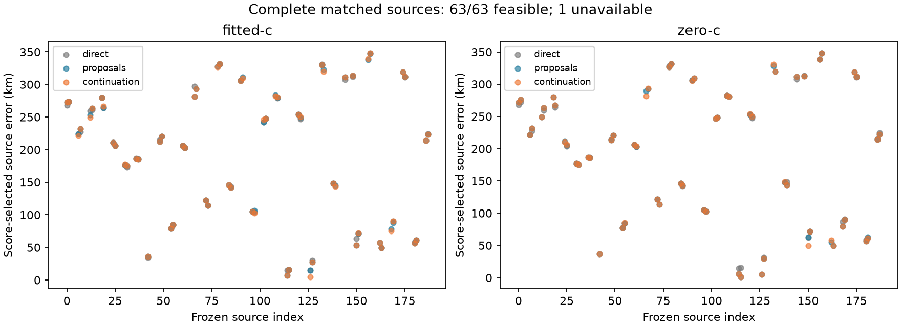

# Iteration71 results: ordinary clock proposals and continuation

**Complete: 63/63 feasible sources complete;
one further source unavailable.**
Only completed source pipelines enter the three-way comparison. All64 planned
slots remain in coverage. There are882 fit receipts so far,
including155 independent-convergence failures.
The longest recorded fit is71.964seconds;
0 reach the90-second allowance.
150 failed fits reported optimizer success
but did not pass the independent convergence gate; they remain ineligible.

## Score-selected winners on the matched completed-source set

| Arm | Search stage | Source | Objective | Position error km | Frequency RMS Hz |
|---|---|---:|---:|---:|---:|
| fitted-c | direct | 180 | 30030.854328 | 58.398433 | 97.599 |
| fitted-c | proposals | 180 | 29983.252593 | 56.567544 | 99.786 |
| fitted-c | continuation | 126 | 29558.389743 | 4.465721 | 100.789 |
| zero-c | direct | 180 | 30102.360078 | 58.639244 | 102.908 |
| zero-c | proposals | 115 | 29442.158624 | 0.889093 | 93.170 |
| zero-c | continuation | 115 | 29442.158624 | 0.889093 | 93.170 |

Reference error is evaluated after winner selection. These are alternative
hypotheses for one consumed recording, not independent dataset samples.
Lower objective or RMS does not establish better position accuracy. The direct
controls are new90-second unchanged-start runs; historical20-second iteration55 differences
are separately retained in summary.json, not silently ignored or substituted.
Currently126 controls are compared, with
2 convergence-flag changes and maximum
absolute objective difference1.3602.
This is a numerical reproducibility audit, not an accuracy selection rule.

## Paired source changes relative to the new direct controls

| Arm | Stage | Improved / regressed / tied | Gained / lost convergence | Both unqualified |
|---|---|---:|---:|---:|
| fitted-c | proposals | 16 / 14 / 21 | 12 / 0 | 0 |
| fitted-c | continuation | 18 / 18 / 15 | 12 / 0 | 0 |
| zero-c | proposals | 14 / 16 / 15 | 18 / 0 | 0 |
| zero-c | continuation | 18 / 18 / 9 | 18 / 0 | 0 |

Position comparisons require both alternatives qualified, with1m tie tolerance.
Convergence gains are not counted as accuracy gains. Earlier eligible candidates
remain available, so a later score improvement can still worsen reference error.
Every fit uses90s/600; proposals and continuation add compute and recenter local
disks. Both arms share starts and stage budgets. No convergence gate is relaxed.

## Source coverage

| Source index | Region | Status |
|---:|---:|---|
| 0 | 0 | complete |
| 1 | 0 | complete |
| 6 | 1 | complete |
| 7 | 1 | complete |
| 12 | 3 | complete |
| 13 | 3 | complete |
| 18 | 4 | complete |
| 19 | 4 | complete |
| 24 | 5 | complete |
| 25 | 5 | complete |
| 30 | 6 | complete |
| 31 | 6 | complete |
| 36 | 7 | complete |
| 37 | 7 | complete |
| 42 | 8 | complete |
| 48 | 9 | complete |
| 49 | 9 | complete |
| 54 | 10 | complete |
| 55 | 10 | complete |
| 60 | 11 | complete |
| 61 | 11 | complete |
| 66 | 12 | complete |
| 67 | 12 | complete |
| 72 | 13 | complete |
| 73 | 13 | complete |
| 78 | 14 | complete |
| 79 | 14 | complete |
| 84 | 15 | complete |
| 85 | 15 | complete |
| 90 | 16 | complete |
| 91 | 16 | complete |
| 96 | 17 | complete |
| 97 | 17 | complete |
| 102 | 19 | complete |
| 103 | 19 | complete |
| 108 | 21 | complete |
| 109 | 21 | complete |
| 114 | 22 | complete |
| 115 | 22 | complete |
| 120 | 23 | complete |
| 121 | 23 | complete |
| 126 | 24 | complete |
| 127 | 24 | complete |
| 132 | 25 | complete |
| 133 | 25 | complete |
| 138 | 26 | complete |
| 139 | 26 | complete |
| 144 | 27 | complete |
| 148 | 27 | complete |
| 150 | 28 | complete |
| 151 | 28 | complete |
| 156 | 29 | complete |
| 157 | 29 | complete |
| 162 | 30 | complete |
| 163 | 30 | complete |
| 168 | 31 | complete |
| 169 | 31 | complete |
| 174 | 32 | complete |
| 175 | 32 | complete |
| 180 | 33 | complete |
| 181 | 33 | complete |
| 186 | 34 | complete |
| 187 | 34 | complete |
| zero-timing | 8 | unavailable: no feasible source arm |

The frozen [experiment policy](README.md) explains the32-region inventory,
three parent calibration failures, common bank, ordinary clock frame, two source
types, priors and tie rules. This consumed single-recording experiment does not
replace any full-cohort result or prove independent generalization. Full148 means
remain1.360148km fitted-c /1.738896km zero-c. Uniform DS16/17/18 assessment and
independent validation remain necessary. Production and RF collection unchanged.
