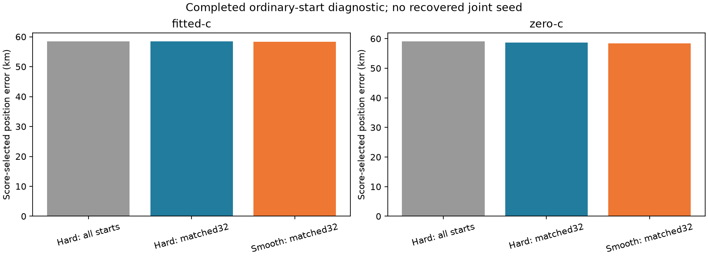

# Iteration72: completed ordinary-start direct and smooth diagnostics

**Neither direct-start search rescues this failure.** The fitted-c score-selected
errors are58.398433km for hard and58.372248km for smooth. A qualified3.433656km
hard endpoint exists but loses under the model score. The smooth configuration
has63/64 converged fits versus43/64 matched hard fits, but the different wall
allowances and late execution overlap prevent attributing that difference to
smoothness alone. The better convergence count does not fix localization.

All192 ordinary endpoints have paired hard-model receipts, including five
explicitly infeasible endpoints in each c arm. The smooth pilot has all32 regions
completed in both arms, with exactly matching hard controls. No recovered joint
seed was used. These are consumed single-recording diagnostics, not replacement
DS18 benchmark results or an independent-validation success.

## Selected results

| Arm | Search | Winning source | Error km | Frequency RMS Hz | Objective |
|---|---|---:|---:|---:|---:|
| fitted-c | Hard all192 | 180 | 58.398433 | 97.599 | 30030.854 |
| fitted-c | Hard matched32 | 180 | 58.398433 | 97.599 | 30030.854 |
| fitted-c | Smooth matched32 | 180 | 58.372248 | 98.005 | 30018.940 |
| zero-c | Hard all192 | 185 | 59.017551 | 101.789 | 30084.958 |
| zero-c | Hard matched32 | 180 | 58.639244 | 102.908 | 30102.360 |
| zero-c | Smooth matched32 | 180 | 58.416093 | 102.870 | 30087.159 |

Each winner minimizes its own model's objective among qualified candidates,
with deterministic index ties. Reference error enters afterward. Objective values
across hard/smooth models are not directly comparable. The all-start hard result
uses more starts than the32-region pilot and is not a matched-budget comparator.

## Convergence and failure accounting

| Arm | All hard: conv / fail / infeasible | Matched hard: conv / fail | Smooth: conv / fail |
|---|---:|---:|---:|
| fitted-c | 145 / 42 / 5 | 23 / 9 | 31 / 1 |
| zero-c | 128 / 59 / 5 | 20 / 12 | 32 / 0 |

Both completed-source inventories preserve the three earlier regional calibration
failures in their parent inventory. No failed fit becomes eligible merely because
the optimizer reports success. No diagnostic result is substituted into cohort
means. Full per-source coverage and paired regressions are in the source reports.

## Evaluation-only reachability check

The closest qualified hard-model endpoint is an evaluation diagnostic; it does
not select an operational winner or a seed for a future scan.

| Arm | Closest qualified source | Error km | Objective | Operational winner objective |
|---|---:|---:|---:|---:|
| fitted-c | 118 | 3.433656 | 30829.036 | 30030.854 |
| zero-c | 118 | 3.491981 | 30832.174 | 30084.958 |

These observations distinguish sampled hypotheses from the model's selected
answer; they cannot justify truth-guided retention. The earlier1.15km recovered
joint seed remains diagnostic because of its reference-guided ancestry. Direct
ordinary starts and the clock-proposal/cross-arm sequence are different searches.
The latter is running separately in iteration71 with the fixed source policy.

## Execution limitations

Hard fits use20seconds/600iterations; smooth fits use90seconds/600iterations,
following measured implementation cost. This is not an equal-wall-budget test.
Late fits overlapped the eight-worker iteration69 run, where unchanged controls
showed reduced evaluation counts and four convergence losses at20seconds.
Iteration70 restored all16 original numerical solutions under two workers and a
larger allowance. Therefore this first-attempt comparison cannot isolate horizon
smoothness from available numerical work. Preserve the original receipts and
report limitations; any controlled repeat requires separate frozen execution.

The numerical models and scientific convergence gates remained fixed. Reporting
updates only mark complete coverage and disclose execution overlap. Results are
descriptive evidence, not grounds for deploying a new default.

## Dataset and goal status

Full-cohort means remain1.360148km fitted-c /1.738896km zero-c over63DS16,
51DS17 and34DS18. The original48/additional15 DS16 membership and consumed24/
other10 DS18 exposure accounting remain intact. The below1km goal is unachieved.
Uniform three-dataset policy evaluation and independent validation remain required.
No production, contract, fixture, QNAP or RF changes occurred.

[Complete hard report](../2026_10_09_position_error_iter55/README.md),
[matched hard/smooth report](../2026_10_09_position_error_iter60/README.md), and
[execution qualification](../2026_10_09_position_error_iter70/README.md) provide
the full receipts, metrics and limitations. This report's summary pins its source
summaries by SHA256 and refuses to overwrite the completed snapshot.
