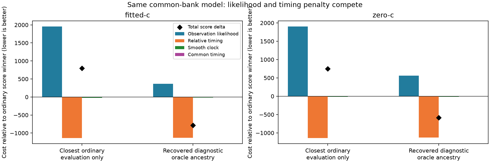

# Iteration73: the nearby ordinary solution loses on observation fit, not timing penalty

**The3.43km fitted-c hypothesis already has a much smaller timing penalty than
the58.40km winner. It loses because its observation-likelihood cost is worse by
more than that penalty advantage.** The historical recovered solution combines
low timing penalty with a better observation fit, but retains oracle ancestry.
This audit changes no fits, starts, priors, winners or dataset errors.

## Fixed-state reconstruction

Commit `06e548ee2` froze12 saved states before evaluation: both ordinary score
winners, both closest qualified evaluation-only states from the completed direct
search, and all eight historical iteration52 states. Rebuild the same common145
bank/ordinary clock frame, sigma1/common3 and joint100 model. Direct evaluations
reproduce every saved objective within1e-6; the four components sum to objective
within1e-7 and clock penalties reproduce within1e-7. No optimization is run.

The raw key `frequency_nll` is the **full observation mixture likelihood**,
including visibility, detection/clutter and normalization terms. It is not just
squared frequency residual. RMS is reported separately and must not stand in for
the full score or for position accuracy.

| Arm | State | Error km | Obs. NLL | Relative timing | Clock | Common timing | Total | RMS Hz |
|---|---|---:|---:|---:|---:|---:|---:|---:|
| fitted-c | operational-winner | 58.398433 | 28791.301 | 1194.538 | 44.884 | 0.131 | 30030.854 | 97.599 |
| fitted-c | closest-evaluation-only | 3.433656 | 30749.264 | 53.939 | 25.773 | 0.060 | 30829.036 | 124.422 |
| fitted-c | historical-recovered | 1.151112 | 29154.582 | 62.394 | 29.611 | 0.028 | 29246.615 | 85.273 |
| zero-c | operational-winner | 59.017551 | 28850.327 | 1193.883 | 40.603 | 0.145 | 30084.958 | 101.789 |
| zero-c | closest-evaluation-only | 3.491981 | 30754.583 | 51.244 | 26.284 | 0.063 | 30832.174 | 124.854 |
| zero-c | historical-recovered | 1.930915 | 29411.026 | 63.995 | 23.853 | 0.022 | 29498.895 | 91.121 |

## Cost differences from each arm's ordinary winner

| Arm | Alternative | Obs. delta | Relative timing | Clock | Common timing | Total delta |
|---|---|---:|---:|---:|---:|---:|
| fitted-c | Closest ordinary (evaluation only) | +1957.963 | -1140.600 | -19.111 | -0.071 | +798.182 |
| fitted-c | Recovered diagnostic (oracle ancestry) | +363.282 | -1132.145 | -15.274 | -0.103 | -784.240 |
| zero-c | Closest ordinary (evaluation only) | +1904.256 | -1142.639 | -14.319 | -0.082 | +747.216 |
| zero-c | Recovered diagnostic (oracle ancestry) | +560.699 | -1129.889 | -16.750 | -0.123 | -586.063 |

The timing prior favors the nearby ordinary state strongly, but its observation
fit remains poor. In the historical recovered state, observation cost is still
worse than the distant winner, yet the timing-prior saving more than compensates.
Thus the same objective can favor a recovered nearby state when one is available.
The direct ordinary search has not reached that complete state; a position near
the receiver is insufficient if its other fitted parameters remain in a different
minimum. These fixed endpoints differ in multiple parameters, so the audit does
not isolate clocks as the sole cause or prove a connecting optimization path.

It would be premature to fix this by tuning a stronger prior from one scan's
reference error. Iteration71 instead tests the already specified clock proposals
and cross-arm continuation uniformly across all ordinary regions and both source
types. Its result will test a search-mechanism hypothesis; this decomposition does
not supply any new seed to that running experiment.

## Receiver-pair diagnostic, with identity caveat

Across516 same-time/RF singleton pairs, the fraction of corrected differences
within250Hz is about0.2% for the closest ordinary state, versus21–23% for the
distant winner and recovered diagnostic. The all-pair median absolute difference
is about44–47kHz in all these states. Most pairs are therefore not a demonstrated
common-satellite sample. Neither that median nor the within250Hz fraction is an
independent physical clock truth measurement or an operational selection score.
They only motivate robust pair-derived proposals; no duplicate pair penalty is
added to the likelihood. Raw per-state counts/fractions remain in results.json.

## Truth isolation and goal status

The closest-state label uses reference position only for post-fit root-cause
evaluation. It is explicitly prohibited as a future operational seed-selection
rule. Historical recovered states carry the iteration31 reference-guided region
ancestry, despite the reference-free bank construction. They remain diagnostic.
No reference coordinate affects an operational bank, region, prior or winner.

All148 cohort means remain1.360148km fitted-c /1.738896km zero-c, with63DS16,
51DS17 and34DS18 fully accounted for and their exposure labels preserved.
No completed cohort result is replaced. Independent validation remains required.
Production hard60 recovery, fitted-c default and longest16 PNGs remain unchanged;
no new RF collection or public-contract/fixture changes. The below1km goal remains
active. Ruff passes and the component plot was inspected.

[Raw fixed-state audit](results.json), [differences](summary.json) and
[frozen protocol](protocol.json) retain all evidence, including the unqualified
historical state that was never eligible to win.
