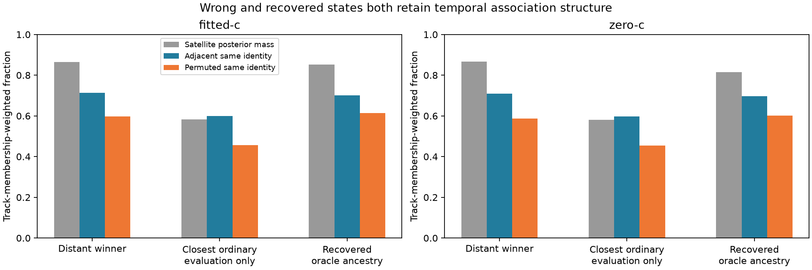

# Iteration74: simple continuity diagnostics do not distinguish the recovered state

**The distant winner is already temporally structured on the existing orbit-blind
tracks.** Its fitted-c adjacent same-satellite agreement is0.712 versus0.701 for
the recovered diagnostic. Both exceed their within-track permutation values.
The ordinary3.43km state is less coherent at0.599 and assigns much less mass to
satellites. These descriptive statistics do not provide a clean rule that ranks
the recovered state over the distant winner.

## Frozen scope and coverage

Commit `522383983` froze code and inputs before execution. The same12 fixed states
as iteration73 are evaluated under the unchanged common145 joint model; each
saved objective reconstructs within1e-6. No fit, bank, prior or operational winner
changes. Known receiver coordinates do not enter this audit's computations.
The closest state's prior selection was explicitly evaluation-only; historical
recovered states retain oracle ancestry and cannot initialize operational work.

Use all24 existing prepared bootstrap tracks, generated without orbit or receiver
reference information. Preparation keeps up to12 long tracks per receiver after
minimum15-window/15-second requirements. Therefore this is a fixed bootstrap
subset, not a census of all possible tracks. It covers
**1050/2299 unique windows**, with
1051 track memberships; one membership is duplicated.
Overlapping memberships are reported rather than treated as independent samples.

## Statistics and their meaning

For adjacent windows, sum products of same-satellite posterior probabilities and
divide by the product of total satellite posterior masses. Aggregate numerator
and denominator across the fixed tracks. This is posterior same-identity agreement
conditioned on both observations being signal; it is not a known-identity accuracy
measurement. Satellite mass is reported separately so clutter-dominated tracks
cannot appear strong merely through conditional normalization.

The MAP switch statistic counts identity changes only when both adjacent maximum
posterior states are satellites; clutter transitions do not count as satellite
switches. The dominant share is the median across tracks of the largest satellite's
share of total satellite mass. One deterministic within-track permutation, shared
across all states, provides descriptive time-order contrast. It preserves each
track's membership and posterior distribution. This is not an independent null
sample, confidence interval or significance test.

| State | Arm | Source | Qualified | Signal | Adjacent | Permuted | Switches / pairs | Dominant |
|---|---|---:|---|---:|---:|---:|---:|---:|
| operational-winner | fitted-c | 180 | True | 0.866 | 0.712 | 0.598 | 207 / 919 | 0.770 |
| closest-evaluation-only | fitted-c | 118 | True | 0.584 | 0.599 | 0.457 | 209 / 548 | 0.491 |
| operational-winner | zero-c | 185 | True | 0.867 | 0.710 | 0.587 | 222 / 912 | 0.762 |
| closest-evaluation-only | zero-c | 118 | True | 0.581 | 0.597 | 0.454 | 210 / 539 | 0.483 |
| historical-ordinary | fitted-c | 0 | False | 0.870 | 0.718 | 0.605 | 193 / 918 | 0.762 |
| historical-ordinary | zero-c | 1 | True | 0.867 | 0.718 | 0.600 | 209 / 920 | 0.775 |
| historical-ordinary | fitted-c | 2 | True | 0.868 | 0.719 | 0.601 | 190 / 914 | 0.774 |
| historical-ordinary | zero-c | 3 | True | 0.867 | 0.719 | 0.606 | 210 / 921 | 0.764 |
| historical-recovered | fitted-c | 4 | True | 0.853 | 0.701 | 0.613 | 193 / 902 | 0.769 |
| historical-recovered | zero-c | 5 | True | 0.816 | 0.697 | 0.601 | 205 / 853 | 0.749 |
| historical-recovered | fitted-c | 6 | True | 0.820 | 0.707 | 0.628 | 191 / 861 | 0.790 |
| historical-recovered | zero-c | 7 | True | 0.813 | 0.706 | 0.620 | 203 / 847 | 0.770 |

The raw switch fraction slightly favors some recovered states, while soft adjacent
agreement and signal fraction favor the distant winner. Thus there is no consistent
separation across these simple statistics. Both families can explain temporally
structured frequency trajectories under different timing/clock assignments.
This supports investigating complete joint minima rather than treating the wrong
answer as necessarily a sequence of unrelated per-window coincidences.

## Decision and limits

Do not add a continuity cutoff or pick its weight from this scan's reference
errors. The audit does not rule out a proper joint track likelihood or temporal
association model; testing one would require a frozen generative model, gradients,
matched c arms and ordinary starts, followed by uniform DS16/DS17/DS18 evaluation
and independent validation. The present subset and posterior diagnostics cannot
prove which satellite identities are physically correct.

Iteration71 continues its fixed ordinary clock-proposal and cross-arm search,
unchanged by these evaluation diagnostics. No result replaces the full148 cohort:
mean1.360148km fitted-c /1.738896km zero-c, with complete63/51/34 membership and
preserved exposure labels. No RF collection, production or contract changes.
The below1km goal remains active.

Three synthetic tests pass: coherent versus clutter-only tracks, alternating
identities, and satellite-column permutation invariance within floating-point
roundoff. All12 score reconstructions pass. Ruff passes and the plot was inspected.
[Raw results](results.json) contain every fixed track's indices and ordered/
permuted statistics; [summary](summary.json) contains every state, including the
unqualified historical state. [Protocol](protocol.json) retains the frozen hashes.
