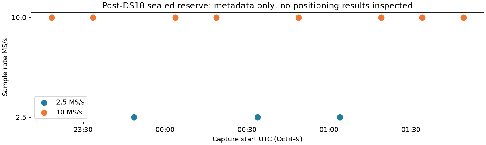

# Iteration75: sealed post-DS18 reserve for future validation

Frozen **11 existing whole recordings** after DS18's endpoint, before
inspecting their localization outcomes. This is a potential validation reserve,
**not yet certified unseen validation** and not a change to DS16/DS17/DS18.
No new RF collection, analysis run, publication or retention hold was initiated.

| Property | Value |
|---|---|
| Reserve identifier | POST18-RESERVE |
| Start inclusive | 2026-10-08T23:08:51+00:00 |
| Cutoff exclusive; sealed by cutoff | 2026-10-09T02:02:21+00:00 |
| Recordings | 11 |
| Retained visits | 24237 |
| Valid seconds per receiver | 2908.44 |
| Sample rates | 3 at2.5MS/s,8 at10MS/s |
| Manifest SHA256 | `71e7477408e31449c14f85a7ae87155780e88c2503dc06544ab00a59016483af` |
| Excluded candidates / observed unsealed partials | 0 / 0 |
| Prior filename matches in the audited scope | 0 recordings |

Commit `c7184a7ea` froze the boundary and source hashes before inventory. The end
is the clock timestamp taken before the first live inventory. The existing
metadata-only DS17/DS18 mint was reused unchanged with explicit successor identity
and boundaries. Its seal verifier passed. The parent DS18 manifest is bound to
the user-specified894a6f4b7055e5f6bd602f94ce3acf7f722f204c68c2b521a06dfd6be35a7516.

Authoritative local manifest:
`/home/mouse9911/gits/leo-hard60-default/reports/2026_10_09_position_error_iter75/local/manifest.json`,
with `seal.json` alongside it. Source snapshots and seals stay local; the small
[membership receipt](membership.json) publishes every member and its bindings.
Raw IQ was not copied, decompressed or rehashed. Inventory is a live, non-atomic
metadata read; future storage availability is not guaranteed.

## Complete membership

| Label | Session | Capture start UTC | MS/s | Visits | Prior matching files |
|---|---|---|---:|---:|---:|
| POST18-RESERVE-001 | `scan-fw-0171c03b0895ea3e` | 2026-10-08T23:18:31.026891+00:00 | 10 | 2199 | 0 |
| POST18-RESERVE-002 | `scan-fw-89be619608df5549` | 2026-10-08T23:33:34.602066+00:00 | 10 | 2198 | 0 |
| POST18-RESERVE-003 | `scan-fw-70f0b98bbad22092` | 2026-10-08T23:48:39.854672+00:00 | 2.5 | 2215 | 0 |
| POST18-RESERVE-004 | `scan-fw-b43ebe18ce112a60` | 2026-10-09T00:03:43.288094+00:00 | 10 | 2197 | 0 |
| POST18-RESERVE-005 | `scan-fw-fcbb8c3b4eaa11dc` | 2026-10-09T00:18:47.124486+00:00 | 10 | 2204 | 0 |
| POST18-RESERVE-006 | `scan-fw-476a8f412cef5751` | 2026-10-09T00:33:51.982773+00:00 | 2.5 | 2212 | 0 |
| POST18-RESERVE-007 | `scan-fw-da4530b2f89e118c` | 2026-10-09T00:48:55.797311+00:00 | 10 | 2202 | 0 |
| POST18-RESERVE-008 | `scan-fw-5b7baf1b2efda9a2` | 2026-10-09T01:04:00.220086+00:00 | 2.5 | 2218 | 0 |
| POST18-RESERVE-009 | `scan-fw-a9e237659e626184` | 2026-10-09T01:19:04.133407+00:00 | 10 | 2193 | 0 |
| POST18-RESERVE-010 | `scan-fw-72cbdef9fd704fa5` | 2026-10-09T01:34:07.890034+00:00 | 10 | 2200 | 0 |
| POST18-RESERVE-011 | `scan-fw-65550c7e66119ef1` | 2026-10-09T01:49:12.155140+00:00 | 10 | 2199 | 0 |

Both receivers stay together. Admission depends on capture-start boundary and
seal completion, not localization availability, signal quality or position error.
Disjointness from all63DS16,51DS17 and34DS18 members was checked by session ID and
uncompressed-IQ digest, with zero intersections. The parent-manifest hashes and
counts are retained in membership.json.

## Prior exposure and interpretation

The exact session IDs were searched in JSON/Markdown/Python/CSV report text in
both repository worktrees, returning only filenames and matching IDs. No
localization values were extracted, inspected or used. Default ignore rules apply;
external notebooks, other machines and private conversations were not audited.
No matching filename alone cannot prove independence. Matching filenames, if any,
are preserved per member for classification before validation, not used as a
quality-based membership exclusion.

The first unprivileged search stopped on unreadable local report-cache paths;
no no-match conclusion was taken from it. Its exact source is preserved as
exposure-attempt1.txt. A privileged batched exact-ID search completed afterward.
The intermediate privileged launch lacked rg in its default PATH; the completed
attempt used the explicit installed rg path. Neither failed attempt produced an
exposure conclusion or changed membership.

Keep positioning outcomes unexamined until the candidate and validation protocol
are frozen. A future evaluation must retain all11 members, explicitly report
missing inputs/failures, match c0/fitted-c observations/banks/priors/budgets, and
show position metrics separately from frequency-fit effects. Any revealed outcome
becomes consumed development evidence for subsequent tuning. This small reserve
does not establish worldwide, mobile-receiver or broad hardware generalization.

## Ongoing research and deployment

Iteration71's ordinary clock-proposal/cross-arm experiment continues unchanged.
The full148 DS16/DS17/DS18 benchmark mean remains1.360148km fitted-c /1.738896km
zero-c. The below1km goal is not achieved. Existing production hard60 recovery,
fitted-c default and longest16-track PNGs are preserved. No RF collection,
analysis default, contract, fixture or QNAP path was changed.
