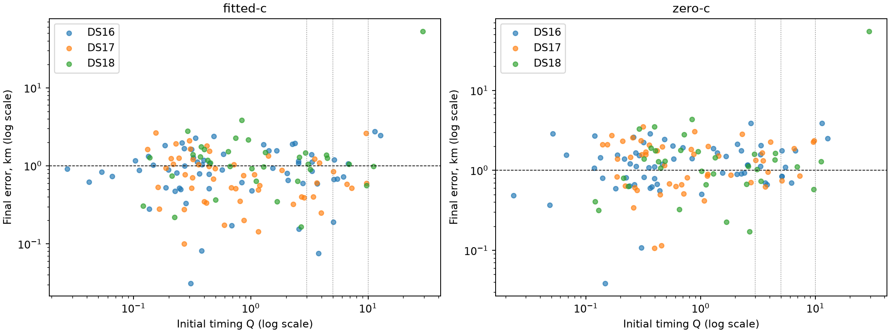

# Iteration 76: can timing strain request extra search?

This is a development audit of all 148 already consumed scans, not independent validation. It changes no position estimate, winner, satellite bank, or dataset membership. No extra-search speed or accuracy benefit has yet been measured.

Before this audit, commit `33152faef` froze thresholds 3, 5, and 10. For each initial joint-100 fit, Q is the mean squared orthonormal relative-timing coefficient divided by the existing 2-second prior variance. Q is basis invariant but is not a calibrated chi-square statistic. A missing/nonconverged fit or Q above the threshold in either c arm requests the same extra search budget for both arms. This would request computation, never discard a scan or accept a position.

Reference errors enter only after flags are computed. All three thresholds apply uniformly to DS16/DS17/DS18. The table evaluates flags against the unchanged iteration-65 final candidate errors, which occur later in the pipeline; successful existing recovery can therefore make an early flag appear unnecessary.

| Dataset | Threshold | Flagged / all | Fitted >2 km caught / all | Zero >2 km caught / all | Fitted >5 km caught / all | Zero >5 km caught / all |
|---|---:|---:|---:|---:|---:|---:|
| DS16 | 3 | 13 / 63 | 2 / 4 | 3 / 12 | 0 / 0 | 0 / 0 |
| DS16 | 5 | 8 / 63 | 2 / 4 | 2 / 12 | 0 / 0 | 0 / 0 |
| DS16 | 10 | 2 / 63 | 2 / 4 | 2 / 12 | 0 / 0 | 0 / 0 |
| DS17 | 3 | 12 / 51 | 1 / 3 | 3 / 13 | 0 / 0 | 0 / 0 |
| DS17 | 5 | 6 / 51 | 1 / 3 | 2 / 13 | 0 / 0 | 0 / 0 |
| DS17 | 10 | 2 / 51 | 0 / 3 | 1 / 13 | 0 / 0 | 0 / 0 |
| DS18 | 3 | 8 / 34 | 1 / 5 | 1 / 5 | 1 / 1 | 1 / 1 |
| DS18 | 5 | 4 / 34 | 1 / 5 | 1 / 5 | 1 / 1 | 1 / 1 |
| DS18 | 10 | 2 / 34 | 1 / 5 | 1 / 5 | 1 / 1 | 1 / 1 |

## Coverage and limitations

- DS16: 63 members; 0 missing initial-fit arms; 0 nonconverged initial-fit arms (both arms counted).
- DS17: 51 members; 0 missing initial-fit arms; 2 nonconverged initial-fit arms (both arms counted).
- DS18: 34 members; 0 missing initial-fit arms; 0 nonconverged initial-fit arms (both arms counted).

Full per-member flags, errors, exposure metadata, and timing diagnostics are in [results.json](results.json); all thresholds, including >20 and >100 km coverage, are in [summary.json](summary.json). Missing/nonconverged fits trigger extra search rather than disappearing from coverage. DS16 includes all original48 plus added15; DS18 retains prior consumed labels and makes no unseen claim for the other10.

The full baseline/candidate position distributions, paired regressions, convergence fallbacks and separate frequency-fit effects remain the unchanged [iteration-65 cohort report](../2026_10_09_position_error_iter65/README.md). This audit has no new frequency fit and cannot establish localization improvement.

Any useful threshold would need a subsequent frozen uniform end-to-end experiment that measures actual extra computation and paired accuracy across the full cohort. Threshold exploration here is consumed-data tuning. New validation must use reproducible random whole independent groups, preserve exposure labels, and keep preprocessing training-only. The 11-recording POST18 reserve remains outcome-unexamined; its chronology alone does not make it randomized validation. No production change is made.

## Finding

All three thresholds flag the remaining >50 km DS18 failure, but each misses most >2 km errors. Thresholds 3/5/10 flag 33/18/6 of 148 scans and catch only 4/4/3 of 12 fitted-c errors above 2 km (zero-c: 7/5/4 of 30). Thus timing strain is a possible catastrophic-error search trigger, not a general accuracy test. With just one remaining >5 km failure, these data cannot establish catastrophic-error recall on future scans. There is no basis to choose or deploy a threshold yet.
