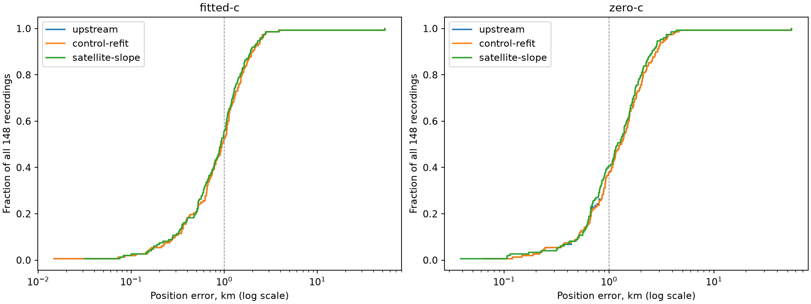

# Iteration 77: uniform full-cohort pipeline endpoint comparison

**Removing the satellite-slope stage would worsen the pooled mean.** Fitted-c improves from 1.399896 to 1.360148 km with that stage (107 improved, 40 regressed, 1 tied); zero-c improves from 1.824159 to 1.738896 km (101 improved, 45 regressed, 2 tied). The control refit leaves all fitted-c errors tied within 1 m. The slope stage slightly worsens the largest error, so it helps broad accuracy without solving the catastrophic case.

All 148 consumed recordings are included: DS16 63 (original48 plus added15), DS17 51, DS18 34 (prior consumed24 plus other10, now also consumed). No new fits, exclusions, reference-guided choices, or reserve outcomes enter this audit. Freeze commit `c6e942e15` pins every input before aggregation.

The three alternatives use the stored operational endpoint before the final extension, the accepted control refit, and the accepted satellite-slope fit. Each includes its original convergence fallback. The same endpoint policy is applied to every scan. The final endpoint exactly reproduces iteration65 in both c arms.

| Dataset | Arm | Endpoint | Mean km | Median km | p95 km | Worst km | Mean frequency RMS Hz | Improved / regressed / tied versus upstream |
|---|---|---|---:|---:|---:|---:|---:|---|
| DS16 | fitted-c | upstream | 1.065141 | 0.992073 | 2.369849 | 2.556293 | 71.175 | 0 / 0 / 63 |
| DS16 | fitted-c | control-refit | 1.065141 | 0.992073 | 2.369849 | 2.556293 | 71.175 | 0 / 0 / 63 |
| DS16 | fitted-c | satellite-slope | 1.017307 | 0.884608 | 2.238156 | 2.750798 | 69.249 | 45 / 17 / 1 |
| DS16 | zero-c | upstream | 1.420143 | 1.215600 | 2.873580 | 4.073590 | 105.158 | 0 / 0 / 63 |
| DS16 | zero-c | control-refit | 1.420710 | 1.215600 | 2.873580 | 4.073590 | 105.254 | 1 / 1 / 61 |
| DS16 | zero-c | satellite-slope | 1.363228 | 1.161220 | 2.846043 | 3.902727 | 103.687 | 43 / 19 / 1 |
| DS17 | fitted-c | upstream | 0.898735 | 0.659585 | 2.151203 | 2.762679 | 66.313 | 0 / 0 / 51 |
| DS17 | fitted-c | control-refit | 0.898735 | 0.659585 | 2.151203 | 2.762679 | 66.313 | 0 / 0 / 51 |
| DS17 | fitted-c | satellite-slope | 0.864203 | 0.707882 | 2.008805 | 2.635226 | 64.876 | 41 / 10 / 0 |
| DS17 | zero-c | upstream | 1.509271 | 1.423558 | 3.031367 | 3.599473 | 123.678 | 0 / 0 / 51 |
| DS17 | zero-c | control-refit | 1.508093 | 1.423558 | 3.031367 | 3.599473 | 123.731 | 1 / 1 / 49 |
| DS17 | zero-c | satellite-slope | 1.417183 | 1.388078 | 2.793543 | 3.518910 | 122.875 | 33 / 17 / 1 |
| DS18 | fitted-c | upstream | 2.771922 | 1.177241 | 3.147993 | 53.000325 | 77.241 | 0 / 0 / 34 |
| DS18 | fitted-c | control-refit | 2.771922 | 1.177241 | 3.147993 | 53.000325 | 77.241 | 0 / 0 / 34 |
| DS18 | fitted-c | satellite-slope | 2.739331 | 1.139814 | 3.167973 | 53.140384 | 75.651 | 21 / 13 / 0 |
| DS18 | zero-c | upstream | 3.045109 | 1.204100 | 4.390442 | 54.864086 | 95.283 | 0 / 0 / 34 |
| DS18 | zero-c | control-refit | 3.047447 | 1.204100 | 4.390442 | 54.864086 | 95.283 | 0 / 1 / 33 |
| DS18 | zero-c | satellite-slope | 2.917558 | 1.209166 | 3.818120 | 54.922335 | 93.896 | 25 / 9 / 0 |
| Pooled | fitted-c | upstream | 1.399896 | 0.940857 | 2.410623 | 53.000325 | 70.893 | 0 / 0 / 148 |
| Pooled | fitted-c | control-refit | 1.399896 | 0.940857 | 2.410623 | 53.000325 | 70.893 | 0 / 0 / 148 |
| Pooled | fitted-c | satellite-slope | 1.360148 | 0.915421 | 2.349786 | 53.140384 | 69.213 | 107 / 40 / 1 |
| Pooled | zero-c | upstream | 1.824159 | 1.292230 | 3.365079 | 54.864086 | 109.272 | 0 / 0 / 148 |
| Pooled | zero-c | control-refit | 1.824531 | 1.292230 | 3.365079 | 54.864086 | 109.330 | 2 / 3 / 143 |
| Pooled | zero-c | satellite-slope | 1.738896 | 1.209052 | 3.009810 | 54.922335 | 108.049 | 101 / 45 / 2 |

## Interpretation and limits

Frequency RMS is reported separately; improved frequency fit does not prove improved position. Objectives across these changed models are not compared. c=0 locks both static c and RF-time terms; candidate banks, observations, other priors and stage budgets are matched within each endpoint. These remain conditional ablations with shared fitted-derived banks and starting states. Later endpoints add computation.

The full [per-member results](results.json) retain membership and exposure metadata; [summary.json](summary.json) records accepted convergence and fallback source stages, plus RMS availability. Accepted convergence is not raw final-stage convergence: a qualified fallback can mask a failed final attempt. Original attempts remain in the pinned source files and [iteration65](../2026_10_09_position_error_iter65/README.md). No failed or missing fit is silently removed from the position denominator.

These are exploratory endpoint comparisons on previously consumed data, not new independent validation. They do not justify choosing different endpoints per scan from reference errors. Any candidate change needs a frozen uniform rule, complete DS16/DS17/DS18 reporting, and randomized independent-group validation. Production and the outcome-unexamined POST18 reserve remain unchanged.

## Remaining work

The final fitted-c total error is 201.301943 km over 148 scans. Even an evaluation-only hypothetical replacement of its worst 53.140384 km error by exactly zero leaves mean 1.001092 km. This is arithmetic, not a candidate result or permission to replace a scan. A tail rescue must be accompanied by some broader improvement to satisfy the strict below-1 km target.

Keep the existing slope stage while completing the frozen ordinary-start clock experiment. A subsequent uniformly applied slope-prior sensitivity experiment could test broad-error improvement, with matched c arms and a separate protocol; do not tune a prior per scan or select from true position error. This audit alone supplies no new prior value and does not justify deployment.
