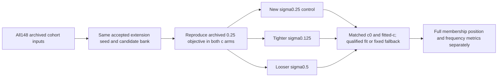

# Iteration78: prepared full-cohort slope-prior sensitivity experiment

**Prepared and tested; no sensitivity fits have run.** The two iteration71
workers retain their existing CPU allocation. This experiment starts only after
both terminate, with two single-thread workers and 90 seconds / 600 iterations
per fit. No radio collection, production change, or reserve evaluation is involved.

Iteration77 found that satellite-slope fitting reduces pooled fitted-c mean
from1.399896 to1.360148 km, but it still regresses40 of148 scans. This motivates
testing the regularization strength uniformly, alongside the continuing separate
tail-recovery experiment. Better frequency fit alone will not establish success.

These are Gaussian standard deviations in Hz/s for satellite-specific slope
corrections. They are distinct from receiver timing sigma and the hard60 limit
on added receiver affine slopes. Each variant starts from the same archived
upstream state; none warms up from another variant's result. The per-satellite
time centers and candidate bank are fixed from the existing reference-free fit.
Both c arms share observations, starts, priors, bank, and numerical budget.
Zero-c also locks RF-time coefficients as in the existing conditional ablation.

The independent convergence gate stays unchanged. A failed candidate uses the
same archived accepted control fallback for its arm. Input failures remain
explicit failed members, never exclusions or zero-valued errors. The new0.25
control is necessary because its90-second allowance differs from the historical
20-second allowance; raw convergence and objective differences must be reported.
Before fitting, reconstructed0.25 scores must agree with both archived raw
final-fit objectives within1e-6. A mismatch stops that member and records failure.

All63 DS16,51 DS17 and34 DS18 members are bound in protocol.json, including the
DS16 original48/added15 and DS18 prior-consumed exposure labels. Every member is
now consumed development data. No outcome from the11-recording POST18 reserve
has been opened. Reference coordinates enter only the post-fit error calculation,
never seed, bank, prior-width or winner selection. There is no per-scan selection
among the three prior widths. Any future candidate choice is consumed-data tuning
and requires independent randomized whole-group validation before promotion.

Four policy tests pass: convergence-only source priority, archive/retry provenance,
explicit missing qualified seed, and convergence-only fallback independent of
reference error. Production-runtime import/CLI help passes without loading a
recording or fitting. The protocol pins1216 source/input files, including the
imported runtime code. **These checks verify preparation, not scientific benefit.**

After both71workers finish and this freeze is committed, launch the two shards
using the same production Python and worker source environment as71. Do not run
additional numerical workers concurrently. Preserve every attempt on failure;
retries requiring code changes get a new protocol and report. Publish all148
coverage, per-dataset mean/median/p95/worst, paired1m regressions, raw failures and
fallbacks, and frequency RMS separately versus the new0.25 control and baseline.

The prepared reporter retains every member when outcomes are missing and uses
identical available-member sets for paired comparisons. Its four additional
tests cover missing-versus-zero outcomes, retaining large errors, paired1m
tolerances and membership, and explicit rejection of nonfinite metrics. All
eight preparation/reporting tests pass. An empty-state integration check returns
all148 pending, no candidate means, and the exact48/15 and24/10 subgroups. This
is a reporter check only; no sensitivity result is available yet. The reporter
also retains historical-versus-new raw0.25 objective and convergence comparisons
to disclose any effect of the changed per-fit allowance.
