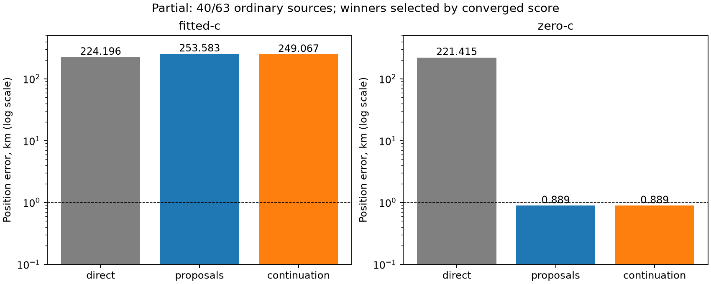

# Iteration79: ordinary-start zero-c recovery; fitted continuation unqualified

**A reference-free ordinary clock proposal reaches and selects a 0.889093 km c=0
solution in the partial 40/63-source experiment. The fitted-c result is not yet
rescued.** The recording is DS18-022, `scan-fw-f1a32cacd910c005`, previously
`RESERVED-001`. This is one consumed DS18 recording, not a full-cohort improvement or
independent validation. Both experiment71 workers remain active; no settings change.

| Arm | Direct control error km | Proposal winner error km | Continuation winner error km |
|---|---:|---:|---:|
| fitted-c | 224.195728 | 253.582751 | 249.066896 |
| c=0 | 221.415046 | 0.889093 | 0.889093 |

These compare the identical40 completed ordinary source pipelines. They do not
replace the completed192-source direct-search result or the full148 cohort.
All64 planned source slots remain in71coverage:63 feasible and1 unavailable;
23 feasible sources are still pending at this snapshot. There are574 receipts,
101 independently unqualified fits, and zero90-second deadlines.

The c=0 winner is source115, region22, ordinary zero-timing endpoint, proposal1
with anchor1. It scores29442.158624 with frequency RMS93.170 Hz and stationarity
0.000125255, below the unchanged0.001 qualification threshold. The winning seed
comes from the frozen ordinary regional inventory and paired receiver frequency
proposals, without reference-error selection or the recovered diagnostic seed.
Score selection occurs before reference-error evaluation.

The c=0 winner's complete state then initializes fitted-c under the frozen rule:

| Fitted continuation diagnostic | Value |
|---|---:|
| Objective | 29403.224325 |
| Optimizer reports success | yes |
| Independent stationarity | 0.660512 |
| Required maximum | 0.001 |
| Qualified | no |
| Runtime seconds | 9.708306 |

That lower objective cannot make an unqualified fit eligible. It is not a
90-second deadline failure. The earlier qualified fitted-c candidates remain
available, and their score-selected winner is still far away. This separates
three issues: finding a useful clock/position region, completing a stationary
fitted-c solution there, and selecting it under the operational score. The first
is now demonstrated for c=0 in this consumed case; the fitted-c recovery and
full experiment remain unfinished. The gate has not been relaxed.

The145-satellite bank remains the union from the reference-free regional
inventory. Its32-region budget was developed after inspecting this consumed
failure, so this result is development evidence, not unseen generalization.
Known/reference coordinates were not used to pick the proposal, retain the
region, choose an arm's winner, or set per-scan priors. The historical1.15 km
reference-guided recovered-seed result remains diagnostic; this new result does
not erase that ancestry or turn earlier experiments into independent validation.

Complete the unchanged71run. If the fitted continuation remains unqualified,
the next recovery rule must be based uniformly on score and convergence across
all sources, never on proximity to the reference. Preserve failed attempts and
freeze any retry policy before running it. The already prepared78full148 slope
prior sensitivity remains queued until both71workers terminate. Both directions
still need uniform DS16/DS17/DS18 evaluation and independent validation.

The full148 fitted mean remains1.360148 km and c=0 mean1.738896 km. No diagnostic
replacement enters those numbers. No production change, RF collection, or
POST18-reserve outcome access occurred. Snapshot.json pins all574 receipts and
the exact partial summary; the original71protocol remains unchanged.
