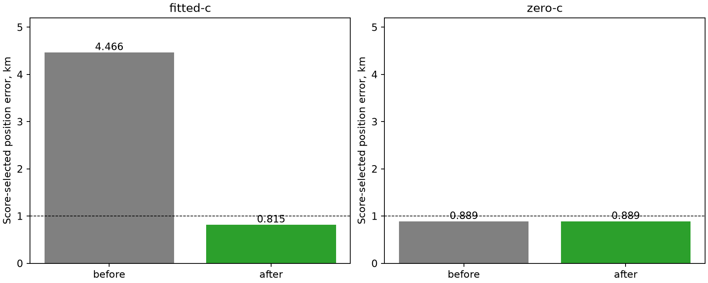

# Iteration81: score-based restart qualifies an ordinary sub-kilometre fitted solution

**One complete-state restart improves the score-selected fitted-c error from
4.465721 to 0.815491 km. c=0 remains 0.889093 km.** No reference coordinate or
error was used to select the retry, initialize it, or select its result. This
is DS18-022 (`scan-fw-f1a32cacd910c005`), an already consumed development case,
not independent validation or a full-cohort deployment qualification.

| Arm | Before km | After km | After objective | After RMS Hz | Stationarity |
|---|---:|---:|---:|---:|---:|
| fitted-c | 4.465721 | 0.815491 | 29403.236033 | 89.445 | 0.000960382 |
| c=0 | 0.889093 | 0.889093 | 29442.158624 | 93.170 | 0.000125255 |

## Frozen general rule and matched computation

Commit `7274edfea` froze the rule before these fits: from all882 prior attempts,
select each arm's lowest-score qualified state and, if any, its lowest-score
unqualified state whose score beats that arm's qualified winner. Stable source
index/order resolve ties. Retry the resulting shared inventory once in both
arms, retaining all earlier eligible candidates. This selects three states and
six retries. Two retries remain unqualified and are retained as failures.
The final winner is the minimum objective among qualified original and retry
fits, selected before evaluating reference errors.

All retries preserve observations,145-satellite bank, clock/timing priors, slope
bounds and the0.001 independent convergence threshold. They use the complete
position/timing/clock state,90seconds/600iterations, one worker. The25km local
disk recenters on each restart as in the existing fitter; this is extra compute
and a recentered local search, not an equal-budget or identical-disk claim.
The nearest-reference state is never selected by that criterion.

## What caused rejection, and what the diagnostic establishes

The failed fitted state had objective29403.224325 and stationarity0.660512,
although SLSQP reported success. It stopped after9.708s, well before the90s
allowance. Its clock coefficients were inside their bounds. Sampling the largest
scaled core and clock gradient coordinates gives:

| Coordinate | Analytic derivative | Central finite difference at step1e-5 |
|---|---:|---:|
| Core105 | -0.363323739 | -0.363322943 |
| Clock153 | 0.040916995 | 0.040917257 |

Perturbations were feasible and caused no satellite visibility changes in these
sampled directions. A positive1e-7 core step decreases the objective by3.53e-8;
a negative1e-3 clock step decreases it by3.15e-5. Thus the earlier rejection is
supported by real local descent, not just an optimizer-status interpretation.
These two-coordinate checks are not a complete gradient audit and do not rule
out nonsmooth behavior in other directions or elsewhere along the trajectory.

Retrying the original qualified c=0 state into fitted-c reproduces the earlier
unqualified objective29403.224325. Restarting from the failed fitted state instead
finds a qualified state in8.197s. Its objective is0.011708 higher than that failed
trial minimum, but its stationarity0.000960382 meets the unchanged0.001 threshold.
It is close to the threshold; this report claims qualification under that gate,
not strong precision or global optimality. The fit then wins by score and only
afterward evaluates to0.815491km. The rejected lower objective stays rejected.

This establishes premature numerical termination relative to the independent
stationarity requirement, and a bounded recovery for this case. We have not
isolated the exact internal SLSQP stopping event: full line-search/Hessian traces
were not recorded. A larger initial time allowance alone does not explain this
recovery; the original run had already stopped successfully before its deadline.

## Scope and next step

This starts from the ordinary reference-free regional inventory and receiver-pair
clock proposals, rather than the historical recovered diagnostic seed. The
inventory budget and model were developed on this consumed recording; that
exposure remains explicit. The historical1.15km reference-guided seed does not
become independently validated because a different ordinary route now works.

The full148 cohort mean remains1.360148km fitted-c and1.738896km c=0. No result
is spliced into those metrics. A uniform bank/search/retry policy still needs
evaluation across DS16/DS17/DS18, including every failure, and independent
randomized whole-group validation. Production remains unchanged.

The already frozen experiment78 now tests satellite-slope priors0.125/0.25/0.5
uniformly across all148 existing cases to address broader errors. The completed
81diagnostic and71experiment use no active worker slots. No RF collection or
POST18-reserve outcome access occurred. Two selector tests, Ruff, objective
reconstruction assertions, raw finite differences and all six retries are retained.
