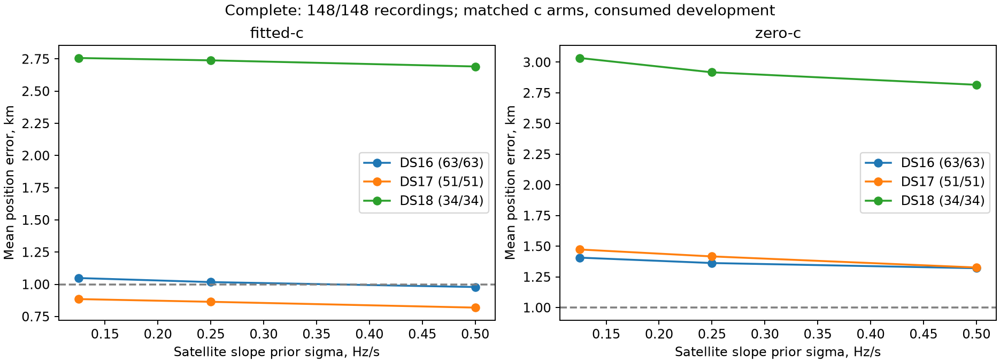

# Iterations78/82: complete148 slope-prior sensitivity

All148 members have completed matched results, including all63 DS16,51 DS17 and34
DS18 members. Satellite-slope sigma0.5Hz/s improves the fitted-c pooled mean from
1.360148 to1.317354km; sigma0.125 worsens it to1.384951km. The below1km goal remains
unachieved. This experiment does not include the separate71/81 clock recovery.

| Dataset | Fitted .25 km | Fitted .5 km | Zero .25 km | Zero .5 km |
|---|---:|---:|---:|---:|
| DS16 (63) | 1.017307 | 0.979007 | 1.363228 | 1.321051 |
| DS17 (51) | 0.864203 | 0.819111 | 1.417183 | 1.326922 |
| DS18 (34) | 2.739331 | 2.691656 | 2.917558 | 2.815838 |
| Pooled (148) | 1.360148 | 1.317354 | 1.738896 | 1.666471 |

The wider prior improves96/regresses52 fitted-c positions and improves92/regresses56
zero-c positions versus0.25, with1m ties. All296 wider-prior raw fits qualify; no
fallback is needed for that variant. Fitted median0.863677km,p95 2.269173km,worst
53.400741km. The largest DS18 failure slightly worsens53.140384->53.400741km.
Mean frequency RMS separately changes69.213->67.204Hz fitted and108.049->106.170Hz
zero; this is not evidence by itself of improved localization.

The [complete report](RESULTS.md) includes every member, all variant distributions
and paired comparisons. [summary.json](summary.json) adds DS16 original48/added15,
DS18 previously consumed24/other10 (also consumed), raw convergence, operational
fallbacks, frequency statistics and original/retry provenance. All296 new0.25
raw objectives exactly reproduce their archived values with unchanged qualification;
the90s allowance did not change those controls.

Keep0.5 as a globally applied research candidate; do not tune sigma per scan from
reference errors. No independent validation or production promotion is claimed.
The next work is the uniform reference-free region/clock/restart policy prepared
in [iteration83](../2026_10_09_position_error_iter83/README.md).

## Input failure and retry history

Iteration78's 51 DS17 members failed before fitting: the historical DS17 loader
imports `digest` from an unqualified module named `freeze`. Later research imports
change the search path, resolving that name to iteration28's different module.
This is an input-loading defect, not evidence of failed localization.

The retry replaces only that metadata lookup with the same SHA256-prefixed digest
verification and JSON decoding, explicitly bound to the DS17 protocol directory.
It calls the unchanged iteration78 numerical evaluator, with a separate output
directory. Original failures remain immutable and are pinned by the retry protocol.
Tests exercise the conflicting module and reject protocol tampering.

All three satellite-slope priors, observations, seeds, candidate banks, matched
c=0/fitted-c arms, convergence gate, budgets and fallback policy remain unchanged.
No additional numerical workers start until the original two terminate. Results
will be combined by explicit receipt provenance, preserving all 148 cohort members
and reporting the 51 original input failures separately from numerical convergence.

This is consumed-data development. Production, reserve outcomes, and RF collection
remain unchanged. Both retry workers completed with exit0; all51 DS17 retries succeeded.

## Retrospective endpoint audit

The [endpoint audit](SLOPE_AUDIT.md) compares the stored0.25 and0.5 endpoints under each fixed prior,
using the exact Gaussian penalty difference and the orthonormal satellite basis.
This separates changed regularization preferences from solver qualification failures.
It generates a regression table and scatter plot, retaining unqualified raw pairs
in JSON while excluding them from claims about qualified endpoints. No new fit or
operational selection occurs. Reference errors are evaluation-only.

For example, DS16-051's two qualified endpoints reverse score preference when the
prior widens. Error increases 2.389 to3.205km; the full satellite-slope vector norm
increases1.311 to4.914Hz/s. These norms are not individual receiver slopes or the
hard60 limit. A regression here does not establish a gradient bug or a wrong
optimizer stopping event. The audit does not establish global optimality either.

The next modeling question is whether slope corrections absorb motion information
needed to constrain position. A future experiment could regularize the correction
modes most confounded with the position derivative, computed at hypothesis positions
without reference coordinates. That is a hypothesis to test under a frozen uniform
rule, not an implemented or validated improvement. Ordinary-region clock recovery
still needs its own full-cohort generalization; it is not included in this sensitivity.
