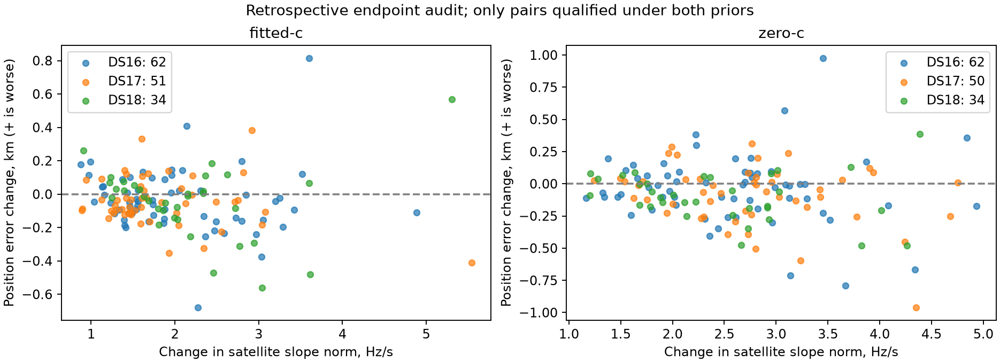

# Retrospective slope-prior endpoint audit

296 raw arm pairs available; 147 fitted-c pairs qualify at both priors.
No new fit, reference-guided inference, or winner selection occurs. This audit uses reference errors only to describe failures after inference. It is consumed-data research.

For each unchanged endpoint, changing only sigma changes objective by 0.5 × squared slope norm × (1/target_sigma² − 1/source_sigma²). The orthonormal satellite basis preserves this norm. This compares endpoints under the same objective; it does not directly compare scores from different models.

Positive score delta means the wider-prior endpoint loses to the control endpoint under that column's fixed model. Raw unqualified fits remain in JSON but do not enter the table. Operational fallbacks remain in the main cohort report.

| Largest fitted-c regressions | Before km | After km | Shift km | RMS delta Hz | Slope norm before/after Hz/s | Score delta at .25 | Score delta at .5 |
|---|---:|---:|---:|---:|---:|---:|---:|
| DS16-051 | 2.389 | 3.205 | 1.194 | +0.796 | 1.311/4.914 | +98.819 | -35.727 |
| DS18-014 | 1.053 | 1.622 | 0.610 | -1.268 | 1.654/6.960 | +190.182 | -84.027 |
| DS16-043 | 2.751 | 3.159 | 0.414 | -2.229 | 1.285/3.426 | +42.349 | -18.175 |
| DS17-051 | 2.101 | 2.484 | 0.419 | -0.963 | 1.240/4.159 | +75.222 | -19.322 |
| DS17-034 | 0.677 | 1.010 | 0.393 | -1.230 | 1.079/2.680 | +26.368 | -9.734 |
| DS18-022 | 53.140 | 53.401 | 0.405 | -2.347 | 0.563/1.469 | +8.051 | -2.997 |
| DS16-031 | 0.721 | 0.918 | 0.263 | -2.531 | 1.423/4.221 | +71.976 | -22.756 |
| DS16-010 | 0.189 | 0.382 | 0.449 | -0.488 | 0.495/1.486 | +8.786 | -2.991 |

This audit can distinguish a changed regularization preference from a convergence failure at these endpoints. It cannot prove the global optimum, identify a physical cause for a particular satellite slope, or justify choosing sigma per scan from known position errors.

