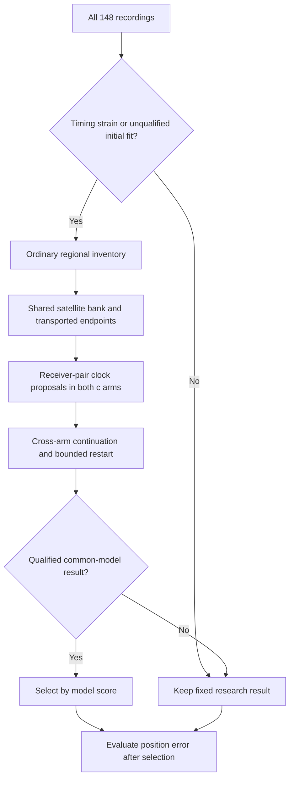

# Iteration83 preparation: generalize ordinary-region clock recovery

This is implementation preparation, not a frozen numerical experiment or a new
accuracy result. No fitting has started. The full execution protocol and source
closure must be frozen before running. Iteration82 remains the only live experiment.

## Candidate policy

Apply the same rule to all63 DS16,51 DS17 and34 DS18 members. Start from the
iteration65 research pipeline with satellite-slope sigma0.25; keep the new0.5
sensitivity separate so the recovery comparison isolates the search change.

Request extra search when either initial joint-100 arm is missing, unqualified,
or has mean squared relative-timing coefficient /4 above10. This threshold was
one of the three consumed-data thresholds audited in76; it flags six existing
members. Selecting it is explicitly development tuning to bound computation,
not evidence of future failure recall. It misses many moderate errors.

For flagged members, reproduce the reference-free inventory policy from41:
32 lowest-score40km coarse points plus ordinary retained basins, deduplicated.
Retain failed regions explicitly. Reconstruct each successful regional calibration
and form one common satellite union from the regional inventory. The same bank
construction rule applies to every recording; satellite identities naturally vary
with capture time. No reference position participates in bank construction.

Transport association and zero-timing endpoints from every available region into
the common ordinary receiver-clock frame, retaining the existing physical
prediction/visibility checks and hard-bound feasibility tests. Do not globally
prune endpoints by their initial score. Use the first feasible source arm in the
existing census order for each region/source type, as in71.

For each endpoint, try the unchanged original and both anchors of each of the
two receiver-pair consensus clock proposals. Fit both c arms under the common
relative timing sigma1 model, joint clock sigma100, hard60 and unchanged gate.
Freeze each arm's qualified proposal winner before cross-arm continuation;
retain every earlier qualified candidate. Apply the81 score-only complete-state
restart rule once to the shared best-qualified and promising-unqualified inventory.
If an arm has no qualified candidate, retry its best finite unqualified state
once as well. This handles a previously unexercised case without accepting it.

Choose the lowest qualified score within this common model. If no qualified
result exists for an arm, keep its fixed iteration65 fallback and report the
failure. Never compare this model's score directly with the differently pruned
sigma2 fallback model. Unflagged members keep their prior result by policy.

## Scientific and execution requirements

- Both c arms receive matched observations, candidate inventory, priors and budgets;
  c0 locks c, and the common model has no RF-time extension. Report frequency fit
  separately from position accuracy.
- Preserve ordinary seeds and all regional failures. The historical reference-guided
  1.15km seed is excluded. The consumed DS18 recovery cannot be spliced into results.
- Candidate geometry uses hypothetical positions; reference coordinates/errors are
  attached only after operational selection. No per-scan truth-based tuning.
- Numerical regional controls must preserve their original budgets or explicitly
  declare and test changed-budget controls. Extra clock fits use90s/600iterations.
- At most two single-thread numerical workers; bounded checkpointed invocations.
  Freeze source/input hashes and preserve receipts. No new RF or reserve outcome access.
- Report full148 coverage, subgroup exposure, mean/median/p95/worst, paired regressions,
  raw failures and fallbacks. Measure extra compute. This is not equal-compute research.
- Independent randomized whole-recording validation is required before promotion.

The present pure policy tests cover timing-trigger inputs, missing/nonfinite fits,
qualification, bounded retry selection, and retention of distinct source regions.
The generic numerical adapter and its reproduction checks remain to be implemented.
An archived-data check reproduces all63 iteration71 endpoint indices exactly and
the three iteration81 retry states (126/6 fitted,115/6 fitted,115/2 zero). This
qualifies the selector on that consumed case, not the unimplemented full pipeline.
