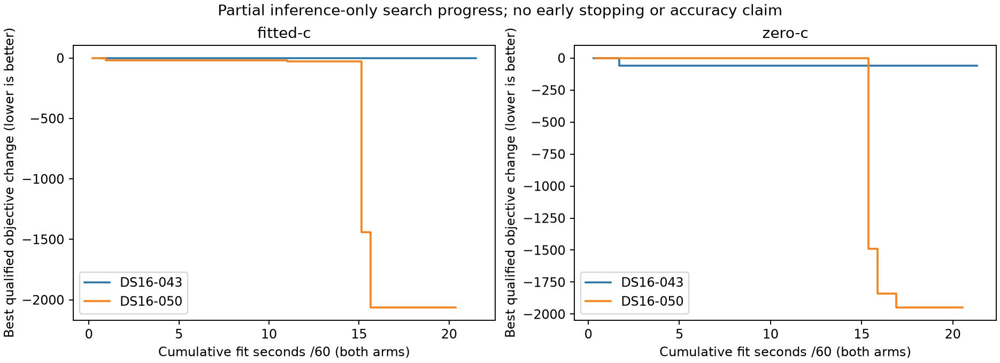

# Partial search progress

This audit reads model scores, qualification and fit durations only. It does not read reference coordinates/errors or change any search decision. Curves are relative to each recording/arm's first qualified objective, not scores comparable across recordings. Time is summed reported fit time; loading and regional stages are excluded. These partial curves cannot establish localization accuracy or justify stopping the frozen search early.

| Recording | Attempts | Qualified | Solver success but unqualified | Fit minutes |
|---|---:|---:|---:|---:|
| DS16-043 | 167 | 145 | 22 | 21.49 |
| DS16-050 | 114 | 98 | 16 | 20.53 |

Receipts observed mid-write, if any, remain explicitly listed in JSON. No benchmark means are replaced. This is a regenerable progress view.
