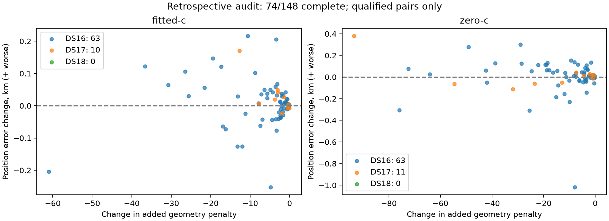

# Geometry-prior fixed-endpoint audit

**74/148 recordings complete.** Partial audits are not full-cohort performance claims.

No new optimization or operational selection. At an unchanged endpoint, the protected model adds 0.5 × (1/0.25² − 1/0.5²) × sᵀPs, where s is the satellite-slope coordinate vector in Hz/s and P is the frozen projector. Subtracting that penalty reconstructs the uniform objective exactly in algebra. Each score comparison below therefore uses one fixed objective.

Positive delta means the protected endpoint loses to the uniform endpoint under that column's model. Opposite signs show a changed regularization preference between these endpoints, not proof of global optimality or a physical cause. Reference errors only order this retrospective diagnostic table; they never select operational results or priors.

| Largest fitted-c regressions | Before km | After km | Shift km | Score delta under uniform | Score delta under protected | RMS delta Hz |
|---|---:|---:|---:|---:|---:|---:|
| DS16-004 | 0.204099 | 0.420833 | 0.220358 | 2.922920 | -7.646807 | 0.444264 |
| DS16-050 | 2.245629 | 2.450794 | 0.227901 | 0.691286 | -2.766580 | 0.299992 |
| DS17-005 | 1.777692 | 1.947961 | 0.172007 | 3.058591 | -9.658092 | 0.437327 |
| DS16-036 | 0.828591 | 0.975271 | 0.156951 | 4.472685 | -14.998189 | 0.430783 |
| DS16-056 | 2.110505 | 2.232805 | 0.207342 | 8.354590 | -28.264418 | 0.435856 |
| DS16-028 | 1.170875 | 1.291809 | 0.129335 | 4.324658 | -13.053675 | 0.625356 |
| DS16-049 | 1.370022 | 1.476177 | 0.219346 | 5.727344 | -20.725049 | 0.766775 |
| DS16-029 | 0.727686 | 0.829340 | 0.102106 | 2.201828 | -6.579726 | 0.206750 |

Raw unqualified pairs and full membership remain in endpoint-audit.json. Operational fallbacks and all performance metrics belong to RESULTS.md. Consumed development only; no deployment or independent validation claim.
