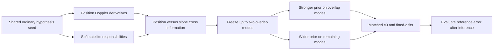

# Iteration84 prototype: protect position information from flexible satellite slopes

This is an untested localization hypothesis, with a tested model-layer prototype.
No recording has been evaluated with it, no fitting has started, and no accuracy
improvement is claimed. Iteration83's frozen recovery workers remain unchanged.

The full148 evaluator and protocol are prepared before new outcomes:592 fits,
uniform0.5 versus protected0.25, each matched in c0/fitted-c. Do not launch until
the active83 runners and numerical children have terminated; only two single-thread
numerical workers may run. This experiment is separate from the83 search recovery.

## Motivation from completed sensitivity

The full148 experiment78/82 improved fitted mean1.360->1.317km by widening the
satellite-slope prior0.25->0.5Hz/s, but52 positions regressed. For DS16-051,
both endpoints qualified, and their score preference reverses under the two priors.
Its error worsens2.389->3.205km as the fitted satellite-slope norm increases.
This motivates testing whether extra correction freedom can absorb frequency
changes that otherwise constrain position. It does not prove that mechanism is
the physical cause of the error, or that the following prior will help.

## Proposed uniform rule

At the ordinary shared hypothesis seed, compute predicted frequency derivatives
with respect to east/north position and the existing soft satellite responsibilities.
Form the conditional-mixture cross-information between those two derivatives and
the existing zero-sum satellite-slope coefficients. It is a2-by-(N-1) matrix.
Use its right-singular-vector row space to identify at most two slope modes.

Keep sigma0.5Hz/s in all other slope directions; use sigma0.25Hz/s in these modes.
Freeze this projector before fitting, sharing it across c0 and fitted-c. Position
is hypothetical/inferred; known receiver coordinates and reference errors are
not inputs. There is no per-scan choice based on measured position accuracy.

For clock coordinates in Hz per100s, with orthogonal projector P:

`precision = I/(100×0.5)^2 + [1/(100×0.25)^2 − 1/(100×0.5)^2] P`.

This remains a positive-definite quadratic Gaussian prior. It changes only the
satellite-slope precision block; the optimizer can use the existing exact quadratic
gradient. The at-most-two-mode restriction is a global rule, not a fitted reference.

## Limits and proposed qualification

This is a local conditional-mixture approximation, not the exact marginalized
likelihood Hessian. It ignores profiling over other clock/timing nuisance variables.
A genuine satellite frequency error may resemble a position change; suppressing
that direction could increase bias. Weak coupling still defines a direction when
nonzero, so its usefulness must be measured. No claim of optimal uncertainty or
causal separation is justified from the prototype.

Synthetic tests cover the Gaussian limits, rank, coordinate/basis invariance,
cross-information against an explicit latent design, and finite-difference gradient.
The model layer also reproduces the existing full objective/gradients when both
sigmas are0.5, changes only the satellite-slope precision block, leaves likelihood
and physical gradients identical at fixed states, and keeps the projector fixed
under later parameter perturbations. All11 synthetic tests pass using
`PYTHONPATH=src:. .venv/bin/pytest -q reports/2026_10_09_position_error_iter84`.
These tests evaluate synthetic objectives only; they do not run an optimizer or
consume recordings or reserve outcomes.

Before fitting each recording, the evaluator reconstructs both archived0.5 objectives
within1e-6 and verifies the uniform geometry wrapper's objective/core/nuisance
gradients against the original uniform model within1e-10. Both variants start from
the same archived upstream seed/clock, never each other's new fitted endpoint.
The shared projector is frozen before either arm is fit. An unqualified attempt
keeps its fixed archived0.5 result, and raw failures remain explicit. An input
failure prevents a full candidate claim rather than disappearing from membership.
Budgets90s/600iterations, banks, observations and other priors remain matched. Report
frequency fit separately, all regressions and dataset/exposure groups. This remains
consumed-data tuning requiring independent randomized whole-recording validation.

No additional numerical workers, RF collection, production change or reserve
outcome access is authorized by this prototype. Real-data qualification and matched
fitting are future work after the current experiment permits worker capacity.
