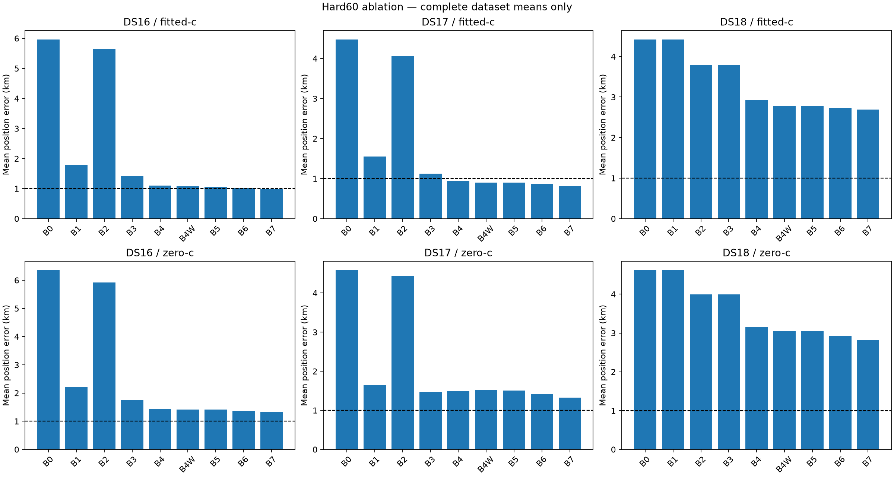
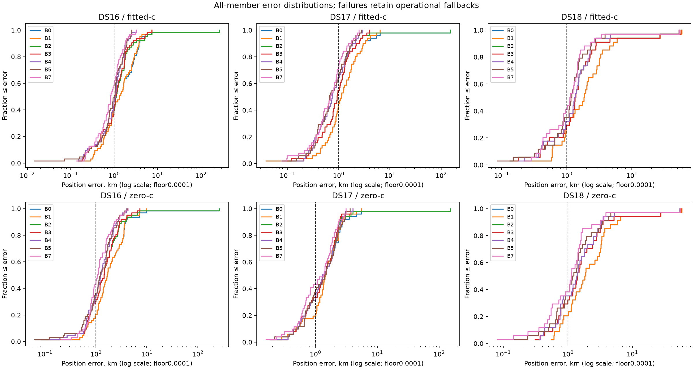
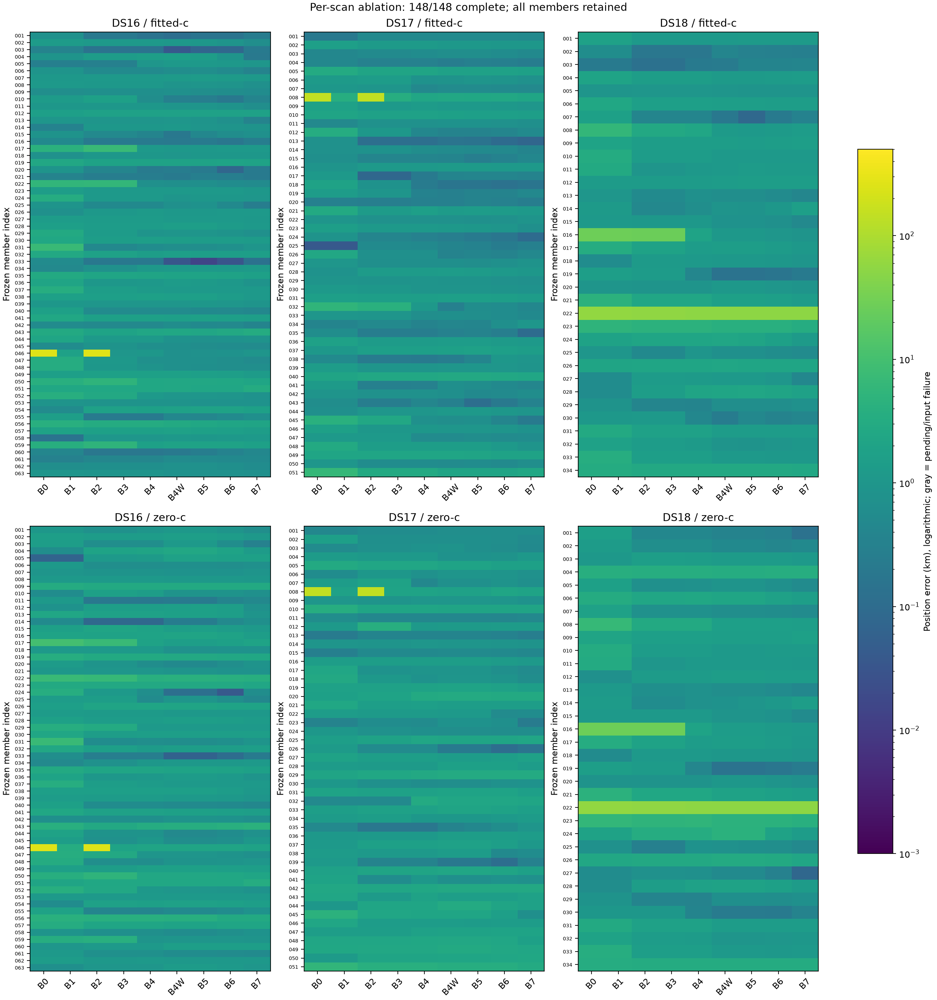

# Hard60 ablation: complete membership and position errors

**148/148 complete.** Full comparison.

B0 is the saved deployed bounded-recovery hard60 baseline. B0/B1 reuse immutable search receipts; all downstream fits are fresh with matched90s/600iteration limits. [Configuration definitions](README.md). All data are consumed development; reference positions are evaluation-only. Production is unchanged.

| Dataset | Arm | Stage | Mean km | Median km | p95 km | Worst km | Raw failures / not attempted / fallback | RMS Hz |
|---|---|---|---:|---:|---:|---:|---|---:|
| DS16 | fitted-c | B0 | 5.964450 | 1.322489 | 4.286429 | 265.276544 | 0/0/0 | 90.174 |
| DS16 | fitted-c | B1 | 1.782396 | 1.322489 | 3.929549 | 7.314257 | 0/0/0 | 89.658 |
| DS16 | fitted-c | B2 | 5.635765 | 1.108591 | 5.123351 | 266.428219 | 0/0/0 | 76.095 |
| DS16 | fitted-c | B3 | 1.422679 | 1.079453 | 4.880340 | 7.451347 | 0/0/0 | 75.601 |
| DS16 | fitted-c | C3 | 1.422679 | 1.079453 | 4.880340 | 7.451347 | 0/0/0 | 75.601 |
| DS16 | fitted-c | B4 | 1.100451 | 1.055624 | 2.292612 | 3.244427 | 0/0/0 | 73.617 |
| DS16 | fitted-c | C4 | 1.100451 | 1.055624 | 2.292612 | 3.244427 | 0/0/0 | 73.617 |
| DS16 | fitted-c | B4W | 1.078602 | 0.992449 | 2.426941 | 2.835493 | 0/0/0 | 71.729 |
| DS16 | fitted-c | C5 | 1.078602 | 0.992449 | 2.426941 | 2.835493 | 0/0/0 | 71.729 |
| DS16 | fitted-c | B5 | 1.065141 | 0.992073 | 2.369849 | 2.556293 | 0/0/0 | 71.175 |
| DS16 | fitted-c | C6 | 1.065141 | 0.992073 | 2.369849 | 2.556293 | 0/0/0 | 71.175 |
| DS16 | fitted-c | B6 | 1.017307 | 0.884608 | 2.238156 | 2.750798 | 1/0/1 | 69.249 |
| DS16 | fitted-c | B7 | 0.979007 | 0.834879 | 2.088464 | 3.204798 | 0/0/0 | 67.066 |
| DS16 | zero-c | B0 | 6.355169 | 1.659830 | 6.889575 | 264.604450 | 0/0/0 | 120.251 |
| DS16 | zero-c | B1 | 2.209787 | 1.659830 | 4.070011 | 9.869728 | 0/0/0 | 120.049 |
| DS16 | zero-c | B2 | 5.919056 | 1.435976 | 4.958154 | 265.326323 | 0/0/0 | 108.383 |
| DS16 | zero-c | B3 | 1.739476 | 1.435976 | 4.023887 | 7.280176 | 0/0/0 | 108.191 |
| DS16 | zero-c | C3 | 1.704638 | 1.433716 | 4.023888 | 8.678271 | 1/0/1 | 108.512 |
| DS16 | zero-c | B4 | 1.432013 | 1.228871 | 2.906976 | 3.981742 | 0/0/0 | 107.391 |
| DS16 | zero-c | C4 | 1.424170 | 1.228871 | 2.906976 | 4.016419 | 1/0/1 | 107.373 |
| DS16 | zero-c | B4W | 1.419185 | 1.215600 | 2.873580 | 4.073590 | 0/0/0 | 105.257 |
| DS16 | zero-c | C5 | 1.420143 | 1.215600 | 2.873580 | 4.073590 | 0/0/0 | 105.158 |
| DS16 | zero-c | B5 | 1.420143 | 1.215600 | 2.873580 | 4.073590 | 0/0/0 | 105.158 |
| DS16 | zero-c | C6 | 1.420710 | 1.215600 | 2.873580 | 4.073590 | 3/0/3 | 105.254 |
| DS16 | zero-c | B6 | 1.363228 | 1.161220 | 2.846043 | 3.902727 | 1/0/1 | 103.687 |
| DS16 | zero-c | B7 | 1.321051 | 1.075030 | 2.937303 | 4.263626 | 0/0/0 | 101.847 |
| DS17 | fitted-c | B0 | 4.477043 | 1.131760 | 4.789302 | 152.839550 | 0/0/0 | 79.960 |
| DS17 | fitted-c | B1 | 1.551480 | 1.131760 | 3.894998 | 6.403932 | 0/0/0 | 80.098 |
| DS17 | fitted-c | B2 | 4.063324 | 0.930369 | 2.804757 | 153.348007 | 0/0/0 | 70.029 |
| DS17 | fitted-c | B3 | 1.125847 | 0.930369 | 2.804757 | 4.052587 | 0/0/0 | 70.112 |
| DS17 | fitted-c | C3 | 1.125847 | 0.930369 | 2.804757 | 4.052587 | 0/0/0 | 70.112 |
| DS17 | fitted-c | B4 | 0.941063 | 0.755007 | 2.304987 | 2.959700 | 0/0/0 | 68.136 |
| DS17 | fitted-c | C4 | 0.941063 | 0.755007 | 2.304987 | 2.959700 | 0/0/0 | 68.136 |
| DS17 | fitted-c | B4W | 0.903526 | 0.697140 | 2.203871 | 2.754123 | 1/0/1 | 67.022 |
| DS17 | fitted-c | C5 | 0.903526 | 0.697140 | 2.203871 | 2.754123 | 1/0/1 | 67.022 |
| DS17 | fitted-c | B5 | 0.898735 | 0.659585 | 2.151203 | 2.762679 | 1/0/1 | 66.313 |
| DS17 | fitted-c | C6 | 0.898735 | 0.659585 | 2.151203 | 2.762679 | 1/0/1 | 66.313 |
| DS17 | fitted-c | B6 | 0.864203 | 0.707882 | 2.008805 | 2.635226 | 0/0/0 | 64.876 |
| DS17 | fitted-c | B7 | 0.819111 | 0.696276 | 2.058978 | 2.483593 | 0/0/0 | 63.135 |
| DS17 | zero-c | B0 | 4.585465 | 1.434317 | 4.047508 | 151.707003 | 0/0/0 | 130.492 |
| DS17 | zero-c | B1 | 1.646902 | 1.434317 | 3.205695 | 5.568416 | 0/0/0 | 130.344 |
| DS17 | zero-c | B2 | 4.431369 | 1.404203 | 3.182895 | 153.106153 | 2/0/2 | 125.054 |
| DS17 | zero-c | B3 | 1.468428 | 1.404203 | 2.578706 | 4.034074 | 2/0/2 | 124.924 |
| DS17 | zero-c | C3 | 1.501510 | 1.404203 | 2.668644 | 4.034074 | 2/0/2 | 125.262 |
| DS17 | zero-c | B4 | 1.488524 | 1.286453 | 2.824160 | 4.034073 | 1/0/1 | 124.629 |
| DS17 | zero-c | C4 | 1.467156 | 1.286454 | 2.824160 | 4.034074 | 4/0/4 | 124.568 |
| DS17 | zero-c | B4W | 1.512875 | 1.423558 | 3.031367 | 3.599473 | 1/0/1 | 123.676 |
| DS17 | zero-c | C5 | 1.509271 | 1.423558 | 3.031367 | 3.599473 | 2/0/2 | 123.678 |
| DS17 | zero-c | B5 | 1.509271 | 1.423558 | 3.031367 | 3.599473 | 2/0/2 | 123.678 |
| DS17 | zero-c | C6 | 1.508093 | 1.423558 | 3.031367 | 3.599473 | 1/0/1 | 123.731 |
| DS17 | zero-c | B6 | 1.417183 | 1.388078 | 2.793543 | 3.518910 | 1/0/1 | 122.875 |
| DS17 | zero-c | B7 | 1.326922 | 1.359911 | 2.874086 | 3.124958 | 0/0/0 | 121.024 |
| DS18 | fitted-c | B0 | 4.422188 | 1.852194 | 13.381472 | 58.693871 | 0/0/0 | 101.057 |
| DS18 | fitted-c | B1 | 4.422188 | 1.852194 | 13.381472 | 58.693871 | 0/0/0 | 101.057 |
| DS18 | fitted-c | B2 | 3.785292 | 1.358825 | 12.367326 | 56.466255 | 0/0/0 | 81.105 |
| DS18 | fitted-c | B3 | 3.785292 | 1.358825 | 12.367326 | 56.466255 | 0/0/0 | 81.105 |
| DS18 | fitted-c | C3 | 3.785292 | 1.358825 | 12.367326 | 56.466255 | 0/0/0 | 81.105 |
| DS18 | fitted-c | B4 | 2.930371 | 1.320604 | 3.435144 | 53.246334 | 0/0/0 | 80.296 |
| DS18 | fitted-c | C4 | 2.907150 | 1.287271 | 3.435144 | 53.246334 | 0/0/0 | 80.273 |
| DS18 | fitted-c | B4W | 2.774181 | 1.179372 | 3.156479 | 52.940877 | 0/0/0 | 77.830 |
| DS18 | fitted-c | C5 | 2.774181 | 1.179372 | 3.156479 | 52.940877 | 0/0/0 | 77.830 |
| DS18 | fitted-c | B5 | 2.771922 | 1.177241 | 3.147993 | 53.000325 | 0/0/0 | 77.241 |
| DS18 | fitted-c | C6 | 2.771922 | 1.177241 | 3.147993 | 53.000325 | 0/0/0 | 77.241 |
| DS18 | fitted-c | B6 | 2.739331 | 1.139814 | 3.167973 | 53.140384 | 0/0/0 | 75.651 |
| DS18 | fitted-c | B7 | 2.691656 | 1.122461 | 2.903525 | 53.400741 | 0/0/0 | 73.564 |
| DS18 | zero-c | B0 | 4.618410 | 1.855630 | 13.926035 | 58.726514 | 0/0/0 | 116.134 |
| DS18 | zero-c | B1 | 4.618410 | 1.855630 | 13.926035 | 58.726514 | 0/0/0 | 116.134 |
| DS18 | zero-c | B2 | 3.992066 | 1.398338 | 12.898070 | 56.864172 | 0/0/0 | 98.576 |
| DS18 | zero-c | B3 | 3.992066 | 1.398338 | 12.898070 | 56.864172 | 0/0/0 | 98.576 |
| DS18 | zero-c | C3 | 3.991629 | 1.398338 | 12.880288 | 56.803589 | 0/0/0 | 98.571 |
| DS18 | zero-c | B4 | 3.157358 | 1.380312 | 4.118124 | 54.606874 | 0/0/0 | 97.823 |
| DS18 | zero-c | C4 | 3.138745 | 1.357825 | 4.118124 | 54.606874 | 0/0/0 | 97.794 |
| DS18 | zero-c | B4W | 3.044115 | 1.204100 | 4.390442 | 54.864085 | 0/0/0 | 95.202 |
| DS18 | zero-c | C5 | 3.045109 | 1.204100 | 4.390442 | 54.864086 | 0/0/0 | 95.283 |
| DS18 | zero-c | B5 | 3.045109 | 1.204100 | 4.390442 | 54.864086 | 0/0/0 | 95.283 |
| DS18 | zero-c | C6 | 3.047447 | 1.204100 | 4.390442 | 54.864086 | 0/0/0 | 95.283 |
| DS18 | zero-c | B6 | 2.917558 | 1.209166 | 3.818120 | 54.922335 | 0/0/0 | 93.896 |
| DS18 | zero-c | B7 | 2.815838 | 1.130151 | 3.701531 | 54.832123 | 0/0/0 | 91.901 |
| Pooled | fitted-c | B0 | 5.097594 | 1.316537 | 5.628300 | 265.276544 | 0/0/0 | 89.154 |
| Pooled | fitted-c | B1 | 2.309262 | 1.316537 | 4.968103 | 58.693871 | 0/0/0 | 88.982 |
| Pooled | fitted-c | B2 | 4.668802 | 1.114246 | 4.897270 | 266.428219 | 0/0/0 | 75.156 |
| Pooled | fitted-c | B3 | 1.863155 | 1.097467 | 3.872018 | 56.466255 | 0/0/0 | 74.974 |
| Pooled | fitted-c | C3 | 1.863155 | 1.097467 | 3.872018 | 56.466255 | 0/0/0 | 74.974 |
| Pooled | fitted-c | B4 | 1.465914 | 1.024199 | 2.485628 | 53.246334 | 0/0/0 | 73.262 |
| Pooled | fitted-c | C4 | 1.460579 | 1.024199 | 2.485628 | 53.246334 | 0/0/0 | 73.257 |
| Pooled | fitted-c | B4W | 1.407796 | 0.966893 | 2.542237 | 52.940877 | 1/0/1 | 71.509 |
| Pooled | fitted-c | C5 | 1.407796 | 0.966893 | 2.542237 | 52.940877 | 1/0/1 | 71.509 |
| Pooled | fitted-c | B5 | 1.399896 | 0.940857 | 2.410623 | 53.000325 | 1/0/1 | 70.893 |
| Pooled | fitted-c | C6 | 1.399896 | 0.940857 | 2.410623 | 53.000325 | 1/0/1 | 70.893 |
| Pooled | fitted-c | B6 | 1.360148 | 0.915421 | 2.349786 | 53.140384 | 1/0/1 | 69.213 |
| Pooled | fitted-c | B7 | 1.317354 | 0.863677 | 2.269173 | 53.400741 | 0/0/0 | 67.204 |
| Pooled | zero-c | B0 | 5.346353 | 1.624181 | 6.312348 | 264.604450 | 0/0/0 | 122.834 |
| Pooled | zero-c | B1 | 2.569152 | 1.624181 | 5.222070 | 58.726514 | 0/0/0 | 122.697 |
| Pooled | zero-c | B2 | 4.963720 | 1.418959 | 4.701520 | 265.326323 | 2/0/2 | 111.875 |
| Pooled | zero-c | B3 | 2.163561 | 1.418959 | 4.000326 | 56.864172 | 2/0/2 | 111.748 |
| Pooled | zero-c | C3 | 2.160031 | 1.403849 | 4.000326 | 56.803589 | 3/0/3 | 112.001 |
| Pooled | zero-c | B4 | 1.847849 | 1.285909 | 3.243203 | 54.606874 | 1/0/1 | 111.133 |
| Pooled | zero-c | C4 | 1.832871 | 1.285909 | 3.243203 | 54.606874 | 5/0/5 | 111.098 |
| Pooled | zero-c | B4W | 1.824765 | 1.300289 | 3.365079 | 54.864085 | 1/0/1 | 109.294 |
| Pooled | zero-c | C5 | 1.824159 | 1.292230 | 3.365079 | 54.864086 | 2/0/2 | 109.272 |
| Pooled | zero-c | B5 | 1.824159 | 1.292230 | 3.365079 | 54.864086 | 2/0/2 | 109.272 |
| Pooled | zero-c | C6 | 1.824531 | 1.292230 | 3.365079 | 54.864086 | 4/0/4 | 109.330 |
| Pooled | zero-c | B6 | 1.738896 | 1.209052 | 3.009810 | 54.922335 | 2/0/2 | 108.049 |
| Pooled | zero-c | B7 | 1.666471 | 1.115160 | 3.122162 | 54.832123 | 0/0/0 | 106.170 |

## Historical membership and exposure groups

All groups are consumed development. DS18's other10 lack a prior registry match; that does not establish unseen validation. The DS16 groups exhaust all63 members.

| Group | Completed/all | Arm | B0 mean km | B3 mean km | B7 mean km |
|---|---|---|---:|---:|---:|
| DS16-original48 | 48/48 | fitted-c | 1.885733 | 1.514729 | 1.023385 |
| DS16-original48 | 48/48 | zero-c | 2.245378 | 1.739503 | 1.323009 |
| DS16-added15 | 15/15 | fitted-c | 19.016343 | 1.128120 | 0.836999 |
| DS16-added15 | 15/15 | zero-c | 19.506499 | 1.739389 | 1.314785 |
| DS18-prior24 | 24/24 | fitted-c | 5.485535 | 4.712342 | 3.251271 |
| DS18-prior24 | 24/24 | zero-c | 5.728161 | 4.991672 | 3.431507 |
| DS18-other10-consumed | 10/10 | fitted-c | 1.870153 | 1.560374 | 1.348581 |
| DS18-other10-consumed | 10/10 | zero-c | 1.955010 | 1.593010 | 1.338233 |

summary.json includes every paired regression, thresholds1/5/10/100km, original48/added15 and prior24/other10 groups, fit times, load times, fallbacks and frequency residuals separately. Wall times exclude archived search compute; these are not cold end-to-end pipeline latency measurements. Static c and RF-time effects are separated by C5/B5; c0 locks RF-time terms.

| Member | Session | Status | Input failure |
|---|---|---|---|
| DS16-001 | scan-fw-ba4cd19379329520 | complete |  |
| DS16-002 | scan-fw-a326fb07c0e9b6e2 | complete |  |
| DS16-003 | scan-fw-1ad7f3926e9a03e5 | complete |  |
| DS16-004 | scan-fw-3ad2719629e7c60d | complete |  |
| DS16-005 | scan-fw-194e6f064a898b85 | complete |  |
| DS16-006 | scan-fw-e90e71153f3be029 | complete |  |
| DS16-007 | scan-fw-0b8d0887b97b192b | complete |  |
| DS16-008 | scan-fw-59521cec45054a41 | complete |  |
| DS16-009 | scan-fw-99f3c2befba57d44 | complete |  |
| DS16-010 | scan-fw-aa77506012889211 | complete |  |
| DS16-011 | scan-fw-8e8033677042ba97 | complete |  |
| DS16-012 | scan-fw-9284d4f6ce040d80 | complete |  |
| DS16-013 | scan-fw-330829d1e597d288 | complete |  |
| DS16-014 | scan-fw-dbf401c02543f194 | complete |  |
| DS16-015 | scan-fw-392b4f493b7c3c0e | complete |  |
| DS16-016 | scan-fw-3b61d64df77251ca | complete |  |
| DS16-017 | scan-fw-5fab2b5974ce6bfb | complete |  |
| DS16-018 | scan-fw-13998828c952f265 | complete |  |
| DS16-019 | scan-fw-96d70bdc5aef38ed | complete |  |
| DS16-020 | scan-fw-151ee2be70b82235 | complete |  |
| DS16-021 | scan-fw-389713be72cd8450 | complete |  |
| DS16-022 | scan-fw-79f5280d20dd9e65 | complete |  |
| DS16-023 | scan-fw-356acff46cd12764 | complete |  |
| DS16-024 | scan-fw-0e40d0535caa0b16 | complete |  |
| DS16-025 | scan-fw-6ad6175fa731231e | complete |  |
| DS16-026 | scan-fw-320fa74020b04d85 | complete |  |
| DS16-027 | scan-fw-84eb24f335b96c64 | complete |  |
| DS16-028 | scan-fw-6cfa779ffd41637a | complete |  |
| DS16-029 | scan-fw-d3b1edc33cb8210d | complete |  |
| DS16-030 | scan-fw-de9320ef0602bad8 | complete |  |
| DS16-031 | scan-fw-9f4e8b72d567c0bb | complete |  |
| DS16-032 | scan-fw-eb9ba03847cd10fb | complete |  |
| DS16-033 | scan-fw-0ffe1eede92820a9 | complete |  |
| DS16-034 | scan-fw-90722ab71ea4e7bd | complete |  |
| DS16-035 | scan-fw-2917f7344e48ba39 | complete |  |
| DS16-036 | scan-fw-a8fbd8c43834a765 | complete |  |
| DS16-037 | scan-fw-9061ae11d2702df3 | complete |  |
| DS16-038 | scan-fw-d6e344d47603fb34 | complete |  |
| DS16-039 | scan-fw-6f9e553db123bebd | complete |  |
| DS16-040 | scan-fw-fedf239661900a5a | complete |  |
| DS16-041 | scan-fw-85f7398f9b9461ec | complete |  |
| DS16-042 | scan-fw-a52fc8f717bd9f76 | complete |  |
| DS16-043 | scan-fw-c937db2e26dad0aa | complete |  |
| DS16-044 | scan-fw-64163dfbcc531a50 | complete |  |
| DS16-045 | scan-fw-58975d3328a47507 | complete |  |
| DS16-046 | scan-fw-c6c51bfeb6a7c3d9 | complete |  |
| DS16-047 | scan-fw-98990902df445215 | complete |  |
| DS16-048 | scan-fw-7e51f48fa65d6f81 | complete |  |
| DS16-049 | scan-fw-3bf66f35e3a07685 | complete |  |
| DS16-050 | scan-fw-7e6fe9f57ae2562c | complete |  |
| DS16-051 | scan-fw-899e83e995c96cdf | complete |  |
| DS16-052 | scan-fw-7b796c5b898df6bf | complete |  |
| DS16-053 | scan-fw-a88b75d9a4cad4ff | complete |  |
| DS16-054 | scan-fw-4dbadefb5dadb59d | complete |  |
| DS16-055 | scan-fw-5e190e43f0c8c9e2 | complete |  |
| DS16-056 | scan-fw-8d94198baa058d67 | complete |  |
| DS16-057 | scan-fw-6aa645776351507d | complete |  |
| DS16-058 | scan-fw-4099ab8ea46fad71 | complete |  |
| DS16-059 | scan-fw-aeea3ef6d81d637f | complete |  |
| DS16-060 | scan-fw-19a8822932068f7a | complete |  |
| DS16-061 | scan-fw-f8a93156e16bf663 | complete |  |
| DS16-062 | scan-fw-ecb0b93df67421a9 | complete |  |
| DS16-063 | scan-fw-82df8e587b0af01b | complete |  |
| DS17-001 | scan-fw-94a135be557220a2 | complete |  |
| DS17-002 | scan-fw-d52ab5a4255e6b69 | complete |  |
| DS17-003 | scan-fw-0b7f58e4a4c5f248 | complete |  |
| DS17-004 | scan-fw-489095a9b5fac6fa | complete |  |
| DS17-005 | scan-fw-3556024e5a9aca59 | complete |  |
| DS17-006 | scan-fw-ede4e78d97eba2b8 | complete |  |
| DS17-007 | scan-fw-489c6a2a9c099f1f | complete |  |
| DS17-008 | scan-fw-f6399482c82aa4ae | complete |  |
| DS17-009 | scan-fw-3aeb80c956be3aa4 | complete |  |
| DS17-010 | scan-fw-a8c6131bf5668000 | complete |  |
| DS17-011 | scan-fw-b730e91a3bc15f50 | complete |  |
| DS17-012 | scan-fw-90cf9bd2e3bdf17a | complete |  |
| DS17-013 | scan-fw-3998f1ce91552465 | complete |  |
| DS17-014 | scan-fw-80e0b5ff0c2281bd | complete |  |
| DS17-015 | scan-fw-02fa8ae90161a54e | complete |  |
| DS17-016 | scan-fw-cd431e86366d1a4c | complete |  |
| DS17-017 | scan-fw-edfd1d12c2197eb2 | complete |  |
| DS17-018 | scan-fw-9cc717ef20e35ab4 | complete |  |
| DS17-019 | scan-fw-311f43e4ce6623c9 | complete |  |
| DS17-020 | scan-fw-70960ed5154a66f4 | complete |  |
| DS17-021 | scan-fw-9842f56a548dce0a | complete |  |
| DS17-022 | scan-fw-e8dab4957e0fa180 | complete |  |
| DS17-023 | scan-fw-ae430bd782cebf78 | complete |  |
| DS17-024 | scan-fw-56d44c8114c78a9e | complete |  |
| DS17-025 | scan-fw-69d773d8350f9180 | complete |  |
| DS17-026 | scan-fw-ba074a45b06c3191 | complete |  |
| DS17-027 | scan-fw-2c2cda36cd4299ab | complete |  |
| DS17-028 | scan-fw-c7bfee3d5232d446 | complete |  |
| DS17-029 | scan-fw-bac72677cbb520e7 | complete |  |
| DS17-030 | scan-fw-57dc40c858e08df6 | complete |  |
| DS17-031 | scan-fw-4a25a326be928fc1 | complete |  |
| DS17-032 | scan-fw-a4acf9fc066cdde8 | complete |  |
| DS17-033 | scan-fw-faf66389f66f36c5 | complete |  |
| DS17-034 | scan-fw-21c4ca5e190aee20 | complete |  |
| DS17-035 | scan-fw-89a46fa06eca3443 | complete |  |
| DS17-036 | scan-fw-c60687ebcb2a8600 | complete |  |
| DS17-037 | scan-fw-f19be4ee7443fdb4 | complete |  |
| DS17-038 | scan-fw-de2ffd1076bbed84 | complete |  |
| DS17-039 | scan-fw-007104def3cc4fb2 | complete |  |
| DS17-040 | scan-fw-bb9c0b011134327c | complete |  |
| DS17-041 | scan-fw-d763b0938d2c73d8 | complete |  |
| DS17-042 | scan-fw-e1fe8a2e07277387 | complete |  |
| DS17-043 | scan-fw-21442a5061e1b639 | complete |  |
| DS17-044 | scan-fw-8e758884efd73e9f | complete |  |
| DS17-045 | scan-fw-6a03003ca0a65459 | complete |  |
| DS17-046 | scan-fw-9a65cd199e826d59 | complete |  |
| DS17-047 | scan-fw-82ee62657e29d639 | complete |  |
| DS17-048 | scan-fw-85e3bfb9e4cfcd46 | complete |  |
| DS17-049 | scan-fw-0faabd2537f4fafd | complete |  |
| DS17-050 | scan-fw-4a9c9e031c781aad | complete |  |
| DS17-051 | scan-fw-da79d96a4515ec30 | complete |  |
| DS18-001 | scan-fw-b299927c33fccc7a | complete |  |
| DS18-002 | scan-fw-4e13bed3c09cadff | complete |  |
| DS18-003 | scan-fw-c351a2d8f24c4455 | complete |  |
| DS18-004 | scan-fw-0014cc103687b490 | complete |  |
| DS18-005 | scan-fw-65e29ebee6f2a036 | complete |  |
| DS18-006 | scan-fw-3d984efc721d4bc6 | complete |  |
| DS18-007 | scan-fw-adcdd076e48cb2d8 | complete |  |
| DS18-008 | scan-fw-db6e1b4079322617 | complete |  |
| DS18-009 | scan-fw-1317eab1ab1dd263 | complete |  |
| DS18-010 | scan-fw-a7930b52d1b01dff | complete |  |
| DS18-011 | scan-fw-c5558b9d9ba7691e | complete |  |
| DS18-012 | scan-fw-7ce336d48ad3409b | complete |  |
| DS18-013 | scan-fw-b8ccfda98272ebe0 | complete |  |
| DS18-014 | scan-fw-5b1967c41451a971 | complete |  |
| DS18-015 | scan-fw-19235796dc3f06a2 | complete |  |
| DS18-016 | scan-fw-818f5d3b8ca6cbbe | complete |  |
| DS18-017 | scan-fw-fd728d9087fe35e2 | complete |  |
| DS18-018 | scan-fw-f5bf95a1570bece0 | complete |  |
| DS18-019 | scan-fw-e43a5641cecd1863 | complete |  |
| DS18-020 | scan-fw-a43bbffc6826cdc5 | complete |  |
| DS18-021 | scan-fw-f7f863971e4aa0b8 | complete |  |
| DS18-022 | scan-fw-f1a32cacd910c005 | complete |  |
| DS18-023 | scan-fw-8d37c3b59f1ca7d1 | complete |  |
| DS18-024 | scan-fw-d406a510f5473348 | complete |  |
| DS18-025 | scan-fw-c17fbfacad538641 | complete |  |
| DS18-026 | scan-fw-433aa9c47fea9cac | complete |  |
| DS18-027 | scan-fw-1d39b7f1cd0643aa | complete |  |
| DS18-028 | scan-fw-6c32f1804f9892a4 | complete |  |
| DS18-029 | scan-fw-4a5a8bdd0dd50f2d | complete |  |
| DS18-030 | scan-fw-317151cefa87e8ac | complete |  |
| DS18-031 | scan-fw-b68bdd7a7011688b | complete |  |
| DS18-032 | scan-fw-7c7196b249b7798a | complete |  |
| DS18-033 | scan-fw-713a66e116375e5d | complete |  |
| DS18-034 | scan-fw-4e603fa090384662 | complete |  |
