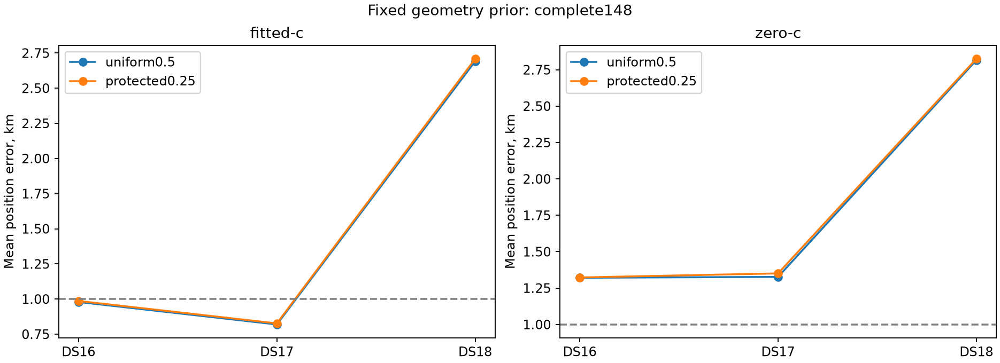
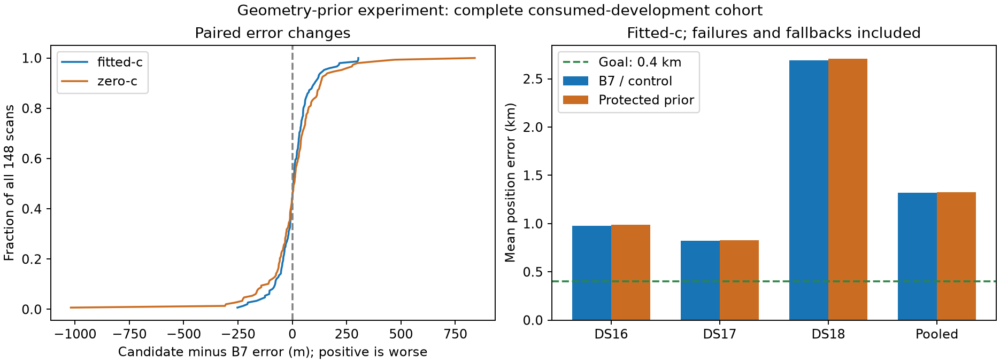

# Iteration86: pause-safe geometry-prior completion

**Complete: all 148 recordings, both c arms. The protected geometry prior does
not improve mean error; retain deployed B7.** The new research target is 0.4 km
mean error, which remains unachieved.

| Dataset | Members | B7/control fitted-c mean km | Protected-prior mean km |
|---|---:|---:|---:|
| DS16 | 63 | 0.979007 | 0.986470 |
| DS17 | 51 | 0.819111 | 0.826775 |
| DS18 | 34 | 2.691656 | 2.709094 |
| Pooled | 148 | 1.317354 | 1.327178 |

The candidate strengthens the Gaussian prior only in up to two satellite-slope
directions that overlap with position sensitivity, computed at an ordinary
hypothesis seed. It worsens fitted-c mean by 9.82 m and median from 0.864 to
0.883 km: 65 improve, 80 regress, and 3 tie. The p95 improves slightly from
2.269 to 2.232 km, but the 53 km failure persists. The largest fitted-c regression
is 304 m on DS18-023; the largest improvement is 253 m on DS16-043. One raw
protected fitted-c result, DS17-008, fails independent stationarity qualification
and retains the fixed B7 fallback. No member is excluded or missing.

The matched c=0 mean also worsens, 1.666471 to 1.677710 km. Frequency RMS is
separate: fitted-c 67.204 to 67.423 Hz, c=0 106.170 to 106.304 Hz. The fresh
uniform controls reproduce every archived B7 objective exactly. All eight
pause-exposed retry objectives also match their original attempts exactly.
These are development results, not evidence from new independent validation.

[RESULTS.md](RESULTS.md) reports all membership, distributions, convergence and
fallbacks. [summary.json](summary.json) retains paired results and subgroup
coverage, including DS16's additional 15 and DS18's consumed exposure categories.
[receipts.tar.zst](receipts.tar.zst) preserves all original and retry fit receipts;
[integrity.json](integrity.json) binds the published artifacts.

The next search experiment resumes iteration83's unchanged checkpoint, which
tests ordinary-region clock recovery on a different fixed control. Its outputs
must not be spliced into B7: a separate common-model composition is necessary.
The ordinary-scan error floor also needs work. [NEXT_MODELS.md](NEXT_MODELS.md)
sets out three hypotheses and requires an audit of residuals at current B7
endpoints before fitting additional receiver-by-satellite corrections. Existing
newer live diagnostics remain consumed; potential reserve outcomes remain closed.

## Pause and reproducibility audit

The fixed geometry-overlap experiment is iteration84. It was explicitly paused
at129/148 completed members, with DS18-016 and DS18-017 in progress. Existing
workers resumed after all1375 frozen source/input hashes matched. The original
monotonic wall-time deadline can count suspended time. A separately frozen rule
therefore repeats both variants and both c arms for both pause-exposed members,
regardless of their original outcomes. That is eight new fits, four per member.
Original receipts are retained. The pause-exposed completed receipts later showed
ordinary0.7–1.6s elapsed and convergence; actual timing contamination is not proved.

The final148-member comparison always takes these two members from iteration86
and the other146 from iteration84. Missing retries stay pending; failed retries
stay explicit. Reference positions and errors never select the receipt or winner.
The original geometry prior and matched90s/600iteration budgets are unchanged.
Both arms share fitted-derived seed, bank and projector; c0 locks staticc and
RF-time terms. All members are consumed development, with no unseen validation
claim. Production B7 remains deployed and this experiment changes no defaults.

Run `freeze.py` once, then `evaluate.py`, then `report.py`. The wrapper calls the
unchanged hash-verified iteration84 evaluator with a separate output root. The
reporter reuses iteration84 metrics and rendering with an explicit source selector;
the in-memory protocol assertion view adapts to the composite report digest while
preserving `source_protocol_sha256` and `selected_source` in summary results.
`receipt-selection.json` records all148 source choices. No persisted original
receipt is rewritten or copied. [RESULTS.md](RESULTS.md) and
[comparison.png](comparison.png) are generated after completion.
