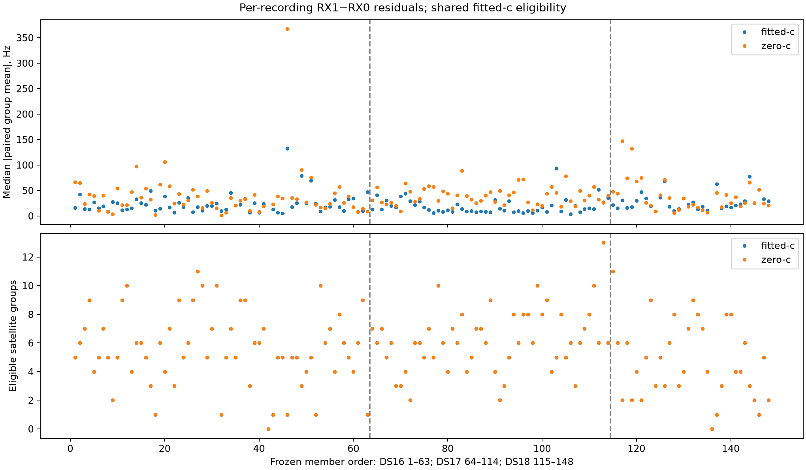
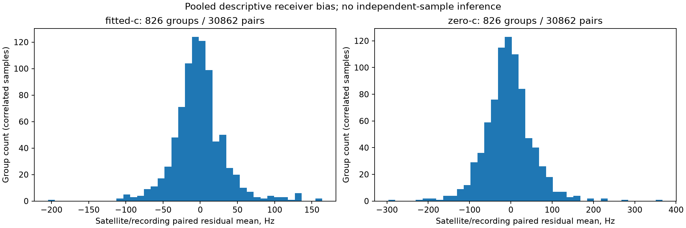

# Completed B7 audit: paired receiver structure remains

**All 148 recordings completed, with both B7 objectives reproduced exactly.**
No input failures, exclusions, reference-guided groups, new position fits, or
production changes occurred. Both audit workers exited0. The frozen protocol
and its original README remain unchanged; this document records the outcome.

There are33,665 same-satellite/channel/millisecond receiver pairs. Of these
recording/satellite groups,826 have at least10 pairs. There is at least one such
group in146 recordings and at least two in138. The proposed contrast correction
would therefore be an explicit no-op in10 recordings under its fixed support
rule. All148 still belong to the comparison; the two scans without any eligible
group have unavailable paired-mean statistics, not zero bias or an exclusion.

For each recording, first take the absolute mean RX1-minus-RX0 residual for each
eligible satellite group, then its median across groups. The table summarizes
that per-recording statistic; it is not the median individual frequency residual.

| Dataset | Recordings | Available paired statistic | Fitted-c median Hz | c=0 median Hz | No-op recordings |
|---|---:|---:|---:|---:|---:|
| DS16 | 63 | 62 | 18.88 | 31.64 | 7 |
| DS17 | 51 | 51 | 13.68 | 39.49 | 0 |
| DS18 | 34 | 33 | 22.59 | 26.47 | 3 |
| Pooled | 148 | 146 | 18.00 | 32.69 | 10 |

The pooled fitted-c p95 of this statistic is52.02Hz. These are conditional
residuals after B7, so the old paired-receiver observation was not entirely
removed by joint clocks, RF calibration, and satellite slopes. This supports
the next confounding diagnostic. It does **not** establish a physical satellite
or LNB error, nor that an extra correction will improve position.

## What remains ambiguous

A common receiver clock error can appear satellite-dependent when satellites
are sampled at different times or channels. The present grouped statistics do
not retain the time detail needed to separate those explanations. Iteration90
will reconstruct the exact pairs and compare a small common time/channel
background with a projection onto the smooth-clock functions already in B7.
Both are predeclared uniform diagnostics, with no per-scan winner selection.

The [iteration88 linear solver](../2026_10_09_position_error_iter88/README.md)
has synthetic algebra tests but no demonstrated localization benefit. It will
not be applied to positioning merely because unadjusted group means differ.
Its purpose is to test an inexpensive correction before adding more nonlinear
parameters. Any later positioning experiment needs same-start zero controls,
matched c arms, all-member failures/fallbacks, and accuracy/runtime comparisons.

Serial correlation also remains: across8,072 eligible receiver/channel/satellite
groups, median adjacent correlation is0.261 fitted-c and0.363 c=0. Pairs can share
observations; these are descriptive correlated samples, not independent trials
or calibrated effective sample sizes. Median per-recording correlation between
GLRT margin and absolute residual is−0.179 fitted-c. This does not calibrate
measurement variance or justify an immediate margin-dependent weighting rule.

## Scientific and execution audit

All429,788 observations remain accounted for:402,269 have the shared fitted-B7
assignment probability strictly above0.5;27,519 are unassigned, with no nonfinite
rows. The two c arms use identical assignments, pair membership and support rules;
their residuals are evaluated at their own accepted endpoints. Zero-c's static-c
and RF-time locks are checked. The assignment threshold conditions these summaries
on the existing model; it does not prove that satellite identities are correct.

[RESULTS.md](RESULTS.md) and [summary.json](summary.json) preserve complete
membership, DS16 original48/added15 and DS18 prior24/other10 exposure categories,
both arms, temporal/margin statistics, and all objective checks. Group summaries
refer to the per-member receipts without duplicating their arrays. Nine synthetic
tests pass; the four reporter tests were rerun after that presentation-only
deduplication. Both plots were visually inspected. [integrity.json](integrity.json)
and [receipts.tar.zst](receipts.tar.zst) bind the published receipts and figures.

There is no new position-error result: deployed B7 remains at pooled fitted-c
mean1.317354km and c=0 mean1.666471km on these consumed development data. The
0.4km goal remains unachieved. The newer-data inventory is metadata-only and
opens no localization outcomes or reserved validation data. No RF was collected.
