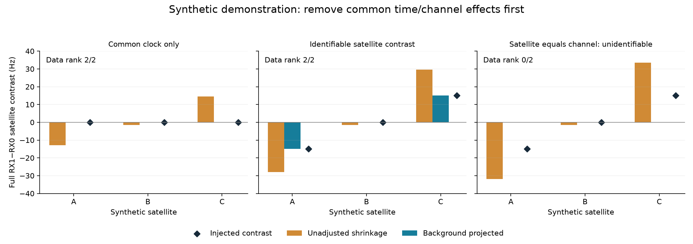

# Iteration88 prototype: a small projected receiver-contrast solver

Prepared pure linear algebra only. No recording has been evaluated, no optimizer
has run, and no position improvement is claimed. The iteration87 audit continues
unchanged; production B7, frozen reports and the post-DS18 reserve are untouched.

This synthetic illustration uses unequal satellite time coverage. Unadjusted
paired-mean shrinkage invents satellite contrasts from a common clock trend;
projection removes that trend. An identifiable injected contrast is recovered
approximately under shrinkage. When satellite and channel are indistinguishable,
the solver reports data rank0 and returns zero rather than inventing an identified
correction. The data have no added random observation noise; the explicit5Hz
pair-noise scale sets the weights for the illustrative30Hz prior. This is a
linear-algebra demonstration, not a recording or position-accuracy result.
The [synthetic receipt](synthetic-confounding.json) records its fixed seed and outputs.

The [embedded design memo](../2026_10_09_position_error_iter87/EMBEDDED_MODEL.md)
motivates a small paired-frequency correction before adding another nonlinear
parameter block. Historical receiver differences may represent common receiver
clock error rather than satellite-specific effects. Zero-sum constraints alone
do not remove confounding from unequal satellite time/channel coverage.

## Fixed mathematical definition

Inputs are already joined RX1-minus-RX0 paired residuals in Hz, satellite indices,
pair times, channels, and optional positive weights interpreted as actual
measurement precisions in1/Hz². Missing weights mean explicit unit precision,
not an empirically calibrated noise claim. Unit precision implies a1Hz pair
noise scale. Any future recording caller must freeze an explicit global pair
noise scale or calibrated precisions, rather than treating unit counts as
physically scaled evidence against10/30/60Hz priors. No reference coordinates or errors
are accepted. Pair generation and association are outside this pure solver.

Satellites need at least10 pairs. Fewer than2 eligible satellites yields an exact
no-op; ineligible satellite corrections stay zero and their rows do not enter
this diagnostic solve. This is not removal from the positioning likelihood.

Background columns are an intercept, weighted-centered/scaled linear time and
deterministic channel indicators excluding the first sorted channel. An
orthonormal Helmert basis represents zero-sum satellite contrasts. Solve

`min ||sqrt(W)*(y-B*beta-Z*theta)||² + ||theta||²/sigma_hz²`.

An SVD removes only the identifiable background column space, without constructing
a pair-count-square projector. A second SVD solves the small regularized contrast
problem. Data-null contrast modes receive exactly zero coefficients; the report
separates data rank from regularized rank and exposes weak modes. Rank tolerance
uses the original whitened contrast design so roundoff left after complete
background projection is not treated as genuine information. Fully unidentifiable
contrasts are explicitly flagged `unsupported_zero` and `no_op`. Sigma0 locks all
contrasts exactly to zero while background diagnostics can still be computed.
No prior is chosen automatically;10/30/60Hz remain globally fixed research
hypotheses for a future protocol, not per-scan choices.

The result exposes contrasts, background coefficients and their units/column
definitions, ranks, singular values, weak modes, matrix dimensions, support and
elapsed time. `shrink_zero_sum_means` additionally implements the small grouped
KKT solution when common effects have already been controlled. It must not
replace projected fitting merely because unadjusted means look different.

## Scope and next gate

Fifteen synthetic tests pass, covering independent augmented-ridge and constrained
KKT agreement, exact zero nesting, zero-sum and permutation/sign invariance,
physical-unit scaling, rank-deficient background handling, and zero contrast
for wholly confounded signal. Ruff passes, and an independent SOL agent reviewed
the mathematics and implementation. The synthetic figure was visually inspected.
These checks establish the algebra; they do not establish recording performance.

For P paired samples, K eligible satellites and L background columns, this dense
prototype uses O(P(K+L)) storage and approximately O(P(K+L)^2+(K+L)^3) work.
It never constructs a P-by-P projector and adds no nonlinear optimizer variables.
The simpler grouped formula costs O(P+K) after indexing, but must not replace
background removal unless its assumptions hold. This is a NumPy reference
prototype, not an embedded implementation or measured embedded speed claim.

Regularization gives a unique
penalized estimate, not proof of physical identifiability. Pair dependence,
spectral-component identity, timestamp precision and circular-alias handling
remain input-level concerns; this solver does not settle them.

The pending B7 residual audit must justify a subsequent frozen paired-data
diagnostic before any position refit. Any future experiment retains full148
coverage, matched c0/fitted-c observations and correction policy, same-start
zero controls, explicit no-ops/failures and randomized whole-recording validation.
Frequency-fit effects and position accuracy remain separate. No recording-fit
protocol, recording evaluation, deployment or reserve-outcome access is performed here.
