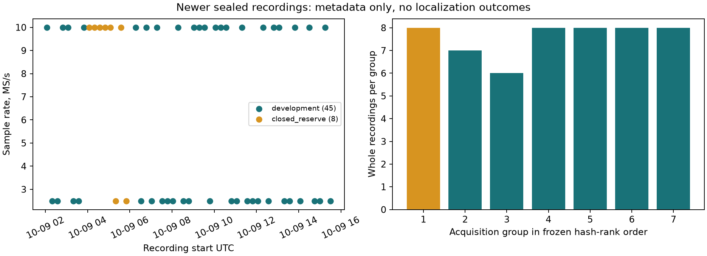

# Iteration89: newer-data metadata mint and split

**Metadata inventory and seal verification completed. No new localization outcome was opened, no analysis or RF collection was started, and no retention hold was created. All eleven existing POST18-RESERVE outcomes remain closed.**

| Property | Value |
|---|---|
| Window, start inclusive / cutoff exclusive | 2026-10-09T02:02:21+00:00 / 2026-10-09T15:46:15+00:00 |
| Full sealed membership | 53 |
| Retained visits | 116483 |
| Valid seconds per receiver | 13977.96 |
| Referenced compressed bytes | 527077320159 |
| Sample-rate counts | {'10000000': 27, '2500000': 26} |
| Source kinds | {'published': 53} |
| Exclusions / observed unsealed partials | 0 / 1 |
| Whole acquisition groups | 7 |
| Group assignments | {'closed_reserve': 1, 'development': 6} |
| Recording assignments | {'closed_reserve': 8, 'development': 45} |
| Manifest SHA256 | `421421e1ff6c94e760960290fe94954c00776a05606e4e4433adc4f2cf02c633` |

The cutoff was clock-frozen before inventory and committed/published in `15e7ef869`. All784 frozen source/runtime/parent hashes passed before the unchanged read-only mint ran. Published metadata used public storage ports; firmware archive inventory had no quality or analysis-readiness gate. No raw IQ was copied, decompressed or rehashed. Live inventory is non-atomic; the execution receipt records observed begin/end times.

[membership.json](membership.json) binds every member, metadata/source hashes, exposure matches, groups and random ranks. [mint-execution.json](mint-execution.json) records exact commands and successful mint/verify exits. The local manifest and seal are authoritative, with copied parent provenance. [metadata.tar.zst](metadata.tar.zst) publishes the complete sealed metadata snapshot without raw IQ. [verification.json](verification.json) records independent seal, coverage and random-rank checks. Disjointness passed by session and IQ digest against DS16(63), DS17(51), DS18(34) and the existing reserve(11). Previous dataset names and membership remain unchanged.

## Exposure and independence

Exposure classifications: {'no_match_in_searched_roots_independence_unproven': 51, 'consumed_known_live_diagnostic': 1, 'metadata_only_queue_receipt_independence_unproven': 1}. Exact identity search included hidden and ignored local receipts in both report worktrees and returned only filenames and identity tokens. No localization lines or values were opened. Known inspected rollout diagnostics are consumed development. Other matches require metadata-only classification before their groups can be reserved. No match alone establishes unseen validation. External machines, notebooks and conversation-only exposure were not fully audited.

Available explicit acquisition identifiers: 0 of53 recordings. Grouping joins available acquisition identities, duplicate manifest/IQ identities and fixed two-hour UTC start blocks. These groups remain an independence assumption; missing campaign metadata can leave longer clock/thermal dependence. Group random ranks use the frozen seed; consumed groups are development. Fewer than five eligible unconsumed groups produces no new reserve under the frozen rule. No split is rebalanced using quality or outcomes.

Candidate/control policy must be frozen before opening new development results; reserved outcomes stay closed through tuning and final candidate freeze. Future evaluation reports all member failures, matched c0/fitted-c and frequency-fit effects separately from position accuracy.

| Member | Session | Start UTC | MS/s | Visits | Exposure | Group assignment |
|---|---|---|---:|---:|---|---|
| POST18-NEWER-20261009-001 | scan-fw-11f104e82ed3cfac | 2026-10-09T02:04:15.953680+00:00 | 10 | 2190 | no_match_in_searched_roots_independence_unproven | development |
| POST18-NEWER-20261009-002 | scan-fw-c8ecc0e1d0ccc0b5 | 2026-10-09T02:19:20.755690+00:00 | 2.5 | 2214 | no_match_in_searched_roots_independence_unproven | development |
| POST18-NEWER-20261009-003 | scan-fw-508e2fc0c45b820a | 2026-10-09T02:34:24.964320+00:00 | 2.5 | 2213 | no_match_in_searched_roots_independence_unproven | development |
| POST18-NEWER-20261009-004 | scan-fw-41a15f2953a49a3a | 2026-10-09T02:49:28.706308+00:00 | 10 | 2196 | no_match_in_searched_roots_independence_unproven | development |
| POST18-NEWER-20261009-005 | scan-fw-f562ab1308c50a28 | 2026-10-09T03:04:33.147484+00:00 | 10 | 2204 | no_match_in_searched_roots_independence_unproven | development |
| POST18-NEWER-20261009-006 | scan-fw-ada3510a0e6db23b | 2026-10-09T03:19:37.929626+00:00 | 2.5 | 2213 | no_match_in_searched_roots_independence_unproven | development |
| POST18-NEWER-20261009-007 | scan-fw-7f53c002cc621a28 | 2026-10-09T03:34:42.844805+00:00 | 2.5 | 2215 | no_match_in_searched_roots_independence_unproven | development |
| POST18-NEWER-20261009-008 | scan-fw-fc5780eb4f814c5e | 2026-10-09T03:49:46.190983+00:00 | 10 | 2193 | no_match_in_searched_roots_independence_unproven | development |
| POST18-NEWER-20261009-009 | scan-fw-ed3574b72549bce2 | 2026-10-09T04:04:50.148943+00:00 | 10 | 2198 | no_match_in_searched_roots_independence_unproven | closed_reserve |
| POST18-NEWER-20261009-010 | scan-fw-05f73129a12752ee | 2026-10-09T04:19:53.581899+00:00 | 10 | 2201 | no_match_in_searched_roots_independence_unproven | closed_reserve |
| POST18-NEWER-20261009-011 | scan-fw-bfd712dd39189c3d | 2026-10-09T04:34:57.134429+00:00 | 10 | 2201 | no_match_in_searched_roots_independence_unproven | closed_reserve |
| POST18-NEWER-20261009-012 | scan-fw-bed01d64124aab05 | 2026-10-09T04:50:00.852398+00:00 | 10 | 2206 | no_match_in_searched_roots_independence_unproven | closed_reserve |
| POST18-NEWER-20261009-013 | scan-fw-ddb370aa9a4bd189 | 2026-10-09T05:05:05.181426+00:00 | 10 | 2204 | no_match_in_searched_roots_independence_unproven | closed_reserve |
| POST18-NEWER-20261009-014 | scan-fw-c5388a198ad195d7 | 2026-10-09T05:20:09.892860+00:00 | 2.5 | 2218 | no_match_in_searched_roots_independence_unproven | closed_reserve |
| POST18-NEWER-20261009-015 | scan-fw-255917a3a2b3cebf | 2026-10-09T05:35:13.180585+00:00 | 10 | 2195 | no_match_in_searched_roots_independence_unproven | closed_reserve |
| POST18-NEWER-20261009-016 | scan-fw-d2c3ca8a9968d1de | 2026-10-09T05:50:17.807965+00:00 | 2.5 | 2225 | no_match_in_searched_roots_independence_unproven | closed_reserve |
| POST18-NEWER-20261009-017 | scan-fw-723324048128bd5f | 2026-10-09T06:17:01.422959+00:00 | 10 | 2200 | no_match_in_searched_roots_independence_unproven | development |
| POST18-NEWER-20261009-018 | scan-fw-5cb1d78987a86957 | 2026-10-09T06:32:05.955652+00:00 | 2.5 | 2216 | no_match_in_searched_roots_independence_unproven | development |
| POST18-NEWER-20261009-019 | scan-fw-0c05cb76279b86d5 | 2026-10-09T06:47:10.135921+00:00 | 10 | 2201 | no_match_in_searched_roots_independence_unproven | development |
| POST18-NEWER-20261009-020 | scan-fw-3d30a9d318240a39 | 2026-10-09T07:02:14.936217+00:00 | 2.5 | 2215 | no_match_in_searched_roots_independence_unproven | development |
| POST18-NEWER-20261009-021 | scan-fw-062dbe0bd2400d24 | 2026-10-09T07:17:18.456904+00:00 | 10 | 2195 | no_match_in_searched_roots_independence_unproven | development |
| POST18-NEWER-20261009-022 | scan-fw-d2c27f98f8b6a96d | 2026-10-09T07:32:22.904969+00:00 | 2.5 | 2219 | no_match_in_searched_roots_independence_unproven | development |
| POST18-NEWER-20261009-023 | scan-fw-22eec89607b2bccc | 2026-10-09T07:47:27.275115+00:00 | 2.5 | 2215 | no_match_in_searched_roots_independence_unproven | development |
| POST18-NEWER-20261009-024 | scan-fw-8a0bef7c8112faa9 | 2026-10-09T08:02:31.863472+00:00 | 2.5 | 2219 | no_match_in_searched_roots_independence_unproven | development |
| POST18-NEWER-20261009-025 | scan-fw-75e2c8bd6d49a43f | 2026-10-09T08:17:35.008909+00:00 | 10 | 2196 | no_match_in_searched_roots_independence_unproven | development |
| POST18-NEWER-20261009-026 | scan-fw-3b7c7239102167f8 | 2026-10-09T08:32:39.680457+00:00 | 2.5 | 2218 | no_match_in_searched_roots_independence_unproven | development |
| POST18-NEWER-20261009-027 | scan-fw-997f95432b7b1c7f | 2026-10-09T08:47:43.530959+00:00 | 2.5 | 2221 | no_match_in_searched_roots_independence_unproven | development |
| POST18-NEWER-20261009-028 | scan-fw-c3d9df269a56d875 | 2026-10-09T09:02:47.035851+00:00 | 10 | 2192 | no_match_in_searched_roots_independence_unproven | development |
| POST18-NEWER-20261009-029 | scan-fw-abd4c4524feede74 | 2026-10-09T09:17:50.668631+00:00 | 10 | 2204 | no_match_in_searched_roots_independence_unproven | development |
| POST18-NEWER-20261009-030 | scan-fw-9bf03efa835e8a94 | 2026-10-09T09:32:54.396398+00:00 | 10 | 2201 | no_match_in_searched_roots_independence_unproven | development |
| POST18-NEWER-20261009-031 | scan-fw-c0746945220b438c | 2026-10-09T09:47:58.915049+00:00 | 2.5 | 2216 | no_match_in_searched_roots_independence_unproven | development |
| POST18-NEWER-20261009-032 | scan-fw-17b7f215f4b20c6d | 2026-10-09T10:03:03.063103+00:00 | 10 | 2202 | no_match_in_searched_roots_independence_unproven | development |
| POST18-NEWER-20261009-033 | scan-fw-92674ee4df08b5b3 | 2026-10-09T10:18:06.915687+00:00 | 10 | 2204 | no_match_in_searched_roots_independence_unproven | development |
| POST18-NEWER-20261009-034 | scan-fw-c2dc375cdf992279 | 2026-10-09T10:33:11.182863+00:00 | 10 | 2195 | no_match_in_searched_roots_independence_unproven | development |
| POST18-NEWER-20261009-035 | scan-fw-61b3bcc3f1fed165 | 2026-10-09T10:48:15.920488+00:00 | 2.5 | 2213 | no_match_in_searched_roots_independence_unproven | development |
| POST18-NEWER-20261009-036 | scan-fw-b9ddfb8d35fbe551 | 2026-10-09T11:03:20.053464+00:00 | 2.5 | 2216 | no_match_in_searched_roots_independence_unproven | development |
| POST18-NEWER-20261009-037 | scan-fw-1d70cb0839cdadbd | 2026-10-09T11:18:24.116506+00:00 | 10 | 2198 | no_match_in_searched_roots_independence_unproven | development |
| POST18-NEWER-20261009-038 | scan-fw-053a91d31d0f9be5 | 2026-10-09T11:33:28.420238+00:00 | 2.5 | 2215 | no_match_in_searched_roots_independence_unproven | development |
| POST18-NEWER-20261009-039 | scan-fw-a45e4bc0b024c626 | 2026-10-09T11:48:32.804383+00:00 | 2.5 | 2219 | no_match_in_searched_roots_independence_unproven | development |
| POST18-NEWER-20261009-040 | scan-fw-eb346c3f2d9d7457 | 2026-10-09T12:03:36.845119+00:00 | 2.5 | 2219 | no_match_in_searched_roots_independence_unproven | development |
| POST18-NEWER-20261009-041 | scan-fw-023e14d7e4471561 | 2026-10-09T12:18:40.407156+00:00 | 10 | 2196 | no_match_in_searched_roots_independence_unproven | development |
| POST18-NEWER-20261009-042 | scan-fw-abfeed0ff8b7593f | 2026-10-09T12:33:44.699413+00:00 | 2.5 | 2218 | no_match_in_searched_roots_independence_unproven | development |
| POST18-NEWER-20261009-043 | scan-fw-2e38a8ab352ee4b8 | 2026-10-09T12:48:47.971255+00:00 | 10 | 2198 | no_match_in_searched_roots_independence_unproven | development |
| POST18-NEWER-20261009-044 | scan-fw-3bf9f75c3f6aa73f | 2026-10-09T13:03:51.476206+00:00 | 10 | 2203 | no_match_in_searched_roots_independence_unproven | development |
| POST18-NEWER-20261009-045 | scan-fw-b87021fd4f97c887 | 2026-10-09T13:18:55.920817+00:00 | 2.5 | 2215 | no_match_in_searched_roots_independence_unproven | development |
| POST18-NEWER-20261009-046 | scan-fw-9f74d1bfe8a3ca6f | 2026-10-09T13:34:00.808597+00:00 | 2.5 | 2216 | no_match_in_searched_roots_independence_unproven | development |
| POST18-NEWER-20261009-047 | scan-fw-7ebf76971ca06c00 | 2026-10-09T13:49:04.692001+00:00 | 10 | 2198 | consumed_known_live_diagnostic | development |
| POST18-NEWER-20261009-048 | scan-fw-6695b65dfec9e78b | 2026-10-09T14:04:09.427355+00:00 | 2.5 | 2216 | no_match_in_searched_roots_independence_unproven | development |
| POST18-NEWER-20261009-049 | scan-fw-b678246b44140a41 | 2026-10-09T14:29:54.808156+00:00 | 10 | 1685 | no_match_in_searched_roots_independence_unproven | development |
| POST18-NEWER-20261009-050 | scan-fw-e52e11f984aea90c | 2026-10-09T14:45:01.552636+00:00 | 2.5 | 2216 | metadata_only_queue_receipt_independence_unproven | development |
| POST18-NEWER-20261009-051 | scan-fw-ac11ac00c0676d1b | 2026-10-09T15:00:05.502277+00:00 | 2.5 | 2213 | no_match_in_searched_roots_independence_unproven | development |
| POST18-NEWER-20261009-052 | scan-fw-fc28aec654597ca9 | 2026-10-09T15:15:09.177829+00:00 | 10 | 2198 | no_match_in_searched_roots_independence_unproven | development |
| POST18-NEWER-20261009-053 | scan-fw-880eaae96cd789e7 | 2026-10-09T15:30:13.704024+00:00 | 2.5 | 2216 | no_match_in_searched_roots_independence_unproven | development |

## Explicit unsealed partials

These are not sealed evaluable members. Their observed metadata remains explicit; none is silently treated as an error-free recording.

- {"path": "/srv/postgres-nvme/leo-scanner-spool/v052-adaptive/.scan-fw-2dedb2b019345fc8.partial", "status": "unsealed_not_evaluable", "time_basis": "file mtimes, no sealed capture timing", "files": 1672, "bytes_observed": 12227534784, "first_file_mtime_utc_ns": 1791560717677180871, "last_file_mtime_utc_ns": 1791560945864924909}
