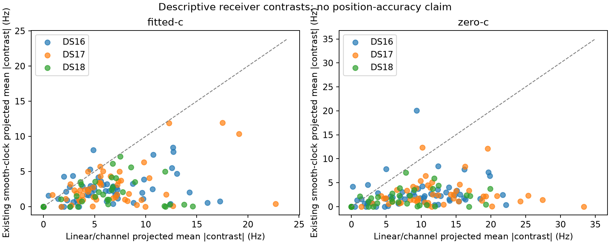
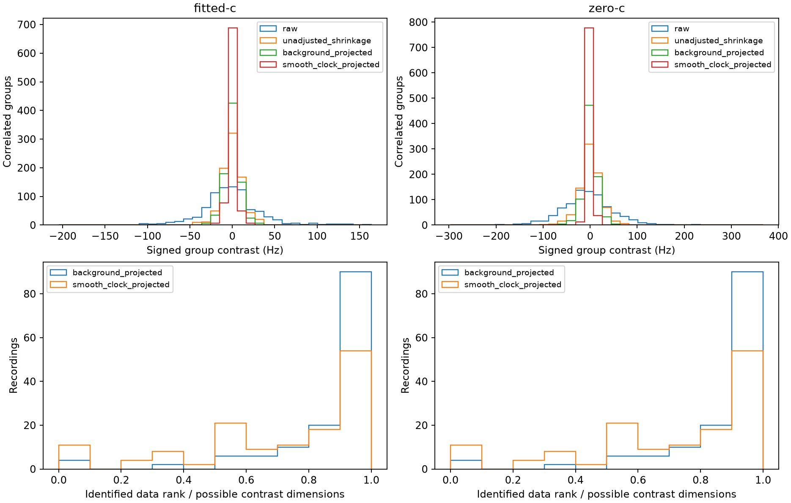

# Iteration90: paired receiver differences and clock confounding

Coverage: **148 members**, statuses `{'complete': 148}`. Every missing/input/reconstruction failure remains in coverage; numerical tables describe explicitly available recordings only.

Fixed30Hz contrast prior; fixed pair precision1/31250Hz². Both c arms use the same fitted-derived assignment and exact paired membership. The smooth sensitivity adds only the existing B7 smooth-clock span. No new position, accuracy improvement, physical hardware diagnosis or independent validation is claimed.

| Dataset | Arm | Available/member | Pairs | Eligible groups | Raw mean | Unadjusted | Linear | Smooth |
|---|---|---:|---:|---:|---:|---:|---:|---:|
| DS16 | fitted-c | 63/63 | 13727 | 350 | 24.866 | 8.747 | 5.173 | 2.100 |
| DS16 | zero-c | 63/63 | 13727 | 350 | 37.362 | 13.882 | 8.955 | 1.798 |
| DS17 | fitted-c | 51/51 | 13939 | 315 | 16.909 | 7.632 | 5.545 | 1.851 |
| DS17 | zero-c | 51/51 | 13939 | 315 | 43.589 | 20.178 | 10.991 | 1.728 |
| DS18 | fitted-c | 34/34 | 5999 | 161 | 28.285 | 9.651 | 6.318 | 1.444 |
| DS18 | zero-c | 34/34 | 5999 | 161 | 37.180 | 13.350 | 6.949 | 1.089 |
| Pooled | fitted-c | 148/148 | 33665 | 826 | 23.944 | 8.849 | 5.583 | 1.874 |
| Pooled | zero-c | 148/148 | 33665 | 826 | 39.610 | 15.979 | 9.498 | 1.709 |
| DS16-original48 | fitted-c | 48/48 | 10801 | 274 | 24.966 | 8.880 | 6.021 | 2.021 |
| DS16-original48 | zero-c | 48/48 | 10801 | 274 | 36.189 | 13.302 | 9.190 | 1.798 |
| DS16-added15 | fitted-c | 15/15 | 2926 | 76 | 23.723 | 7.706 | 4.744 | 2.239 |
| DS16-added15 | zero-c | 15/15 | 2926 | 76 | 41.555 | 16.145 | 6.775 | 1.754 |
| DS18-prior24 | fitted-c | 24/24 | 4274 | 117 | 25.151 | 9.612 | 5.420 | 1.444 |
| DS18-prior24 | zero-c | 24/24 | 4274 | 117 | 40.634 | 13.350 | 6.887 | 1.089 |
| DS18-other10-consumed | fitted-c | 10/10 | 1725 | 44 | 28.865 | 9.899 | 6.726 | 1.557 |
| DS18-other10-consumed | zero-c | 10/10 | 1725 | 44 | 33.856 | 14.122 | 8.688 | 1.686 |

Entries are median per-recording mean absolute eligible-group contrast, Hz. Raw means contain common effects; unadjusted shrinkage is not background-adjusted.

| Dataset | Arm | Background | No-op | No identified modes | Median rank fraction | Median background RMS Hz | Median after-background RMS Hz | Median final RMS Hz |
|---|---|---|---:|---:|---:|---:|---:|---:|
| DS16 | fitted-c | background_projected | 7 | 7 | 1.000 | 22.586 | 69.661 | 67.739 |
| DS16 | fitted-c | smooth_clock_projected | 10 | 10 | 0.800 | 41.321 | 62.659 | 62.578 |
| DS16 | zero-c | background_projected | 7 | 7 | 1.000 | 32.189 | 74.767 | 69.638 |
| DS16 | zero-c | smooth_clock_projected | 10 | 10 | 0.800 | 60.330 | 62.766 | 62.692 |
| DS17 | fitted-c | background_projected | 2 | 2 | 1.000 | 17.677 | 61.848 | 58.964 |
| DS17 | fitted-c | smooth_clock_projected | 4 | 4 | 0.833 | 30.515 | 55.633 | 55.598 |
| DS17 | zero-c | background_projected | 2 | 2 | 1.000 | 41.581 | 79.940 | 69.611 |
| DS17 | zero-c | smooth_clock_projected | 4 | 4 | 0.833 | 62.618 | 55.703 | 55.656 |
| DS18 | fitted-c | background_projected | 5 | 5 | 1.000 | 30.099 | 104.259 | 101.059 |
| DS18 | fitted-c | smooth_clock_projected | 7 | 7 | 0.667 | 55.548 | 90.719 | 90.719 |
| DS18 | zero-c | background_projected | 5 | 5 | 1.000 | 37.138 | 101.157 | 101.157 |
| DS18 | zero-c | smooth_clock_projected | 7 | 7 | 0.667 | 66.158 | 90.641 | 90.641 |
| Pooled | fitted-c | background_projected | 14 | 14 | 1.000 | 21.181 | 69.548 | 67.739 |
| Pooled | fitted-c | smooth_clock_projected | 21 | 21 | 0.800 | 39.017 | 63.342 | 62.968 |
| Pooled | zero-c | background_projected | 14 | 14 | 1.000 | 36.819 | 82.238 | 71.063 |
| Pooled | zero-c | smooth_clock_projected | 21 | 21 | 0.800 | 62.818 | 63.215 | 63.069 |

Background RMS describes the fitted common clock/channel prediction; after-background RMS retains the fitted contrast plus residual. These are descriptive projections, not an additive variance decomposition or proof of physical identifiability. Data rank, regularized rank and no-ops are distinct. No calibrated uncertainty or position effect.

[Compact summaries and complete membership](summary.json); raw receipts remain under results/.

| Member | Status | Failure |
|---|---|---|
| DS16-001 | complete |  |
| DS16-002 | complete |  |
| DS16-003 | complete |  |
| DS16-004 | complete |  |
| DS16-005 | complete |  |
| DS16-006 | complete |  |
| DS16-007 | complete |  |
| DS16-008 | complete |  |
| DS16-009 | complete |  |
| DS16-010 | complete |  |
| DS16-011 | complete |  |
| DS16-012 | complete |  |
| DS16-013 | complete |  |
| DS16-014 | complete |  |
| DS16-015 | complete |  |
| DS16-016 | complete |  |
| DS16-017 | complete |  |
| DS16-018 | complete |  |
| DS16-019 | complete |  |
| DS16-020 | complete |  |
| DS16-021 | complete |  |
| DS16-022 | complete |  |
| DS16-023 | complete |  |
| DS16-024 | complete |  |
| DS16-025 | complete |  |
| DS16-026 | complete |  |
| DS16-027 | complete |  |
| DS16-028 | complete |  |
| DS16-029 | complete |  |
| DS16-030 | complete |  |
| DS16-031 | complete |  |
| DS16-032 | complete |  |
| DS16-033 | complete |  |
| DS16-034 | complete |  |
| DS16-035 | complete |  |
| DS16-036 | complete |  |
| DS16-037 | complete |  |
| DS16-038 | complete |  |
| DS16-039 | complete |  |
| DS16-040 | complete |  |
| DS16-041 | complete |  |
| DS16-042 | complete |  |
| DS16-043 | complete |  |
| DS16-044 | complete |  |
| DS16-045 | complete |  |
| DS16-046 | complete |  |
| DS16-047 | complete |  |
| DS16-048 | complete |  |
| DS16-049 | complete |  |
| DS16-050 | complete |  |
| DS16-051 | complete |  |
| DS16-052 | complete |  |
| DS16-053 | complete |  |
| DS16-054 | complete |  |
| DS16-055 | complete |  |
| DS16-056 | complete |  |
| DS16-057 | complete |  |
| DS16-058 | complete |  |
| DS16-059 | complete |  |
| DS16-060 | complete |  |
| DS16-061 | complete |  |
| DS16-062 | complete |  |
| DS16-063 | complete |  |
| DS17-001 | complete |  |
| DS17-002 | complete |  |
| DS17-003 | complete |  |
| DS17-004 | complete |  |
| DS17-005 | complete |  |
| DS17-006 | complete |  |
| DS17-007 | complete |  |
| DS17-008 | complete |  |
| DS17-009 | complete |  |
| DS17-010 | complete |  |
| DS17-011 | complete |  |
| DS17-012 | complete |  |
| DS17-013 | complete |  |
| DS17-014 | complete |  |
| DS17-015 | complete |  |
| DS17-016 | complete |  |
| DS17-017 | complete |  |
| DS17-018 | complete |  |
| DS17-019 | complete |  |
| DS17-020 | complete |  |
| DS17-021 | complete |  |
| DS17-022 | complete |  |
| DS17-023 | complete |  |
| DS17-024 | complete |  |
| DS17-025 | complete |  |
| DS17-026 | complete |  |
| DS17-027 | complete |  |
| DS17-028 | complete |  |
| DS17-029 | complete |  |
| DS17-030 | complete |  |
| DS17-031 | complete |  |
| DS17-032 | complete |  |
| DS17-033 | complete |  |
| DS17-034 | complete |  |
| DS17-035 | complete |  |
| DS17-036 | complete |  |
| DS17-037 | complete |  |
| DS17-038 | complete |  |
| DS17-039 | complete |  |
| DS17-040 | complete |  |
| DS17-041 | complete |  |
| DS17-042 | complete |  |
| DS17-043 | complete |  |
| DS17-044 | complete |  |
| DS17-045 | complete |  |
| DS17-046 | complete |  |
| DS17-047 | complete |  |
| DS17-048 | complete |  |
| DS17-049 | complete |  |
| DS17-050 | complete |  |
| DS17-051 | complete |  |
| DS18-001 | complete |  |
| DS18-002 | complete |  |
| DS18-003 | complete |  |
| DS18-004 | complete |  |
| DS18-005 | complete |  |
| DS18-006 | complete |  |
| DS18-007 | complete |  |
| DS18-008 | complete |  |
| DS18-009 | complete |  |
| DS18-010 | complete |  |
| DS18-011 | complete |  |
| DS18-012 | complete |  |
| DS18-013 | complete |  |
| DS18-014 | complete |  |
| DS18-015 | complete |  |
| DS18-016 | complete |  |
| DS18-017 | complete |  |
| DS18-018 | complete |  |
| DS18-019 | complete |  |
| DS18-020 | complete |  |
| DS18-021 | complete |  |
| DS18-022 | complete |  |
| DS18-023 | complete |  |
| DS18-024 | complete |  |
| DS18-025 | complete |  |
| DS18-026 | complete |  |
| DS18-027 | complete |  |
| DS18-028 | complete |  |
| DS18-029 | complete |  |
| DS18-030 | complete |  |
| DS18-031 | complete |  |
| DS18-032 | complete |  |
| DS18-033 | complete |  |
| DS18-034 | complete |  |
