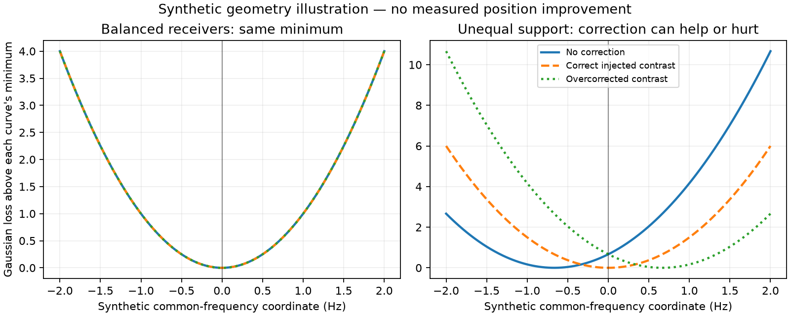

# Preparation: geometry limits of receiver contrast correction

Four pure NumPy synthetic tests pass under production Python3.14.4. No recording
or orbit data, optimizer, or receiver reference coordinates are used. This is
mathematical qualification for a possible later experiment, not a position result.

For equal-precision pairs with identical common-position derivatives, an
antisymmetric receiver correction leaves the spatial gradient unchanged. The
tests verify the common/differential residual decomposition, then demonstrate
three limits: unequal receiver support, unequal precision, and different
receiver geometry. With unequal support, the same mechanism lets a correct
injected correction remove a spurious gradient and a wrong correction create one.

These identities assume known assignments and unwrapped Gaussian residuals.
They do not prove invariance for B7's clutter/association mixture or for changing
clock/timing parameters. A frequency-fit improvement alone is not a position gain.

The prospective position experiment remains conditional on the completed
[iteration90 diagnostic](../2026_10_09_position_error_iter90/README.md). No
recording experiment is frozen or launched by this preparation. B7 remains the
deployed policy, and reserve outcomes remain closed.

The horizontal axis is a synthetic common-frequency coordinate, not geographic
distance. Subtracting each curve's own minimum exposes the unchanged spatial
shape for balanced pairs. With unequal support, the correct injected correction
centers the optimum; an excessive correction moves it in the opposite direction.
`plot_geometry.py` produces this figure without any recorded data.

## Additional research prototypes

`fixed_receiver_contrast.py` adds a frozen antisymmetric prediction correction
while preserving B7's fitted dimensions, priors and production fitter. Its nine
synthetic tests cover exact zero-control equivalence, analytic gradients,
receiver exchange, unsigned receiver indices, invalid inputs and c0 RF locks.
No recording fits have run. A later matched control/candidate protocol must be
frozen before using this wrapper for an accuracy comparison.

[The existing-clock linear solver](LINEAR_NUISANCE.md) solves a bounded Gaussian
surrogate using B7's existing smooth-clock and RF coefficients, with satellite
coefficients locked. Eleven synthetic tests cover actual-coefficient priors,
independent optimization checks, bounds, rank and exact-mixture acceptance.
It is a possible computational shortcut, not a new position model or a measured
runtime improvement. Combined with the four geometry tests, this preparation
contains 24 synthetic checks; none establish position accuracy on recordings.
