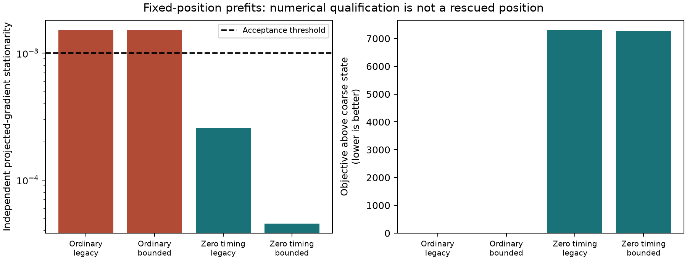

# Four-prefit replay: calibration failure remains unresolved

**Both ordinary-start prefits stop immediately without meeting independent stationarity. Zeroing timing produces qualified prefits with substantially worse objectives. No final position rescue has been demonstrated.**

Four numerical fitter calls returned and all immutable receipts exist. Driver statuses are `{'complete': 2, 'failed': 2}`: both bounded receipts report a post-fit instrumentation failure, `AttributeError: PositionFit has no attribute get`, when the driver treats the typed terminal fit as a mapping. Their numerical fit and returned-state gradient audit were already preserved; terminal finite-difference audits are missing. This driver defect is explicit and is not an optimizer failure or permission to rewrite original receipts.

| Start | Solver | Driver | Numerically qualified | Objective | Stationarity | Evaluations | Seconds | Posterior RMS Hz | Signal windows |
|---|---|---|---|---:|---:|---:|---:|---:|---:|
| ordinary-coarse | legacy | complete | False | 40696.314624 | 0.001527615 | 1 | 0.006 | 159.108 | 2066.759 |
| ordinary-coarse | bounded | failed | False | 40696.314624 | 0.001527615 | 1 | 0.014 | 159.108 | 2066.759 |
| zero-timing | legacy | complete | True | 47991.647223 | 0.000257885 | 149 | 0.396 | 158.681 | 373.624 |
| zero-timing | bounded | failed | True | 47974.035154 | 0.000045480 | 174 | 0.471 | 167.421 | 384.969 |

## What this establishes

The causal bank/order and input bindings reproduce the original coarse objective exactly at reconstruction: `40696.314622537022`. All frozen source hashes match. The saved shared coarse stationarity was0.001535439; both ordinary-start replay returns are approximately0.001527615, still above the unchanged0.001 threshold. Both report optimizer success but evaluate only one feasible state; bounded reports five optimizer iterations. Neither uses the20-second allowance. More elapsed-time budget alone cannot force continued optimization after that termination.

The largest returned projected-gradient coordinate is relative timing basis12 (vector coordinate20). It is also the largest raw scaled coordinate; one active constraint is recorded, but projecting it does not remove this residual component. Both returned vectors are feasible. Tight-step central differences at1e-5 and1e-6 are around+0.00151 and support a remaining derivative above the acceptance threshold. At1e-4 the sign reverses to about−0.00126. That step sensitivity limits claims of smooth local behavior and deserves a separate objective/constraint continuation diagnostic; these checks alone do not identify its numerical cause.

Zero-timing starts converge below threshold, but their objectives are roughly 7278–7295 higher, with only374–385 signal windows versus2067 for the ordinary state. A lower posterior RMS in one return does not overturn the matched model score. This is a different, poorer prefit basin, not proof of useful calibration recovery. No sampled position changed in any attempt.

## Root-cause scope and next gate

The existing path sampled an ordinary rank-one retained region at5km spacing and discarded it after calibration prefit failure in all three separation passes. Recovery eligibility collected failed points only at40km spacing, leaving this retained5km failure without bounded calibration recovery. That coverage gap is confirmed independently of position error. The replay now shows that simply using the existing bounded fitter from the same state also remains unqualified; expanding eligibility alone is not a demonstrated numerical cure.

The published final B7 state converged in both arms; its approximately55.685km fitted-c and53.945km c0 errors remain the current result. The original calibration exception retained no retry terminal vector, so exact historical retry behavior cannot be recovered from this replay. Independent stationarity rejection is appropriate under the current policy; neither relaxing its threshold nor selecting the omitted region using reference error is justified by these receipts.

Any continuation must be separately frozen, preserve original attempts, use the ordinary score-selected hypothesis and unchanged stationarity/prior/bounds, and retain a derivative/feasibility audit. A calibrated region still requires matched c0/fitted-c downstream association and final fitting with model-only winner selection before position improvement can be measured. These four prefits are fitted-c/shared calibration scope, not a full c ablation. Production remains unchanged and reserves remain closed.

[Receipt hashes and verification](prefit-report-verification.json); [frozen replay policy](prefit-protocol.json); [confirmed calibration path](CALIBRATION_PATH.md).
