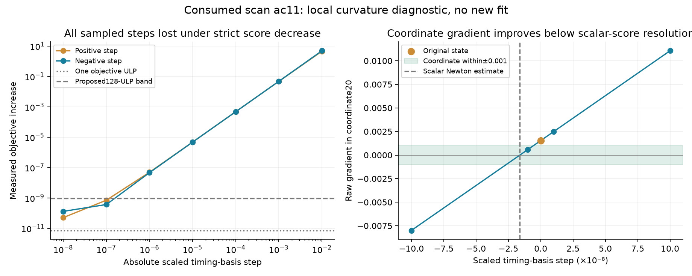

# Why a visibly nonzero gradient can be difficult to polish by objective decrease

This is a read-only calculation from the completed immutable iteration94 trial
receipt. It does not evaluate another objective, run another fit, or select a
position using reference error. The numerical values and source hashes are in
[curvature.json](curvature.json).

The largest scaled KKT residual at the original state is approximately0.00153544,
in coordinate20, relative timing basis12. This is a basis coefficient, **not an
individual satellite timing error or receiver-clock drift**. The unchanged gate
is0.001. Both production-prefit retry parameterizations stopped without qualifying
the state; strict score-decrease coordinate polishing also accepted no move.

Stored gradients at±1e-5 estimate a local scalar curvature of approximately
95,298.31. A scalar Newton model therefore suggests a step around−1.61119e-8
and a quadratic objective reduction of only1.23694e-11. The objective is
40,696.31462253702, whose floating-point ULP is7.27596e-12: the predicted benefit
is approximately1.70ULP. This is below the observed variation in the stored tiny
step costs, which is tens of ULP.

At the already sampled−1e-8 step, the raw coordinate gradient falls to about
0.000582, but the recorded scalar objective rises by1.30967e-10. The+1e-8 step
raises the objective by5.09317e-11. Larger±1e-5 steps raise the cost by roughly
4.8e-6, as expected from the strong curvature. Simply taking a larger step or
waiting longer on an already-successful optimizer is therefore not an established
remedy. The scalar Newton calculation is local and approximate; it does not prove
that the predicted step will satisfy every constraint or the full KKT test.

The evidence is consistent with a convergence gate asking for a gradient cleanup
whose benefit is near scalar numerical resolution. It does not prove a physical
model error, a globally optimal point, or that an inaccurate analytic gradient
is impossible. At the neighboring10⁻5 scale the finite-difference derivative
approximately agrees with the analytic derivative; finite differences of costs
become unreliable as their numerator approaches these tiny cost differences.

## Proposed numerical test, not a relaxed scientific gate

Estimate local curvature from finite differences of gradients, propose a small
bounded Newton correction, and require a reduction in the **full independently
projected KKT residual**. Preserve the exact original vector, model, observations,
priors and0.001 qualification threshold. Restrict any score increase to a globally
fixed128ULP band around the original objective (approximately9.31e-10 here), not
a tolerance that accumulates across steps. This treats differences inside the
declared band as numerical score ties; it must not justify a scientifically worse
minimum or a wider stationarity gate.

The band is a proposed numerical policy requiring synthetic tests and a freeze
before evaluation. Negative/undefined curvature, infeasible directions, or no
full-KKT improvement should reject the step. A lower single-coordinate gradient
alone is insufficient. If the state qualifies, the ordinary region still needs
calibration, association, matched c finals and score-based regional selection
before anyone can claim the55km positioning failure is fixed.
