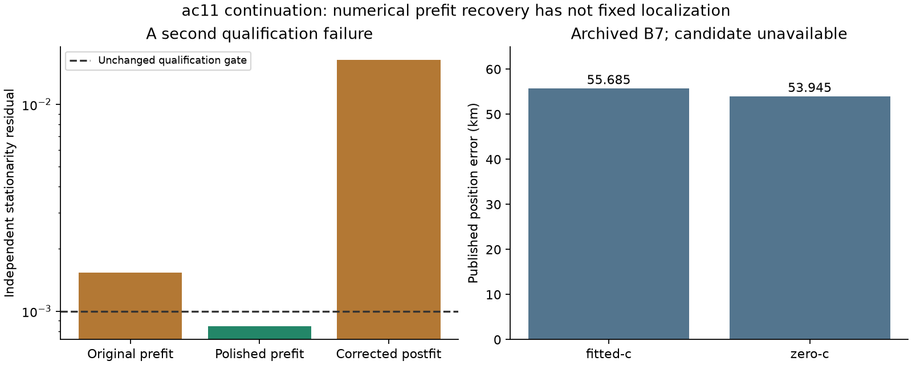

# Iteration95: rescued prefit meets a second calibration bottleneck

The continuation did **not** produce a new position. The ordinary lowest-score failed region's prefit qualified after iteration96, but its corrected fixed-position postfit failed the unchanged stationarity check. Association, both c finals, ordinary-only B7 replay, and candidate B7 were not reached.

## Recorded result

The frozen score-only selection chose iteration96 from all six saved prefits: objective 40696.314622537066, independent stationarity 0.000845178642. The two qualified zero-timing alternatives had worse same-model scores. No reference error entered selection.

After the unchanged receiver correction, the bounded postfit reported optimizer success, but stationarity was **0.0164009702**, versus the0.001 requirement. It performed 228 evaluations in 0.620s of its20s/600iteration budget. This was a convergence qualification failure, not a time limit.

Its objective was 40544.490315730, posterior RMS 152.318Hz, and effective signal support 2074.974. The correction changes the likelihood baseline: its raw objective must not be treated as an improvement over the uncorrected prefit objective. No candidate association or B7 pruning/support result exists.

## Matched c coverage and baseline

| Arm | Archived B7 error (km) | New final position | Fresh baseline parity |
|---|---:|---|---|
| fitted-c | 55.685054 | Not reached | Not measured |
| zero-c | 53.945451 | Not reached | Not measured |

Published B7 remains the original ordinary region `point:-72.5:-137.5`. The candidate fixed position remained the ordinary score-selected `point:-47.5:-62.5`; it never became an operational winner. Reference errors above are evaluation-only archived results. There is no measured position improvement or matched-c frequency-fit comparison from this continuation.

## Next causal test

A separate frozen diagnostic can reconstruct this corrected objective and apply the already tested curvature polish to its saved terminal state, preserving the same full stationarity threshold, physical constraints and fixed initial-score roundoff allowance. The near-threshold prefit mechanism does not by itself prove the postfit failure has the same cause. Only a qualified downstream continuation and ordinary-only baseline replay can establish whether this region improves localization.

No frozen source, deployment or original checkpoint was changed. This is a consumed single-scan diagnostic, not independent validation. The report reads persisted receipts only.

Sources: [frozen protocol](protocol.json), [terminal receipt](result.json), [full numerical summary](summary.json), [iteration96](../2026_10_09_position_error_iter96/README.md).
