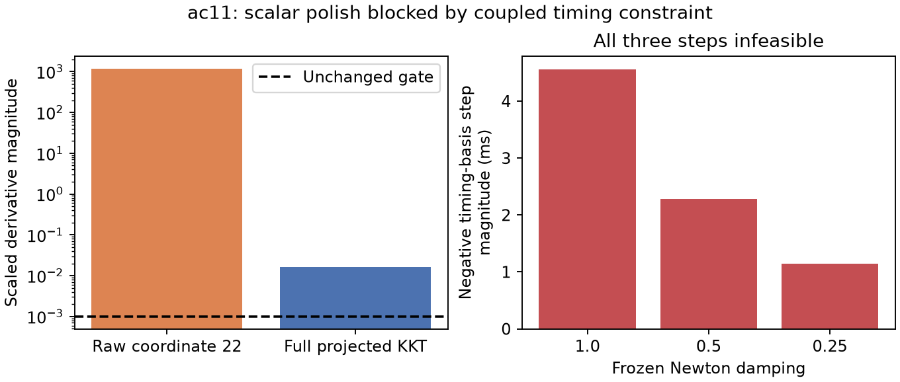

# Scalar refinement fails at the coupled timing boundary

**Iteration97 did not qualify the corrected postfit.** The unchanged independent KKT
is 0.0164009702412, above the 0.001 gate. The scalar routine accepted no
step, performed 2 objective/gradient evaluations, and returned
the exact original vector and objective (40544.4903157). The published
fitted-c position error remains 55.685 km; no downstream position improvement was established.

The chosen relative-timing basis coordinate is 22. Its raw scaled derivative is
1176.38714552, while the largest full projected KKT component is only
0.0164009702412. An active coupled timing constraint absorbs most of the
raw gradient. Moving this coordinate alone in the negative Newton direction violates
the physical constraint; moving jointly along a feasible tangent may behave differently.

The +1e-5 curvature probe is feasible, but increases the objective by
0.0117767760748; the -1e-5 probe is infeasible.
The forward-gradient curvature estimate is 258092.211852.
The frozen full, half and quarter Newton steps are respectively
-0.00455801101893, -0.00227900550947, -0.00113950275473 seconds in this
timing-basis coefficient. All are infeasible and therefore receive no objective evaluation.

This establishes a limitation of **single-coordinate refinement** at a coupled
boundary. It does not prove mathematical impossibility of convergence, an incorrect
physical bound, or that no feasible joint direction improves the objective/KKT.
The independent gate still rejects this endpoint; solver termination alone is not
a convergence certificate. Iteration96's interior scalar rescue remains valid,
but does not generalize to this boundary case without further testing.

## Provenance and scope

All 690 frozen source/input hashes match, including
inherited93/94/95/96 receipts. The protocol was frozen and pushed at `af2c6bb40`
before execution. The source vector is the saved failed95 corrected postfit;
its saved and reconstructed objective agree exactly. Every probe and rejected
step remains in [result.json](result.json). See [verification](verification.json).

This is a fitted-c calibration diagnostic with fixed position, unchanged hard60,
priors, physical constraints, 128-ULP ceiling and qualification gate. It is not a
matched position-accuracy ablation. No reference-guided start, new RF collection,
production change or additional model evaluation was used to create this report.
