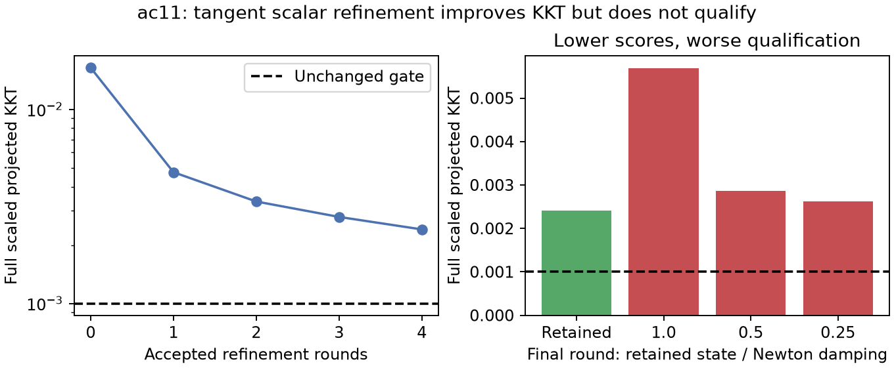

# Active-face scalar refinement: improvement without qualification

**The corrected calibration still fails the unchanged 0.001 KKT gate.**
Full projected KKT decreases from 0.0164009702412 to 0.00240807098717
after four accepted rounds and 26 objective/gradient evaluations.
Position stays fixed. The published fitted-c error remains 55.685 km;
association and matched c=0/fitted-c final-position testing have not been unlocked.

Unlike iteration97's infeasible single-coordinate Newton steps, this routine
projects the scaled gradient into the nullspace of the active constraint normals.
The persisted rounds have one active normal and a 21-dimensional tangent space.
All accepted steps preserve the physical constraints. This demonstrates that
the earlier scalar-coordinate blockage did not prove an absence of feasible
joint refinement.

The retained objective is 40544.4903157, a change of -1.22236087918e-09
(-168 initial-score ULP) from its own
corrected starting objective. The fixed 128-ULP ceiling is unchanged and is never
accumulated across rounds. These tiny score changes establish no frequency-fit
or localization gain.

## Why refinement stopped

The final round's three feasible Newton proposals all lower the objective, but
increase the full infinity-norm projected KKT. The frozen selection policy rejects
them because they do not improve independent qualification.

| Damping | Score delta versus retained state | Full KKT | Outcome |
|---|---:|---:|---|
| 1.0 | -1.89174897969e-10 | 0.00568555396922 | Feasible, rejected |
| 0.5 | -1.60071067512e-10 | 0.00286256716721 | Feasible, rejected |
| 0.25 | -6.54836185277e-11 | 0.00262534788995 | Feasible, rejected |

This is an algorithmic limitation of scalar curvature along a projected-gradient
direction, not a mathematical impossibility of convergence. A lower objective
need not monotonically improve the largest projected-gradient component.
The receipt does not prove that a coupled reduced-Hessian correction will work;
that requires a separately frozen test. Active-face refinement also cannot release
a wrongly active constraint. Qualification remains the full independent gate,
not reduced tangent stationarity or optimizer success.

## Immutable evidence and scope

All 698 frozen source/input hashes match. The original
iteration97 terminal vector is exactly the iteration99 start; reference positions
do not enter it. Every probe, rejected proposal, gradient and accepted state remains
in [result.json](result.json), with [protocol](protocol.json),
[verification](verification.json) and [artifact hashes](report-integrity.json).

This is a consumed single-scan fitted-c calibration diagnostic, not an independent
validation or matched position-accuracy ablation. Hard60, priors, fixed position,
physical constraints and the qualification threshold remain unchanged. No new
RF collection, production edit or additional model evaluation was used for this report.
