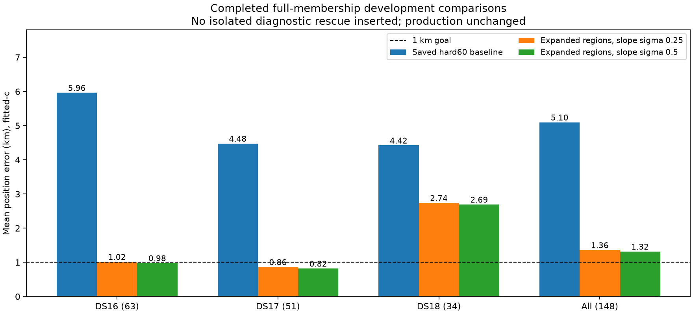

# Position research: completed comparisons and outstanding validation

The latest completed full-membership experiment has **1.317354 km fitted-c mean
position error across all 148 recordings**, compared with 5.097594 km for the
saved bounded-recovery hard60 baseline. The below-1-km goal is unachieved.
This is a research comparison, not a deployment announcement or independent
validation result. Production and longest-16-track PNG rendering are unchanged.

| Dataset | Members | Baseline fitted-c km | Expanded-region fitted-c km | Latest fitted-c km | Baseline c=0 km | Latest c=0 km |
|---|---:|---:|---:|---:|---:|---:|
| DS16 | 63 | 5.964450 | 1.017307 | 0.979007 | 6.355169 | 1.321051 |
| DS17 | 51 | 4.477043 | 0.864203 | 0.819111 | 4.585465 | 1.326922 |
| DS18 | 34 | 4.422188 | 2.739331 | 2.691656 | 4.618410 | 2.815838 |
| Pooled | 148 | 5.097594 | 1.360148 | 1.317354 | 5.346353 | 1.666471 |

## What changed

1. The joint-clock, RF-time and satellite-slope research sequence brought the
   pooled mean from 5.097594 to 3.150628 km. This is the combined sequence's
   effect, not an isolated attribution to one parameter.
2. Keeping the original regional finalists plus 25-km and 50-km separated
   alternatives brought it to 1.360148 km. Selection uses qualified regional
   model score. One consumed DS16 case improved from 265.789 to 0.798370 km;
   the other 147 were unchanged. Additional search costs are explicit.
3. Widening the Gaussian satellite-slope prior from 0.25 to 0.5 Hz/s brought it
   to 1.317354 km. This differs from timing sigma and the receiver hard60 bound.
   Ninety-six fitted-c errors improved and 52 regressed. The narrower 0.125
   alternative reached 1.384951 km. All 296 raw fits at 0.5 qualified without
   fallback. Its fitted-c median is 0.863677 km, p95 2.269173 km and worst
   53.400741 km. Frequency RMS improved separately from 69.213 to 67.204 Hz;
   frequency improvement alone is not evidence of position accuracy.

The latest c=0 arm also locks the RF-time terms. Observations, candidate banks,
other priors, starts and budgets are matched between arms. The starts and banks
are fitted-derived: this is a conditional ablation, not independent c-specific
search pipelines. See [the complete comparison](../2026_10_09_position_error_iter82/RESULTS.md)
for membership, distributions, paired regressions and original input failures
with their separately frozen successful retries. The
[expanded-region assessment](../2026_10_09_position_error_iter65/README.md)
documents the preceding policy and its computation/provenance limits.

## A promising recovery is still separate from cohort results

On consumed DS18-022, ordinary regional starts, a reference-free common satellite
bank, receiver-pair clock proposals and qualified complete-state retries reached
0.815491 km fitted-c / 0.889093 km c=0. A common bank is the union of candidates
from successful regional hypotheses, held fixed when comparing those fits.
It is not selected using the known receiver location. This ordinary route is
distinct from the earlier reference-guided 1.15-km diagnostic seed.

The [single-case recovery](../2026_10_09_position_error_iter81/README.md) is **not
spliced into the means above**. Its search and restart rules were developed on
consumed data and need uniform cohort evaluation followed by independent testing.
[Iteration83](../2026_10_09_position_error_iter83/README.md) applies that search
policy to six scans flagged by a fixed timing/convergence rule; it is checkpointed
and incomplete. The timing threshold was tuned on consumed data to bound compute.

[Iteration84](../2026_10_09_position_error_iter84/README.md) is running a full148
comparison of a geometry-dependent Gaussian slope prior: tighten at most two
slope directions that can mimic position changes, retain the wider prior in
other directions. Geometry comes from the shared hypothesis seed, not reference
coordinates. Its full result is pending; no benefit is claimed yet.

## Coverage and validation boundaries

DS16 includes both the historical48 and added15; DS17 includes all51; DS18
includes all34, including its sealed unpublished archive member. DS18's24 prior
consumed recordings retain that label. No prior registry match for the other10
does not establish unseen status; all evaluated recordings are now consumed.
The detailed comparisons preserve these subgroups and all failed attempts.

Reference coordinates/errors are evaluation-only. Operational bank construction,
seeds, region retention and winner selection must remain reference-free. The
configured Sacramento spatial prior remains an explicit dependency; this is not
a claim of unconstrained worldwide localization. No new RF has been collected.
The separately minted post-DS18 reserve remains outcome-unexamined; independent
validation requires a frozen protocol before consuming it.

The next decisions depend on completed84 and83 results, including regressions,
fallbacks and frequency effects, not a selective replacement of difficult scans.
