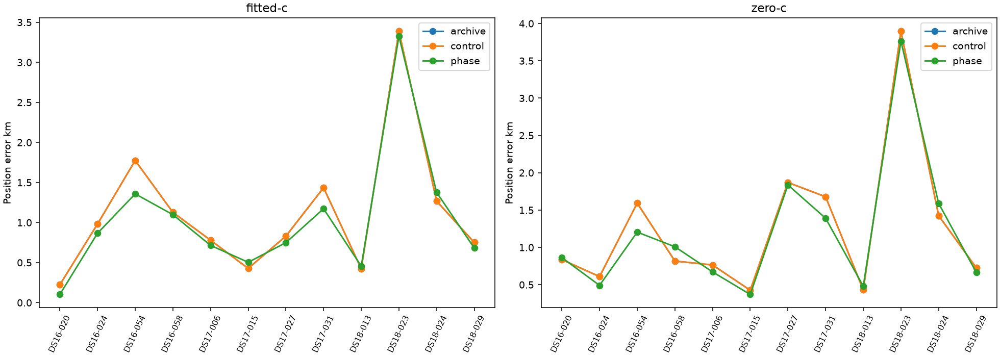

# Matched phase timing sensitivity

**Diagnostic admission limitation:** the inherited legacy loader asserts equality of an archived horizontal position error field. It does not guide numerical starts or ranking, but this execution is not fully reference-free admission. See [exact dependency audit](REFERENCE_DEPENDENCY_AUDIT.md).

All12 terminal member receipts are accounted. Fresh control and phase fits share ordinary archived starts, inputs, priors and budgets; archive is a separate fallback comparator. Position metrics are withheld unless all12 raw endpoints qualify. Frequency scores belong to different physical models and cannot choose the convention alone.

|Arm|Model|Present|Qualified|Mean km|Median km|p95 km|Worst km|
|---|---|---:|---:|---:|---:|---:|---:|
|fitted-c|archive|12|12|1.1174|0.9058|2.5013|3.3893|
|fitted-c|control|12|12|1.1174|0.9058|2.5013|3.3893|
|fitted-c|phase|12|12|1.0336|0.8077|2.2541|3.3263|
|zero-c|archive|12|12|1.2560|0.8267|2.7825|3.8979|
|zero-c|control|12|12|1.2560|0.8267|2.7825|3.8979|
|zero-c|phase|12|12|1.1942|0.9360|2.7037|3.7639|

|Dataset|Arm|Model|Expected|Qualified|Mean km|Median km|p95 km|Worst km|
|---|---|---|---:|---:|---:|---:|---:|---:|
|full|fitted-c|archive|12|12|1.1174|0.9058|2.5013|3.3893|
|full|fitted-c|control|12|12|1.1174|0.9058|2.5013|3.3893|
|full|fitted-c|phase|12|12|1.0336|0.8077|2.2541|3.3263|
|full|zero-c|archive|12|12|1.2560|0.8267|2.7825|3.8979|
|full|zero-c|control|12|12|1.2560|0.8267|2.7825|3.8979|
|full|zero-c|phase|12|12|1.1942|0.9360|2.7037|3.7639|
|DS16|fitted-c|archive|4|4|1.0265|1.0541|1.6776|1.7747|
|DS16|fitted-c|control|4|4|1.0265|1.0541|1.6776|1.7747|
|DS16|fitted-c|phase|4|4|0.8561|0.9823|1.3190|1.3579|
|DS16|zero-c|archive|4|4|0.9636|0.8267|1.4795|1.5929|
|DS16|zero-c|control|4|4|0.9636|0.8267|1.4795|1.5929|
|DS16|zero-c|phase|4|4|0.8918|0.9360|1.1750|1.2044|
|DS17|fitted-c|archive|4|4|0.8680|0.8049|1.3439|1.4345|
|DS17|fitted-c|control|4|4|0.8680|0.8049|1.3439|1.4345|
|DS17|fitted-c|phase|4|4|0.7852|0.7323|1.1092|1.1727|
|DS17|zero-c|archive|4|4|1.1845|1.2211|1.8411|1.8699|
|DS17|zero-c|control|4|4|1.1845|1.2211|1.8411|1.8699|
|DS17|zero-c|phase|4|4|1.0666|1.0307|1.7694|1.8363|
|DS18|fitted-c|archive|4|4|1.4576|1.0092|3.0710|3.3893|
|DS18|fitted-c|control|4|4|1.4576|1.0092|3.0710|3.3893|
|DS18|fitted-c|phase|4|4|1.4596|1.0287|3.0339|3.3263|
|DS18|zero-c|archive|4|4|1.6197|1.0755|3.5271|3.8979|
|DS18|zero-c|control|4|4|1.6197|1.0755|3.5271|3.8979|
|DS18|zero-c|phase|4|4|1.6243|1.1270|3.4378|3.7639|

Explicit archive-fallback sensitivity (reported, not an operational model choice):

|Dataset|Arm|Model|Fallbacks|Mean km|Median km|p95 km|Worst km|
|---|---|---|---:|---:|---:|---:|---:|
|full|fitted-c|control|0|1.1174|0.9058|2.5013|3.3893|
|full|fitted-c|phase|0|1.0336|0.8077|2.2541|3.3263|
|full|zero-c|control|0|1.2560|0.8267|2.7825|3.8979|
|full|zero-c|phase|0|1.1942|0.9360|2.7037|3.7639|
|DS16|fitted-c|control|0|1.0265|1.0541|1.6776|1.7747|
|DS16|fitted-c|phase|0|0.8561|0.9823|1.3190|1.3579|
|DS16|zero-c|control|0|0.9636|0.8267|1.4795|1.5929|
|DS16|zero-c|phase|0|0.8918|0.9360|1.1750|1.2044|
|DS17|fitted-c|control|0|0.8680|0.8049|1.3439|1.4345|
|DS17|fitted-c|phase|0|0.7852|0.7323|1.1092|1.1727|
|DS17|zero-c|control|0|1.1845|1.2211|1.8411|1.8699|
|DS17|zero-c|phase|0|1.0666|1.0307|1.7694|1.8363|
|DS18|fitted-c|control|0|1.4576|1.0092|3.0710|3.3893|
|DS18|fitted-c|phase|0|1.4596|1.0287|3.0339|3.3263|
|DS18|zero-c|control|0|1.6197|1.0755|3.5271|3.8979|
|DS18|zero-c|phase|0|1.6243|1.1270|3.4378|3.7639|

[All members, qualification and frequency effects](evaluation.json). No truth guided starts or winner selection, and no production change.
