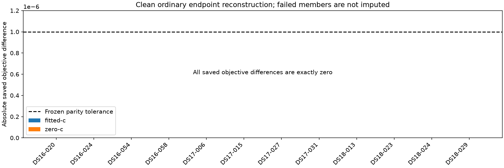

# Clean ordinary endpoint reconstruction

All twelve members terminal: 12 complete, 0 failed. Both c arms use the same clean physical reconstruction. Zero optimizer calls; no reference coordinates or errors entered runtime admission.

| Member | Status | Fitted delta | Zero-c delta | Runtime s |
|---|---|---:|---:|---:|
| DS16-020 | complete | 0 | 0 | 13.162 |
| DS16-024 | complete | 0 | 0 | 13.102 |
| DS16-054 | complete | 0 | 0 | 12.073 |
| DS16-058 | complete | 0 | 0 | 11.696 |
| DS17-006 | complete | 0 | 0 | 10.871 |
| DS17-015 | complete | 0 | 0 | 12.950 |
| DS17-027 | complete | 0 | 0 | 10.685 |
| DS17-031 | complete | 0 | 0 | 11.805 |
| DS18-013 | complete | 0 | 0 | 10.734 |
| DS18-023 | complete | 0 | 0 | 11.160 |
| DS18-024 | complete | 0 | 0 | 11.149 |
| DS18-029 | complete | 0 | 0 | 10.833 |

The five saved physical signatures were verified by the public131 loader. Regional session/input/analysis identity and saved ordinary objectives were checked. This establishes clean reconstruction parity, not fresh optimizer qualification, new position accuracy, or proof of the phase convention. Iteration130 remains a consumed diagnostic with inherited evaluation-field admission; it is not relabelled.

Metadata preparation verified original source receipts as provenance before whitelisting. Runtime identity binds only sanitized inference fields. Summed elapsed time includes input reconstruction; it is not parallel wall time.
