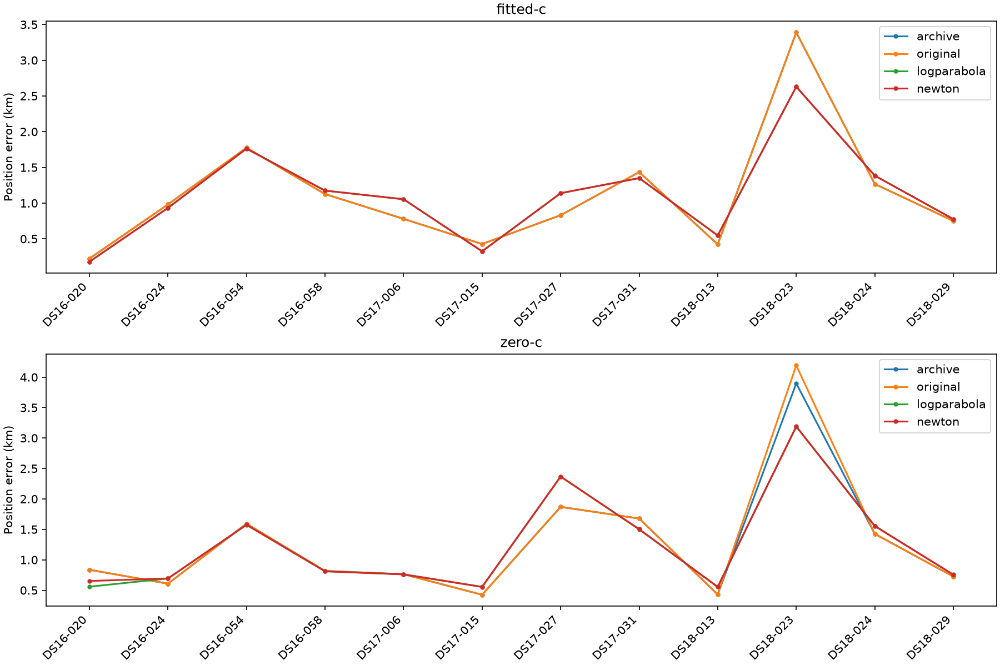

# Matched frequency measurement sensitivity

All twelve consumed pilot members are reported. Ordinary model, bank, priors and fitted-derived starts are matched; no variant is selected for deployment. Frequency score/RMS is separate from geographic accuracy. Archived B7 differs from fresh same-start control initialization for c=0. Unqualified/raw-integrity failures withhold full metrics; archive fallback is explicit sensitivity only. Archive qualification is published130 historical comparator provenance, not new132 qualification (132 checks reconstruction/score parity only).

| Group | Arm | Variant | Qualified | Mean km | Median km | p95 km | Worst km |
|---|---|---|---:|---:|---:|---:|---:|
| full | fitted-c | archive | 12/12 | 1.117359 | 0.905836 | 2.501273 | 3.389263 |
| full | fitted-c | original | 12/12 | 1.117359 | 0.905836 | 2.501273 | 3.389263 |
| full | fitted-c | logparabola | 12/12 | 1.104340 | 1.097311 | 2.151639 | 2.628350 |
| full | fitted-c | newton | 12/12 | 1.104707 | 1.096246 | 2.153156 | 2.630162 |
| full | zero-c | archive | 12/12 | 1.255968 | 0.826722 | 2.782485 | 3.897895 |
| full | zero-c | original | 12/12 | 1.280581 | 0.826722 | 2.915394 | 4.193248 |
| full | zero-c | logparabola | 12/12 | 1.240088 | 0.787617 | 2.736961 | 3.189004 |
| full | zero-c | newton | 12/12 | 1.247961 | 0.786027 | 2.737934 | 3.190709 |
| DS16 | fitted-c | archive | 4/4 | 1.026534 | 1.054130 | 1.677589 | 1.774735 |
| DS16 | fitted-c | original | 4/4 | 1.026534 | 1.054130 | 1.677589 | 1.774735 |
| DS16 | fitted-c | logparabola | 4/4 | 1.012116 | 1.053910 | 1.673657 | 1.761604 |
| DS16 | fitted-c | newton | 4/4 | 1.012388 | 1.053654 | 1.674644 | 1.762878 |
| DS16 | zero-c | archive | 4/4 | 0.963645 | 0.826722 | 1.479465 | 1.592919 |
| DS16 | zero-c | original | 4/4 | 0.963645 | 0.826722 | 1.479465 | 1.592919 |
| DS16 | zero-c | logparabola | 4/4 | 0.909812 | 0.753064 | 1.460241 | 1.574512 |
| DS16 | zero-c | newton | 4/4 | 0.933324 | 0.752281 | 1.461577 | 1.576328 |
| DS17 | fitted-c | archive | 4/4 | 0.867977 | 0.804945 | 1.343881 | 1.434476 |
| DS17 | fitted-c | original | 4/4 | 0.867977 | 0.804945 | 1.343881 | 1.434476 |
| DS17 | fitted-c | logparabola | 4/4 | 0.967087 | 1.097311 | 1.317602 | 1.348970 |
| DS17 | fitted-c | newton | 4/4 | 0.967223 | 1.096246 | 1.318985 | 1.350806 |
| DS17 | zero-c | archive | 4/4 | 1.184515 | 1.221124 | 1.841141 | 1.869877 |
| DS17 | zero-c | original | 4/4 | 1.184515 | 1.221124 | 1.841141 | 1.869877 |
| DS17 | zero-c | logparabola | 4/4 | 1.296391 | 1.131369 | 2.237074 | 2.367108 |
| DS17 | zero-c | newton | 4/4 | 1.296534 | 1.131934 | 2.237829 | 2.367481 |
| DS18 | fitted-c | archive | 4/4 | 1.457567 | 1.009240 | 3.071035 | 3.389263 |
| DS18 | fitted-c | original | 4/4 | 1.457567 | 1.009240 | 3.071035 | 3.389263 |
| DS18 | fitted-c | logparabola | 4/4 | 1.333816 | 1.080023 | 2.441794 | 2.628350 |
| DS18 | fitted-c | newton | 4/4 | 1.334511 | 1.080337 | 2.443198 | 2.630162 |
| DS18 | zero-c | archive | 4/4 | 1.619744 | 1.075528 | 3.527085 | 3.897895 |
| DS18 | zero-c | original | 4/4 | 1.693582 | 1.075528 | 3.778135 | 4.193248 |
| DS18 | zero-c | logparabola | 4/4 | 1.514061 | 1.155966 | 2.944276 | 3.189004 |
| DS18 | zero-c | newton | 4/4 | 1.514026 | 1.155178 | 2.945214 | 3.190709 |

Paired changes compare refiners with fresh original measurements:

| Group | Arm | Refiner | Pairs | Improvements | Regressions | Max regression km |
|---|---|---|---:|---:|---:|---:|
| full | fitted-c | logparabola | 12/12 | 6 | 6 | 0.309343 |
| full | fitted-c | newton | 12/12 | 6 | 6 | 0.308160 |
| full | zero-c | logparabola | 12/12 | 6 | 6 | 0.497231 |
| full | zero-c | newton | 12/12 | 6 | 6 | 0.497604 |
| DS16 | fitted-c | logparabola | 4/4 | 3 | 1 | 0.048195 |
| DS16 | fitted-c | newton | 4/4 | 3 | 1 | 0.047554 |
| DS16 | zero-c | logparabola | 4/4 | 3 | 1 | 0.085202 |
| DS16 | zero-c | newton | 4/4 | 3 | 1 | 0.085027 |
| DS17 | fitted-c | logparabola | 4/4 | 2 | 2 | 0.309343 |
| DS17 | fitted-c | newton | 4/4 | 2 | 2 | 0.308160 |
| DS17 | zero-c | logparabola | 4/4 | 2 | 2 | 0.497231 |
| DS17 | zero-c | newton | 4/4 | 2 | 2 | 0.497604 |
| DS18 | fitted-c | logparabola | 4/4 | 1 | 3 | 0.124342 |
| DS18 | fitted-c | newton | 4/4 | 1 | 3 | 0.124683 |
| DS18 | zero-c | logparabola | 4/4 | 1 | 3 | 0.131657 |
| DS18 | zero-c | newton | 4/4 | 1 | 3 | 0.128247 |

Regressing labels (qualified pairs; no tuning from these outcomes):

full, fitted-c, logparabola: DS16-058, DS17-006, DS17-027, DS18-013, DS18-024, DS18-029.

full, fitted-c, newton: DS16-058, DS17-006, DS17-027, DS18-013, DS18-024, DS18-029.

full, zero-c, logparabola: DS16-024, DS17-015, DS17-027, DS18-013, DS18-024, DS18-029.

full, zero-c, newton: DS16-024, DS17-015, DS17-027, DS18-013, DS18-024, DS18-029.

DS16, fitted-c, logparabola: DS16-058.

DS16, fitted-c, newton: DS16-058.

DS16, zero-c, logparabola: DS16-024.

DS16, zero-c, newton: DS16-024.

DS17, fitted-c, logparabola: DS17-006, DS17-027.

DS17, fitted-c, newton: DS17-006, DS17-027.

DS17, zero-c, logparabola: DS17-015, DS17-027.

DS17, zero-c, newton: DS17-015, DS17-027.

DS18, fitted-c, logparabola: DS18-013, DS18-024, DS18-029.

DS18, fitted-c, newton: DS18-013, DS18-024, DS18-029.

DS18, zero-c, logparabola: DS18-013, DS18-024, DS18-029.

DS18, zero-c, newton: DS18-013, DS18-024, DS18-029.

Frequency and cost are separate descriptive metrics:

| Arm | Variant | RMS median Hz (n) | Objective median (n) | Evaluations median (n) |
|---|---|---:|---:|---:|
| fitted-c | archive | unavailable (0) | 31223.009 (12) | unavailable (0) |
| fitted-c | original | 59.940 (12) | 31223.009 (12) | 12.000 (12) |
| fitted-c | logparabola | 79.472 (12) | 31453.796 (12) | 219.000 (12) |
| fitted-c | newton | 79.355 (12) | 31451.887 (12) | 214.000 (12) |
| zero-c | archive | unavailable (0) | 31939.582 (12) | unavailable (0) |
| zero-c | original | 107.641 (12) | 31939.582 (12) | 206.000 (12) |
| zero-c | logparabola | 115.144 (12) | 32144.486 (12) | 203.000 (12) |
| zero-c | newton | 115.100 (12) | 32142.669 (12) | 197.500 (12) |

Summed per-member runtime: 235.931 s; not parallel wall time. No operational fallback or variant is selected.

Qualified score components (median; separate from position accuracy):

| Arm | Variant | Frequency NLL (n) | Timing prior (n) | Nuisance prior (n) |
|---|---|---:|---:|---:|
| fitted-c | archive | unavailable (0) | unavailable (0) | unavailable (0) |
| fitted-c | original | 31159.266 (12) | 4.906 (12) | 36.622 (12) |
| fitted-c | logparabola | 31386.985 (12) | 4.918 (12) | 40.667 (12) |
| fitted-c | newton | 31385.083 (12) | 4.918 (12) | 40.666 (12) |
| zero-c | archive | unavailable (0) | unavailable (0) | unavailable (0) |
| zero-c | original | 31845.894 (12) | 4.798 (12) | 58.498 (12) |
| zero-c | logparabola | 32047.967 (12) | 4.816 (12) | 62.545 (12) |
| zero-c | newton | 32046.147 (12) | 4.816 (12) | 62.512 (12) |

Within-arm saved responsibility/support changes relative to original. These include complete unqualified fits, explicitly marked; no accuracy inference. Nonclutter mass is sum(1-clutter probability), not a sample-independence count.

| Member | Arm | Refiner | Qualified pair | Changed labels | Nonclutter mass delta |
|---|---|---|---|---:|---:|
| DS16-020 | fitted-c | logparabola | True/True | 69 | 12.456391 |
| DS16-020 | fitted-c | newton | True/True | 69 | 12.559554 |
| DS16-020 | zero-c | logparabola | True/True | 139 | -19.324487 |
| DS16-020 | zero-c | newton | True/True | 136 | -17.990344 |
| DS16-024 | fitted-c | logparabola | True/True | 71 | -1.531741 |
| DS16-024 | fitted-c | newton | True/True | 71 | -1.483295 |
| DS16-024 | zero-c | logparabola | True/True | 112 | -17.677885 |
| DS16-024 | zero-c | newton | True/True | 112 | -17.669649 |
| DS16-054 | fitted-c | logparabola | True/True | 39 | 0.537375 |
| DS16-054 | fitted-c | newton | True/True | 39 | 0.557919 |
| DS16-054 | zero-c | logparabola | True/True | 37 | -0.638940 |
| DS16-054 | zero-c | newton | True/True | 37 | -0.614403 |
| DS16-058 | fitted-c | logparabola | True/True | 31 | 2.129574 |
| DS16-058 | fitted-c | newton | True/True | 31 | 2.152225 |
| DS16-058 | zero-c | logparabola | True/True | 40 | -8.917592 |
| DS16-058 | zero-c | newton | True/True | 40 | -8.823646 |
| DS17-006 | fitted-c | logparabola | True/True | 40 | 6.388966 |
| DS17-006 | fitted-c | newton | True/True | 40 | 6.408424 |
| DS17-006 | zero-c | logparabola | True/True | 53 | -12.202530 |
| DS17-006 | zero-c | newton | True/True | 52 | -12.106281 |
| DS17-015 | fitted-c | logparabola | True/True | 63 | 6.778561 |
| DS17-015 | fitted-c | newton | True/True | 63 | 6.794510 |
| DS17-015 | zero-c | logparabola | True/True | 81 | -0.416266 |
| DS17-015 | zero-c | newton | True/True | 80 | -0.321527 |
| DS17-027 | fitted-c | logparabola | True/True | 44 | 13.557635 |
| DS17-027 | fitted-c | newton | True/True | 43 | 13.597085 |
| DS17-027 | zero-c | logparabola | True/True | 49 | 7.015589 |
| DS17-027 | zero-c | newton | True/True | 50 | 7.051804 |
| DS17-031 | fitted-c | logparabola | True/True | 47 | -0.454869 |
| DS17-031 | fitted-c | newton | True/True | 47 | -0.414744 |
| DS17-031 | zero-c | logparabola | True/True | 106 | -19.521771 |
| DS17-031 | zero-c | newton | True/True | 105 | -19.272242 |
| DS18-013 | fitted-c | logparabola | True/True | 60 | 10.612455 |
| DS18-013 | fitted-c | newton | True/True | 61 | 10.619083 |
| DS18-013 | zero-c | logparabola | True/True | 64 | 10.383832 |
| DS18-013 | zero-c | newton | True/True | 64 | 10.391555 |
| DS18-023 | fitted-c | logparabola | True/True | 65 | 18.231000 |
| DS18-023 | fitted-c | newton | True/True | 65 | 18.275858 |
| DS18-023 | zero-c | logparabola | True/True | 81 | 17.182203 |
| DS18-023 | zero-c | newton | True/True | 81 | 17.238632 |
| DS18-024 | fitted-c | logparabola | True/True | 47 | -0.949362 |
| DS18-024 | fitted-c | newton | True/True | 47 | -0.894829 |
| DS18-024 | zero-c | logparabola | True/True | 62 | -7.757024 |
| DS18-024 | zero-c | newton | True/True | 62 | -7.640612 |
| DS18-029 | fitted-c | logparabola | True/True | 56 | 5.093691 |
| DS18-029 | fitted-c | newton | True/True | 56 | 5.127549 |
| DS18-029 | zero-c | logparabola | True/True | 61 | 4.396407 |
| DS18-029 | zero-c | newton | True/True | 60 | 4.431011 |

Frequency replay lineage preserves the original128 failure and its cost. DS18-029 originally had 1,782 read failures;134 replays every original observation after the documented ordinal-reader correction. Other eleven use128. The original failure receipt remains provenance, not a silently dropped member.

| Member | Attempt lineage | Attempt elapsed s | Total replay s |
|---|---|---:|---:|
| DS16-020 | reports/2026_10_09_position_error_iter128/results/DS16-020/result.json (complete) | 42.855 | 42.855 |
| DS16-024 | reports/2026_10_09_position_error_iter128/results/DS16-024/result.json (complete) | 132.421 | 132.421 |
| DS16-054 | reports/2026_10_09_position_error_iter128/results/DS16-054/result.json (complete) | 101.394 | 101.394 |
| DS16-058 | reports/2026_10_09_position_error_iter128/results/DS16-058/result.json (complete) | 100.614 | 100.614 |
| DS17-006 | reports/2026_10_09_position_error_iter128/results/DS17-006/result.json (complete) | 83.219 | 83.219 |
| DS17-015 | reports/2026_10_09_position_error_iter128/results/DS17-015/result.json (complete) | 128.450 | 128.450 |
| DS17-027 | reports/2026_10_09_position_error_iter128/results/DS17-027/result.json (complete) | 38.294 | 38.294 |
| DS17-031 | reports/2026_10_09_position_error_iter128/results/DS17-031/result.json (complete) | 104.827 | 104.827 |
| DS18-013 | reports/2026_10_09_position_error_iter128/results/DS18-013/result.json (complete) | 32.697 | 32.697 |
| DS18-023 | reports/2026_10_09_position_error_iter128/results/DS18-023/result.json (complete) | 30.918 | 30.918 |
| DS18-024 | reports/2026_10_09_position_error_iter128/results/DS18-024/result.json (complete) | 103.940 | 103.940 |
| DS18-029 | reports/2026_10_09_position_error_iter128/results/DS18-029/result.json (complete-with-failures); reports/2026_10_10_position_error_iter134/results/result.json (complete) | 74.881; 92.293 | 167.174 |

Summed frequency replay cost, including original failed128 attempt: 1066.804 s; separate from final-fit runtime.

Complete membership: DS16-020 (complete), DS16-024 (complete), DS16-054 (complete), DS16-058 (complete), DS17-006 (complete), DS17-015 (complete), DS17-027 (complete), DS17-031 (complete), DS18-013 (complete), DS18-023 (complete), DS18-024 (complete), DS18-029 (complete).
